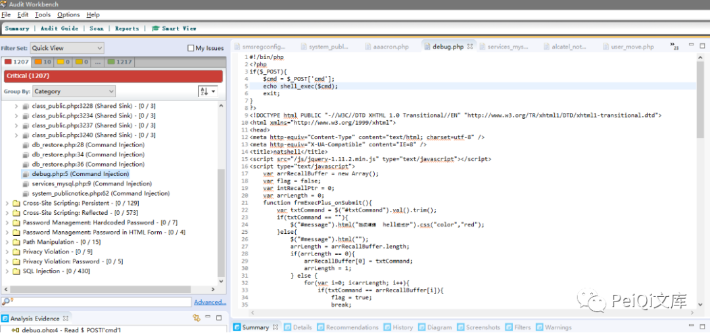
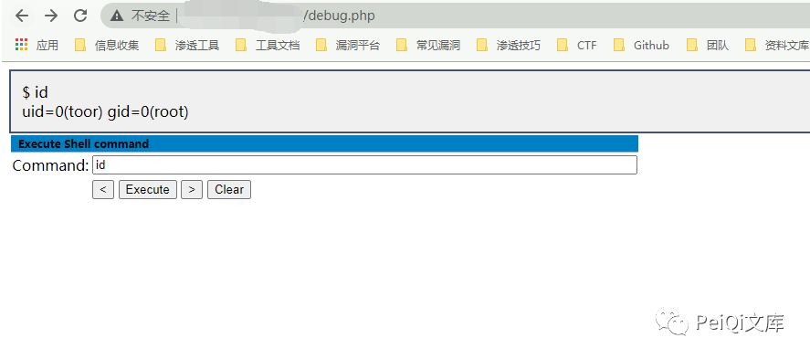
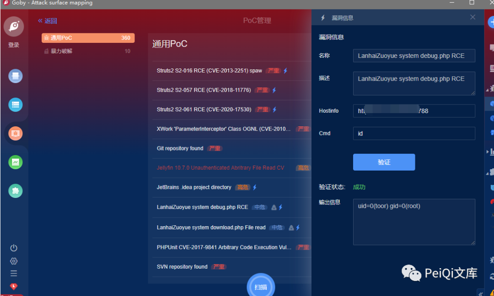

# 蓝海卓越计费管理系统 debug.php命令调试页面暴露

## 条目说明

- 对象与具体问题：蓝海卓越计费管理系统；debug.php命令调试页面暴露
- 版本、配置及部署条件：版本未知，调试页访问控制未知
- 认证与权限前提：未说明
- 核验边界：已完成原始 Markdown 的文本审阅；未执行 PoC、未访问目标、未视检截图。来源所述影响与复现结果不等于本库独立验证。

## 证据边界与更正

以下记录原始资料的证据边界。可以由原文确定的产品、编号及格式问题已在本条修订；没有原始证据的版本、响应和补丁信息仍待核实。

- 同527入口；源码、操作、证明全为未视检图，527有可读HTTP可互补
- POC指向仓库主页非具体不可变脚本，缺修复/版本
- 文库广告大量，保留作者/转载许可信息但清理宣传与重复图片

## 操作风险

现有材料未完整列明副作用；示例不保证只读或无状态变化。保留原示例供静态分析；仅可在明确授权的隔离测试环境验证，事先准备备份与回滚。

## 技术资料与来源记录

> 本文由 [简悦 SimpRead](http://ksria.com/simpread/) 转码， 原文地址 [mp.weixin.qq.com](https://mp.weixin.qq.com/s/CVe7GSRzCKcYXj5Pj8W5SA)


****

**一****：漏洞描述🐑**

**蓝海卓越计费管理系统 debug.php 存在命令调试页面，导致攻击者可以远程命令执行**

**二:  漏洞影响🐇**

**蓝海卓越计费管理系统**

**三:  漏洞复现🐋**

```
title=="蓝海卓越计费管理系统"
```

**登录页面如下**


**漏洞代码**



**访问 debug.php 页面 远程调试命令执行**  



 ****四:  漏洞 POC🦉****

```
https://github.com/PeiQi0/PeiQi-WIKI-POC
```



 ****五:  关于文库🦉****

 **在线文库：**

**http://wiki.peiqi.tech**

 **Github：**

**https://github.com/PeiQi0/PeiQi-WIKI-POC**


最后
--

> 下面就是文库的公众号啦，更新的文章都会在第一时间推送在交流群和公众号
> 
> 想要加入交流群的师傅公众号点击交流群加我拉你啦~
> 
> 别忘了 Github 下载完给个小星星⭐

公众号

**同时知识星球也开放运营啦，希望师傅们支持支持啦🐟**

**知识星球里会持续发布一些漏洞公开信息和技术文章~**


**由于传播、利用此文所提供的信息而造成的任何直接或者间接的后果及损失，均由使用者本人负责，文章作者不为此承担任何责任。**

**PeiQi 文库 拥有对此文章的修改和解释权如欲转载或传播此文章，必须保证此文章的完整性，包括版权声明等全部内容。未经作者允许，不得任意修改或者增减此文章内容，不得以任何方式将其用于商业目的。**

---

> 来源：MrWQ/vulnerability-paper（https://github.com/MrWQ/vulnerability-paper）
