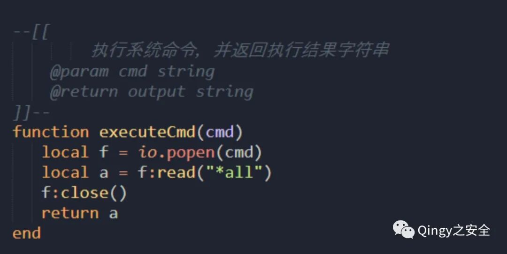
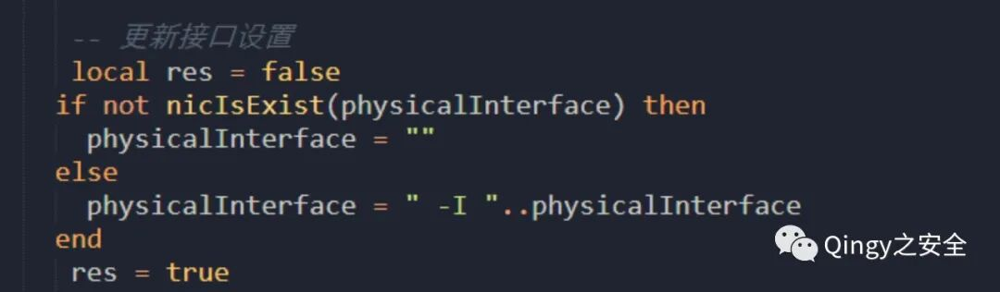
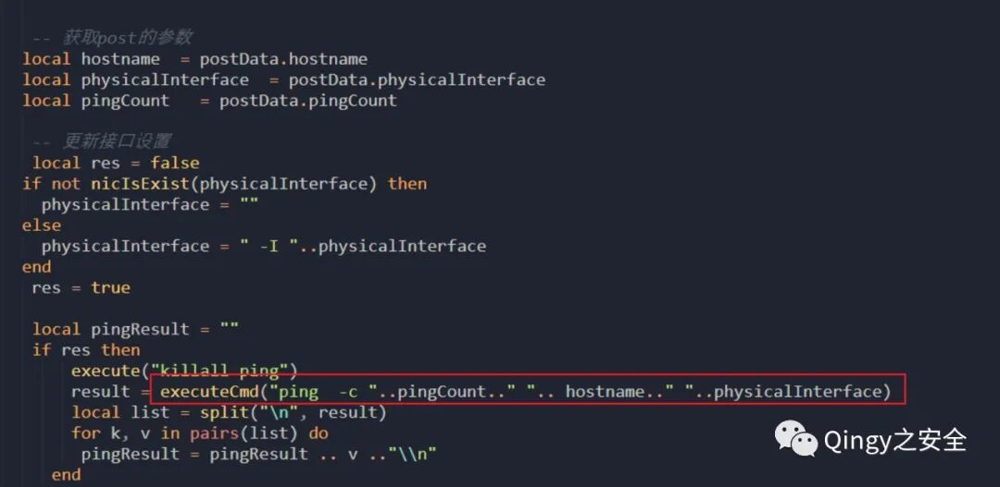
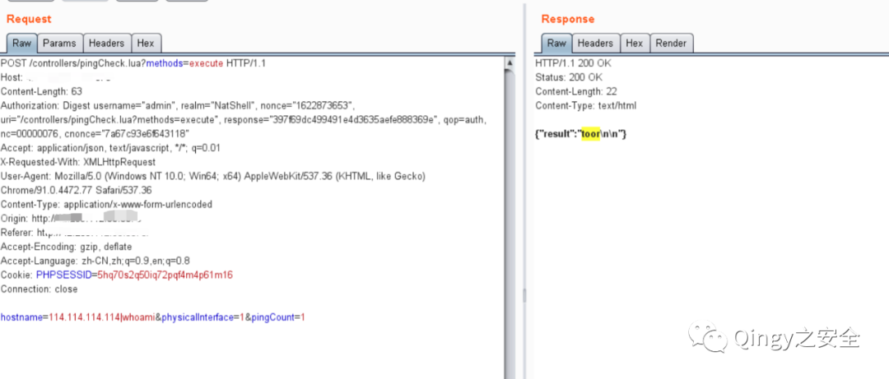
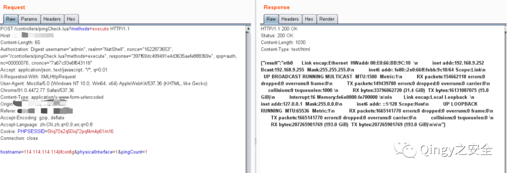
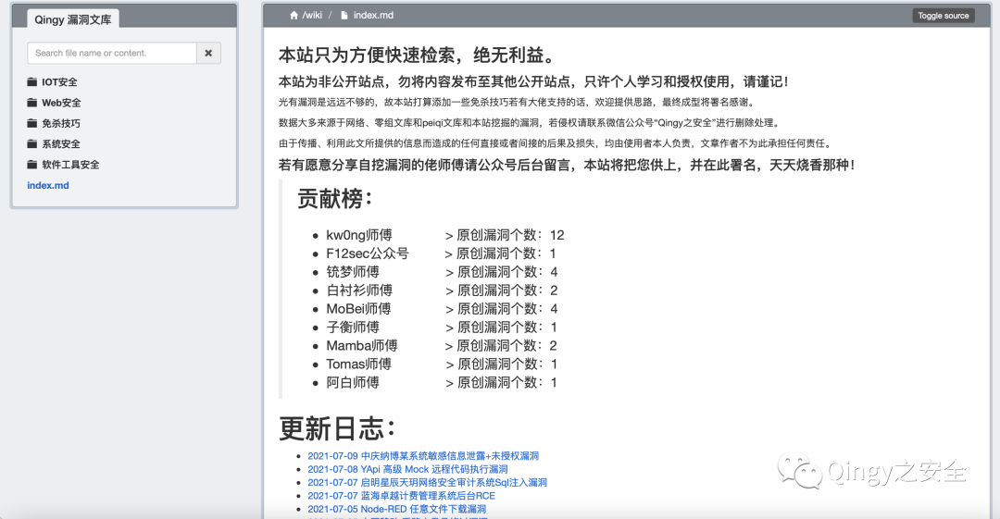
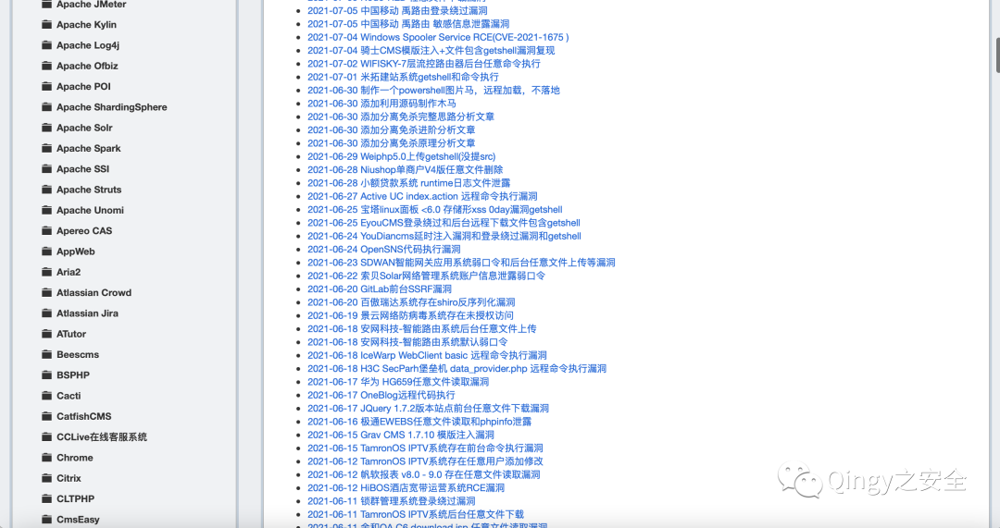
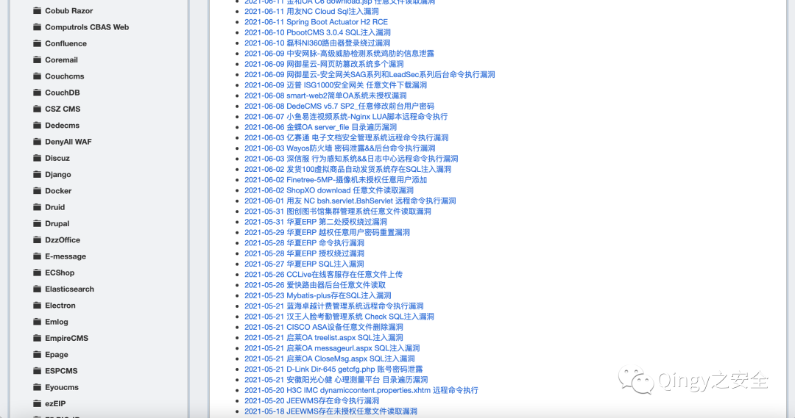

# 蓝海卓越计费管理系统 后台网络诊断Hostname命令注入

## 条目说明

- 对象与具体问题：蓝海卓越计费管理系统；后台网络诊断Hostname命令注入
- 版本、配置及部署条件：版本未知，文称网络接口不存在才可拼接，6070仅常见端口
- 认证与权限前提：后台登录
- 核验边界：已完成原始 Markdown 的文本审阅；未执行 PoC、未访问目标、未视检截图。来源所述影响与复现结果不等于本库独立验证。

## 证据边界与更正

以下记录原始资料的证据边界。可以由原文确定的产品、编号及格式问题已在本条修订；没有原始证据的版本、响应和补丁信息仍待核实。

- 与debug.php不同诊断入口，不能按产品+RCE去重
- 只有body无请求路由/方法，关键源码和返回都在未视检图
- 接口不存在疑指物理网卡非HTTP接口，术语需澄清；端口不作为影响条件
- 大量文库推广与授权公告，应去噪保留来源；缺修复/版本

## 操作风险

命令/代码执行示例可能改变主机状态。保留原示例供静态分析；仅可在明确授权的隔离测试环境验证，事先准备备份与回滚。

## 技术资料与来源记录

> 本文由 [简悦 SimpRead](http://ksria.com/simpread/) 转码， 原文地址 [mp.weixin.qq.com](https://mp.weixin.qq.com/s/Q2ltToW0qOyU1YVkeXWgyw)

**1、描述**

  

蓝海卓越计费管理系统公网已经爆出两个漏洞，任意文件读取和远程命令执行，本次为后台 RCE 漏洞。

  

  

  

  

  

**2、影响范围**

  

蓝海卓越计费管理系统

  

  

  

  

  

**3、FOFA**

  

app="蓝海卓越计费管理系统"

  

  

  

  

  


漏洞复现

漏洞存在点很简单，就是没有对输入的过滤  



执行拼接代码执行，这里有个点需要注意以下，就是接口不能存在，才能进行拼接，当接口不存在的时候，接口调用为空，则后面可以进行拼接



无任何其他的过滤操作

端口一般开在 6070

```
Hostname=114.114.114.114|ls -la&physicalInterface=1&pingCount=1
```





                     

漏洞文库：wiki.xypbk.com

免费授权已发放完毕，以后不定期发放授权。  
如有特殊需要请留言，或提交一篇自挖或公网未流出漏洞，即可获取授权  
如需投稿请后台回复 "投稿" 获取微信，添加微信后直接发送漏洞文章即可。







    本站开设的起因是因为某一次 HW，查漏洞真的太麻烦了，就想起来做了一个站点，本意就是自己用来快速检索漏洞详情的，为了方便大家就公开了，但是这样就又会被不法份子利用，和影响一些大佬的权益。  

    为防止黑产份子的非法利用漏洞，不给国家安全添麻烦，本站从此开启授权访问。

    如若因漏洞利用产生重大影响，会根据登录 IP、请求内容、申请授权等信息进行查证，查证后将对号主进行追责，故不要分享账号，终害己身。  

    虽然比较麻烦了些，但会稍微对黑产份子有一些限制，保证了本站安全，也保证国家安全。同时有些敏感东西也能第一时间放出来了，还请大家谅解。

    同时本站承诺永远不会出现买卖账号等利益相关的事情，本站永不割韭菜，永久免费检索，坚决抵制安全圈的歪风邪气。

    最后，若大家对此有意见请后台留言，本站将及时改正，若内容有侵犯您的权益，请及时提出，进行删除处理。  

    本站能坚持多久全看大家是否滥用，内容若更新较慢也请谅解，本人有工作有生活，会尽量坚持更新的。

  


扫取二维码获取

更多精彩


Qingy 之安全  


                                   


点个在看你最好看

---

> 来源：MrWQ/vulnerability-paper（https://github.com/MrWQ/vulnerability-paper）
