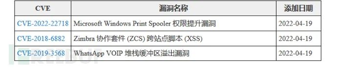

#  CISA 发出警告，攻击者正在利用Windows 漏洞   

<!-- article-review:devices:begin -->
## 技术校订与证据边界（2026-10-02）

- 产品/组件：Windows Print Spooler
- 本文讨论：CVE-2022-22718主；PrintNightmare与CLFS仅背景
- 版本、权限与配置前提：本地提权，2022年2月补丁；具体Windows版本未列
- 资料类型：KEV新闻；本次仅核对归档正文，未执行 PoC、未请求目标，未把原作者的“复现成功”继承为本库验证结果

### 逐项校订

- CISA是通报机构，不是受影响安全设备，应重分类Windows
- 新增另外两CVE只在图片，全文元数据缺主CVE；所有Windows版本过泛
- 修补三周需保留2022历史日期，FCEB适用范围不可扩大

### 操作风险与恢复

- 本篇未提供足以确认无副作用的完整验证流程；应依正文所述配置、权限与交互前提评估，不能把通告或截图当成可直接运行的检测脚本

### 待核与来源

- 官方KEV加入/截止日期与补丁KB待核
- 引用图片未查看，截图内容及有效性待核验
- 文内原始链接和图片引用继续保留；未检查图片像素、未下载或执行外部附件。版本边界、修复/在野状态及厂商归属若缺一手依据，均不能视为本次已确认
- 下方保留原技术正文与载荷；其中历史时间表述和成功主张应按本节限定阅读
<!-- article-review:devices:end -->

 关键基础设施安全应急响应中心   2022-04-22 14:30  
  
Bleeping Computer 消息称，美国网络安全和基础设施安全局（CISA）在其积极利用漏洞列表中新增三个安全漏洞，**其中包括 Windows Print Spooler 中的本地权限提升漏洞。**  
  
  
  
从微软发布的公告来看，此高严重性漏洞（被追踪为 CVE-2022-22718）会影响所有 Windows 版本，已于 2022 年 2 月被修补。  
  
值得一提的是，在 PrintNightmare 的技术细节和概念验证（POC）漏洞被意外泄露后，CISA 立刻警告管理员在域控制器和不用于打印的系统上禁用 Windows Print Spooler 服务，以阻止潜在的网络攻击。  
  
另外，从微软处获悉，攻击者能够利用 CVE-2022-22718 漏洞在本地进行低复杂度攻击，而无需用户互动。过去 12 个月里，Redmond 修补了其他几个 Windows Print Spooler 存在的漏洞，其中包括关键的PrintNightmare 远程代码执行漏洞。  
  
上周，CISA 将 Windows 通用日志文件系统驱动程序中另一个特权升级漏洞也添加到野外利用漏洞列表中，此漏洞由 CrowdStrike 和美国国家安全局（NSA）报告，目前微软已经修补。  
  
 联邦机构给予三周时间修补   
  
根据美国 11 月发布的一项具有项约束力操作指令（BOD 22-01），所有联邦民事行政部门机构（FCEB）都必须保护其系统，免受 CISA 已知利用漏洞 (KEV) 目录中安全漏洞的影响。  
  
尽管该指令只适用于美国联邦机构，但 CISA 强烈敦促所有在美机构立即修复 Windows Print Spooler 权限提升漏洞，以阻止潜在攻击者在其 Windows 系统上提升权限的企图。  
  
**CISA 给了美国机构三周时间，来修补被积极利用的 CVE-2022-22718 漏洞并阻止正在进行的利用尝试。**  
  
另外，美国网络安全机构在其 KEV 目录中增加了两个相对较早的安全漏洞，这些漏洞也在持续攻击中被滥用。  
  
  
  
据悉，BOD 22-01 约束性指令自发布以来，CISA 已将数百个安全漏洞添加到其积极利用漏洞列表中，同时也在积极敦促美国联邦机构尽快修补这些漏洞以防止网络攻击。  
  
**参考文章：**  
  
https://www.bleepingcomputer.com/news/security/cisa-warns-of-attackers-now-exploiting-windows-print-spooler-bug/  
  
  
  
原文来源：FreeBuf  
  
“投稿联系方式：孙中豪 010-82992251   sunzhonghao@cert.org.cn”  
  
  

---

> 来源：gelusus/wxvl（微信公众号漏洞文章自动归档，原文见文首链接）
