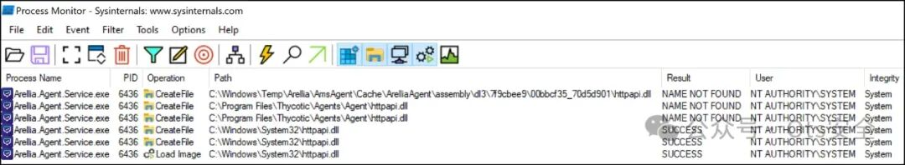
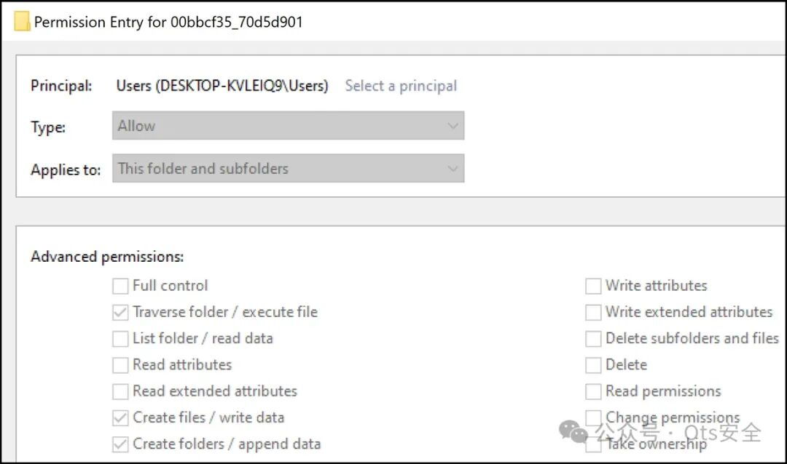
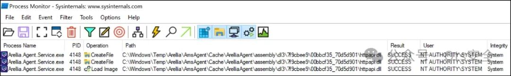
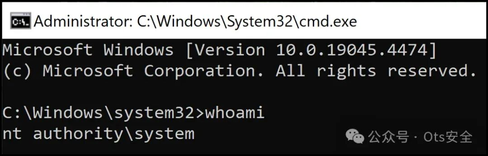
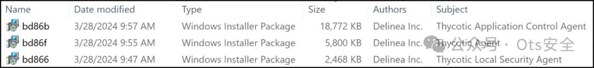
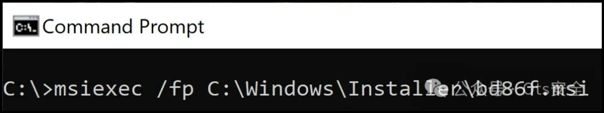
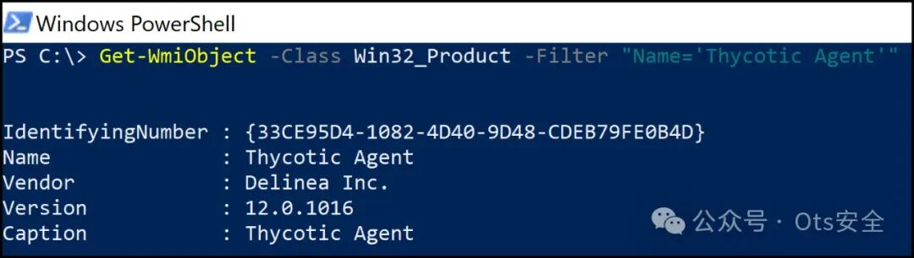
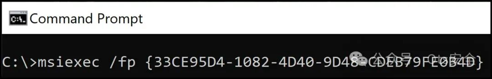

#  身份危机：Delinea 本地特权升级漏洞的奇怪案例   

<!-- article-review:devices:begin -->
## 技术校订与证据边界（2026-10-02）

- 产品/组件：Delinea Privilege Manager Windows Agent
- 本文讨论：CVE-2024-39708
- 版本、权限与配置前提：&lt;12.0.1096，本地低权可写缓存、服务重启/MSI修复触发，SYSTEM服务
- 资料类型：本地DLL劫持研究；本次仅核对归档正文，未执行 PoC、未请求目标，未把原作者的“复现成功”继承为本库验证结果

### 逐项校订

- 关键DACL、MSI修复命令和SYSTEM结果为图片，缺文本转录
- 特定cache哈希目录属于实例，不可硬编码为全部部署；Windows Temp子目录权限不能泛称全部默认继承可写

### 操作风险与恢复

- 本篇未提供足以确认无副作用的完整验证流程；应依正文所述配置、权限与交互前提评估，不能把通告或截图当成可直接运行的检测脚本

### 待核与来源

- 实际ACL、服务修复权限与受影响版本待核
- 引用图片未查看，截图内容及有效性待核验
- 文内原始链接和图片引用继续保留；未检查图片像素、未下载或执行外部附件。版本边界、修复/在野状态及厂商归属若缺一手依据，均不能视为本次已确认
- 下方保留原技术正文与载荷；其中历史时间表述和成功主张应按本节限定阅读
<!-- article-review:devices:end -->

 Ots安全   2024-07-27 16:39  
  
  
  
在最近的一次客户接触中，CyberArk Red Team 发现并利用了 Delinea 权限管理器（以前称为 Thycotic 权限管理器）中的特权提升 (EoP) 漏洞 ( CVE-2024-39708 )。此漏洞允许非特权用户以 SYSTEM 身份执行任意代码。作为我们致力于为安全社区做出贡献的承诺的一部分，CyberArk 负责任地向 Delinea 披露了此漏洞，包括漏洞利用概念验证 (POC) 代码。  
  
分析CVE-2024-39708  
  
适用于 Windows 12.0.1096 之前的版本 Delinea Privilege Manager 容易受到动态链接库 (DLL) 搜索顺序劫持漏洞的影响，该漏洞允许非特权用户以 SYSTEM 身份执行任意代码。  
  
代理服务启动后，会尝试从以下路径按顺序加载httpapi.dll ：  
- C:\Windows\Temp\Arellia\AmsAgent\Cache\ArelliaAgent\assembly\dl3\7f9cbee9\00bbcf35_70d5d901\  
  
- C:\Program Files\Thycotic\Agents\Agent\  
  
- C:\Windows\System32\  
  
如图 1 所示，代理服务在 Windows 临时目录和应用程序安装目录中找不到 DLL 后，成功从System32目录加载httpapi.dll 。  
  
  
  
图 1：DLL 搜索顺序 - 代理服务 httpapi.dll  
  
默认情况下，Windows 授予非特权用户将文件和文件夹写入C:\Windows\Temp 的权限，除非另有说明，否则此默认的自由访问控制列表 (DACL) 将被子目录继承。如图 2 所示，由于继承了 DACL，Users 组可以写入C:\Windows\Temp\Arellia\AmsAgent\Cache\ArelliaAgent\assembly\dl3\7f9cbee9\00bbcf35_70d5d901 中的文件和文件夹。  
  
  
  
图 2：用户权限  
  
**C:\Windows\Temp\Arellia\AmsAgent\Cache\ArelliaAgent\assembly\dl3\7f9cbee9\00bbcf35_70d5d901**  
  
由于 DACL 较弱，非特权用户可以在目录中植入自定义的httpapi.dll二进制文件，以便在服务重新启动时找到并加载该 DLL，从而以 SYSTEM 身份执行任意代码。  
  
  
  
图 3：DLL 搜索顺序劫持  
  
  
  
图4：以SYSTEM身份执行  
  
代理服务不允许非特权用户手动重启它；但是，我们可以通过重新启动系统或对某些 MSI 安装使用巧妙的技巧来强制重新启动服务并随后加载我们的 DLL。即使配置了NoModify设置（通过“应用程序和功能”Windows 设置禁用任何安装修改），也可以使用缓存的安装包或安装产品代码执行安装修复操作。  
  
使用 MSI 包安装软件时，Windows 会将包缓存在C:\Windows\Installer目录中，文件名由 Windows 安装程序选择。我们可以在命令行上通过识别目标安装的缓存包（例如，通过文件的Author 和 Subject属性）来执行修复操作。  
  
  
  
图 5：C:\Windows\Installer  
  
  
  
图 6：MSI 修复安装  
  
或者，可以从 WMI 数据库或 Windows 注册表中检索安装产品代码，并可以通过命令行或应用程序安装和服务Win32 API 执行修复操作。  
  
  
  
图 7：WMI 获取安装产品代码  
  
  
  
图 8：按产品代码安装 MSI 修复程序  
  
CVE-2024-39708 披露时间表  
  
2024 年 5 月 29 日：CyberArk 向 Delinea 报告了该漏洞并要求分配 CVE。  
  
2024 年 5 月 29 日：Delinea 承认收到了披露。  
  
2024 年 6 月 5 日：CyberArk 跟进 Delinea，确认使用提供的概念证明 (POC) 成功重现了该漏洞。  
  
2024 年 6 月 5 日：Delinea 确认正在内部测试修复方法。  
  
2024 年 6 月 11 日：CyberArk 收到 Delinea 的确认，确认分配 CVE。  
  
2024 年 7 月 1 日：Delinea 发布修复代理版本 12.0.1096。  
  
了解 CyberArk Red Team Services 用来模拟真实对手并防范漏洞的高级策略。探索CyberArk 上的 Red Team Services，详细了解这些策略如何帮助加强防御。  
  
```
Identity Crisis: The Curious Case of a Delinea Local Privilege Escalation Vulnerability
https://www.cyberark.com/resources/threat-research-blog/identity-crisis-the-curious-case-of-a-delinea-local-privilege-escalation-vulnerability
```  
  
  
  
  
感谢您抽出  
  
  
  
.  
  
  
  
.  
  
  
  
来阅读本文  
  
  
  
**点它，分享点赞在看都在这里**  
  


---

> 来源：gelusus/wxvl（微信公众号漏洞文章自动归档，原文见文首链接）
