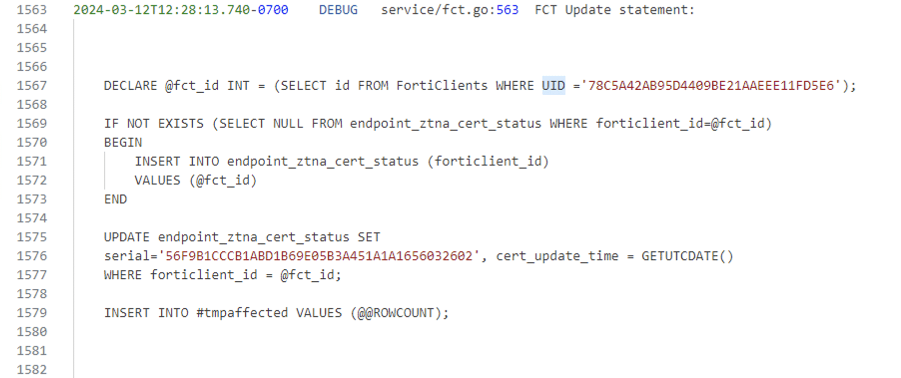

# （CVE-2023-48788）Fortinet FortiClientEMS SQL 注入致远程代码执行漏洞

<!-- article-review:devices:begin -->
## 技术校订与证据边界（2026-10-02）

- 产品/组件：Fortinet FortiClientEMS FcmDaemon/DAS Windows
- 本文讨论：CVE-2023-48788
- 版本、权限与配置前提：TCP8013可达，7.0.1–7.0.10/7.2.0–7.2.2，修复7.0.11/7.2.3；xp_cmdshell权限与SQL服务身份
- 资料类型：SQL注入至RCE汇编；本次仅核对归档正文，未执行 PoC、未请求目标，未把原作者的“复现成功”继承为本库验证结果

### 逐项校订

- 称README HTTP200即可运行/有效混淆链接可达与PoC正确性；本审阅不继承已验证声明
- 命令行和MSG_HEADER示意声称原文，需对仓库实际脚本参数/协议逐项核查
- 普通FCKARPLY响应不应独自判漏洞；SYSTEM权限需对应SQL服务账户，不能由FcmDaemon身份直接推出
- 官方9.3与NVD9.8应给评分版本/向量避免冲突

### 操作风险与恢复

- 本篇未提供足以确认无副作用的完整验证流程；应依正文所述配置、权限与交互前提评估，不能把通告或截图当成可直接运行的检测脚本

### 待核与来源

- 固定提交的脚本参数、真实请求/判据、评分及截图来源待原源核验
- 引用图片未查看，截图内容及有效性待核验
- 文内原始链接和图片引用继续保留；未检查图片像素、未下载或执行外部附件。版本边界、修复/在野状态及厂商归属若缺一手依据，均不能视为本次已确认
- 下方保留原技术正文与载荷；其中历史时间表述和成功主张应按本节限定阅读
<!-- article-review:devices:end -->

一、漏洞简介
------------

2024 年 3 月 12 日，Fortinet 发布安全公告 FG-IR-24-007，披露
FortiClientEMS 的 SQL 注入漏洞 CVE-2023-48788。horizon3ai Attack Team
随后发布了完整技术深挖与可运行的公开 PoC；CISA 将其列入 KEV 目录，
确认在野利用。

漏洞位于 FcmDaemon 服务（**TCP 8013**）：其消息头 `FCTUID` 参数存在
SQL 注入（CWE-89），攻击者**无需认证**发送特制注册消息，经 DAS 组件
注入 SQL 并启用 `xp_cmdshell`，最终以 **SYSTEM 权限**在 Windows 服务器
上执行任意命令。CVSS 3.1 评分为 **9.8**（NVD；Fortinet 官方评级 9.3）。

*上图：horizon3ai PoC 发送注入报文并判定目标存在漏洞（来源：
horizon3ai 公开 PoC 仓库，已本地化保存）。*

二、漏洞影响
------------

-   产品：Fortinet FortiClientEMS（Windows 服务端）
-   版本：**7.0.1–7.0.10、7.2.0–7.2.2**
    （修复版：7.0.11+ / 7.2.3+，以 Fortinet 官方公告为准）
-   组件/攻击向量：远程，FcmDaemon TCP 8013，`FCTUID` 消息头 SQL 注入 →
    DAS 组件 → `xp_cmdshell` → SYSTEM 命令执行
-   前提条件：无，攻击者无需任何凭证；8013 端口需网络可达

三、复现过程
------------

### 漏洞分析

FortiClientEMS 的 FcmDaemon 负责处理终端注册消息。horizon3ai 的分析
指出，服务端在拼接 SQL 时未对 `FCTUID` 消息头做任何过滤，攻击者注入
`' OR 1=1 --` 即可操纵查询；进一步通过 DAS（Data Access Service）
组件执行堆叠 SQL，调用 `xp_cmdshell` 将 SQL 注入升级为操作系统命令
执行，且服务以 SYSTEM 权限运行，一步到位拿到最高权限。

### PoC（来源：https://github.com/horizon3ai/CVE-2023-48788，仅限授权测试）

仓库 README 已实际打开验证（HTTP 200），含可运行的 Python exploit：

    python3 CVE-2023-48788.py -t 192.168.1.3 -p 8013

脚本构造的恶意注册消息关键部分（来源：仓库 README 原文）：

    MSG_HEADER: FCTUID=CBE8FC122B1A46D18C3541E1A8EFF7BD' OR 1=1 --
    IP=127.0.0.1
    MAC=00-50-56-11-22-33
    ...
    X-FCCK-REGISTER: SYSINFO||...

服务端返回 `FCKARPLY` 且脚本输出 `[+] The target is vulnerable!` 即判定
存在漏洞；在此基础上可继续通过 SQL 注入执行系统命令。

四、修复建议
------------

1.  升级到修复版本（7.0.11+ / 7.2.3+）；
2.  限制 TCP 8013 仅允许受管终端网段访问，不要暴露在互联网；
3.  检查 EMS 服务器数据库与系统日志中的异常 `xp_cmdshell` 调用、可疑
    进程，按 horizon3ai 文章中的 IoC 排查是否已被利用。

### 附录

参考链接：

-   Fortinet 公告 FG-IR-24-007：https://www.fortiguard.com/psirt/FG-IR-24-007
-   horizon3ai 技术深挖：https://www.horizon3.ai/attack-research/cve-2023-48788-fortinet-forticlientems-sql-injection-deep-dive
-   公开 PoC：https://github.com/horizon3ai/CVE-2023-48788
