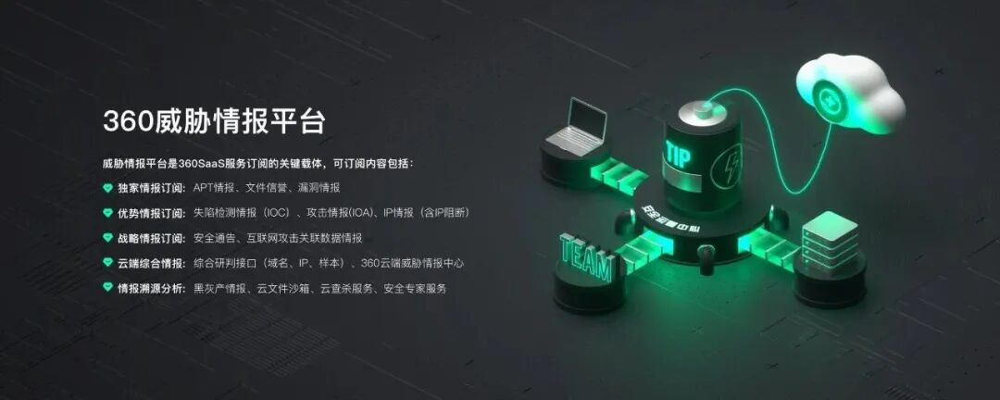

#  CVE-2023-3079：Google V8类型混淆漏洞通告   

<!-- article-review:devices:begin -->
## 技术校订与证据边界（2026-10-02）

- 产品/组件：Google Chrome V8
- 本文讨论：CVE-2023-3079
- 版本、权限与配置前提：Win&lt;114.0.5735.110、Mac/Linux&lt;114.0.5735.106；网页触发
- 资料类型：浏览器CERT公告；本次仅核对归档正文，未执行 PoC、未请求目标，未把原作者的“复现成功”继承为本库验证结果

### 逐项校订

- 安全设备分类错误，360是通报方及营销产品
- 设备完全控制省略浏览器沙箱/第二链前提
- 通用建议统一110与平台修复表不同，应按平台；评分8.8为360评级须保留来源
- 大段产品营销非补丁证据

### 操作风险与恢复

- 本篇未提供足以确认无副作用的完整验证流程；应依正文所述配置、权限与交互前提评估，不能把通告或截图当成可直接运行的检测脚本

### 待核与来源

- 官方评分/在野措辞及各平台范围待核
- 引用图片未查看，截图内容及有效性待核验
- 文内原始链接和图片引用继续保留；未检查图片像素、未下载或执行外部附件。版本边界、修复/在野状态及厂商归属若缺一手依据，均不能视为本次已确认
- 下方保留原技术正文与载荷；其中历史时间表述和成功主张应按本节限定阅读
<!-- article-review:devices:end -->

原创 360CERT  三六零CERT   2023-06-06 15:30  
  
**赶紧点击上方话题进行订阅吧！**  
  
报告编号：CERT-R-2023-201  
  
报告来源：360CERT  
  
报告作者：360CERT  
  
更新日期：2023-06-06  
  
1  
  
 漏洞简述  
  
  
  
  
2023年06月06日，360CERT监测发现Google官方发布了Google Chrome的风险通告，漏洞编号为CVE-2023-3079，漏洞等级：高危，漏洞评分：8.8。该漏洞已出现在野利用。  
  
Google Chrome是由Google开发的免费网页浏览器。Chrome代码是基于其他开放源代码软件所编写，包括Apple WebKit和Mozilla Firefox，并开发出称为“V8”的高性能JavaScript引擎。  
  
对此，360CERT建议广大用户及时将Google Chrome升级到最新版本。与此同时，请做好资产自查以及预防工作，以免遭受黑客攻击。  
  
2  
  
 风险等级  
  
  
  
  
360CERT对该漏洞的评定结果如下  
<table><tbody style="margin: 0px;padding: 0px;border-width: 0px;border-style: initial;border-color: initial;"><tr style="border-width: 1px 0px 0px;border-right-style: initial;border-bottom-style: initial;border-left-style: initial;border-right-color: initial;border-bottom-color: initial;border-left-color: initial;border-top-style: solid;border-top-color: rgb(204, 204, 204);background-color: white;margin: 0px;padding: 0px;"><th style="font-size: 12px;border-width: 1px;border-style: solid;border-color: rgb(204, 204, 204);margin: 0px;padding: 0.5em 1em;word-break: unset;">评定方式</th><th style="font-size: 12px;border-width: 1px;border-style: solid;border-color: rgb(204, 204, 204);margin: 0px;padding: 0.5em 1em;word-break: unset;">等级</th></tr><tr style="border-width: 1px 0px 0px;border-right-style: initial;border-bottom-style: initial;border-left-style: initial;border-right-color: initial;border-bottom-color: initial;border-left-color: initial;border-top-style: solid;border-top-color: rgb(204, 204, 204);background-color: white;margin: 0px;padding: 0px;"><td style="text-align: center !important;">威胁等级</td><td style="text-align: center !important;">高危</td></tr><tr style="border-width: 1px 0px 0px;border-right-style: initial;border-bottom-style: initial;border-left-style: initial;border-right-color: initial;border-bottom-color: initial;border-left-color: initial;border-top-style: solid;border-top-color: rgb(204, 204, 204);background-color: white;margin: 0px;padding: 0px;"><td style="text-align: center !important;">影响面</td><td style="text-align: center !important;">广泛</td></tr><tr style="border-width: 1px 0px 0px;border-right-style: initial;border-bottom-style: initial;border-left-style: initial;border-right-color: initial;border-bottom-color: initial;border-left-color: initial;border-top-style: solid;border-top-color: rgb(204, 204, 204);background-color: white;margin: 0px;padding: 0px;"><td style="text-align: center !important;">攻击者价值</td><td style="text-align: center !important;">高</td></tr><tr style="border-width: 1px 0px 0px;border-right-style: initial;border-bottom-style: initial;border-left-style: initial;border-right-color: initial;border-bottom-color: initial;border-left-color: initial;border-top-style: solid;border-top-color: rgb(204, 204, 204);background-color: white;margin: 0px;padding: 0px;"><td style="text-align: center !important;">利用难度</td><td style="text-align: center !important;">低</td></tr><tr style="border-width: 1px 0px 0px;border-right-style: initial;border-bottom-style: initial;border-left-style: initial;border-right-color: initial;border-bottom-color: initial;border-left-color: initial;border-top-style: solid;border-top-color: rgb(204, 204, 204);background-color: white;margin: 0px;padding: 0px;"><td style="text-align: center !important;">360CERT评分</td><td style="text-align: center !important;">8.8</td></tr></tbody></table>  
  
3  
  
 漏洞详情  
  
  
  
  
### CVE-2023-3079: Google Chrome V8类型混淆漏洞  
  
组件: Google:Chrome for Windows, Google:Chrome for Mac and Linux  
  
漏洞类型: 类型混淆  
  
实际影响: 任意代码执行  
  
主要影响: 设备完全控制  
  
简述: 该漏洞为Chrome V8 JavaScript 引擎中的类型混淆漏洞，此类漏洞通常会在成功读取或写入超出缓冲区边界的内存后导致浏览器崩溃或执行任意代码。  
  
4  
  
 影响版本  
  
  
  
  
### CVE-2023-3079  
<table><tbody style="margin: 0px;padding: 0px;border-width: 0px;border-style: initial;border-color: initial;"><tr style="border-width: 1px 0px 0px;border-right-style: initial;border-bottom-style: initial;border-left-style: initial;border-right-color: initial;border-bottom-color: initial;border-left-color: initial;border-top-style: solid;border-top-color: rgb(204, 204, 204);background-color: white;margin: 0px;padding: 0px;"><th style="font-size: 12px;border-width: 1px;border-style: solid;border-color: rgb(204, 204, 204);margin: 0px;padding: 0.5em 1em;word-break: unset;">组件</th><th style="font-size: 12px;border-width: 1px;border-style: solid;border-color: rgb(204, 204, 204);margin: 0px;padding: 0.5em 1em;word-break: unset;">影响版本</th><th style="font-size: 12px;border-width: 1px;border-style: solid;border-color: rgb(204, 204, 204);margin: 0px;padding: 0.5em 1em;word-break: unset;" width="145">安全版本</th></tr><tr style="border-width: 1px 0px 0px;border-right-style: initial;border-bottom-style: initial;border-left-style: initial;border-right-color: initial;border-bottom-color: initial;border-left-color: initial;border-top-style: solid;border-top-color: rgb(204, 204, 204);background-color: white;margin: 0px;padding: 0px;"><td style="text-align: center !important;">Google:Chrome for Windows</td><td style="text-align: center !important;">&lt; 114.0.5735.110</td><td style="text-align: center !important;" width="21">&gt;= 114.0.5735.110</td></tr><tr style="border-width: 1px 0px 0px;border-right-style: initial;border-bottom-style: initial;border-left-style: initial;border-right-color: initial;border-bottom-color: initial;border-left-color: initial;border-top-style: solid;border-top-color: rgb(204, 204, 204);background-color: white;margin: 0px;padding: 0px;"><td style="text-align: center !important;">Google:Chrome for Mac and Linux</td><td style="text-align: center !important;">&lt; 114.0.5735.106</td><td style="text-align: center !important;" width="21">&gt;= 114.0.5735.106</td></tr></tbody></table>  
  
5  
  
 修复建议  
  
  
  
  
### 通用修补建议  
  
建议用户更新到114.0.5735.110以阻止潜在威胁。还建议 Microsoft Edge、Brave、Opera 和 Vivaldi 等基于 Chromium 的浏览器的用户在修复可用时应用这些修复。  
  
6  
  
 产品侧解决方案  
  
  
  
  
若想了解更多产品信息或有相关业务需求，可移步至http://360.net。  
### 360企业安全浏览器  
  
360企业安全浏览器相比传统浏览器，360企业安全浏览器兼集中管控、企业数据防护、安全大脑赋能、跨平台适配、商用密码算法支持、应用兼容等六大特点。请用户前往360企业安全浏览器获取对应产品。  
  
### 360威胁情报平台（TIP）  
  
360威胁情报平台（TIP）一款构建全面情报管理、赋能、评价、分享能力的新一代本地化情报平台。可以用来增强对关键威胁的检测；可以自动化识别报警中的重点事件；还可以提供情报分析、外部攻击面管理、行业威胁情报等高阶能力，帮助组织全面应对数字时代的安全风险。  
  
### 360安全分析响应平台  
  
360安全大脑的安全分析响应平台通过网络流量检测、多传感器数据融合关联分析手段，对该类漏洞的利用进行实时检测和阻断，请用户联系相关产品区域负责人获取对应产品。  
  
### 360本地安全大脑  
  
360本地安全大脑是将360云端安全大脑核心能力本地化部署的一套开放式全场景安全运营平台，实现安全态势、监控、分析、溯源、研判、响应、管理的智能化安全运营赋能。360本地安全大脑已支持对相关漏洞利用的检测，请及时更新网络神经元（探针）规则和本地安全大脑关联分析规则，做好防护。  
  
  
  
7  
  
 时间线  
  
  
  
  
**2023-6-5** Google官方发布通告  
  
**2023-6-6** 360CERT发布通告  
  
8  
  
 参考链接  
  
  
  
  
1、 https://chromereleases.googleblog.com/2023/06/stable-channel-update-for-desktop.html  
  
9  
  
 特制报告相关说明  
  
  
  
  
一直以来，360CERT对全球重要网络安全事件进行快速通报、应急响应。为更好地为政企用户提供最新漏洞以及信息安全事件的安全通告服务，现360CERT推出了安全通告特制版报告订阅服务，以便用户做资料留存、传阅研究与查询验证。  
  
今后特制报告将不再提供公开下载，用户可扫描下方二维码进行服务订阅。  
  
  
  
  
  
  
360CERT  
https://cert.360.cn/  
  
进入官网查看更多资讯  
  
长按扫码关注我们  
  
  
  
  
  
  
  
点击在看，进行分享  
  
  
  
  

---

> 来源：gelusus/wxvl（微信公众号漏洞文章自动归档，原文见文首链接）
