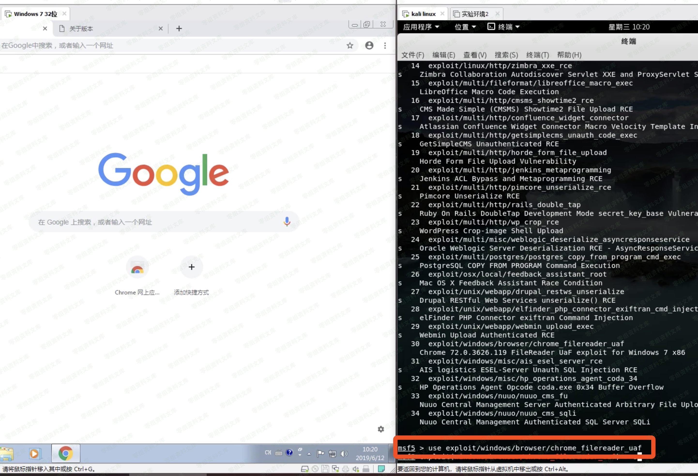
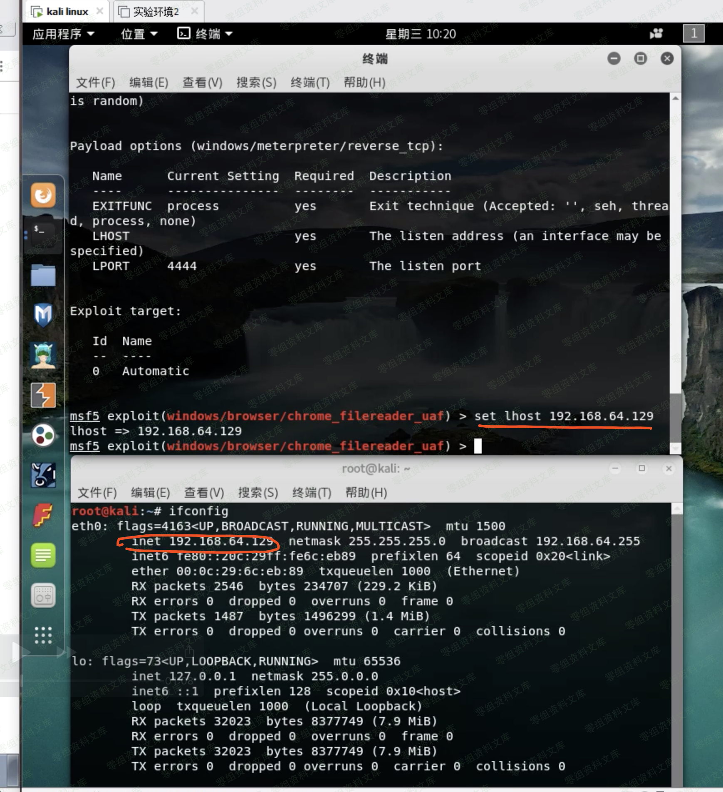
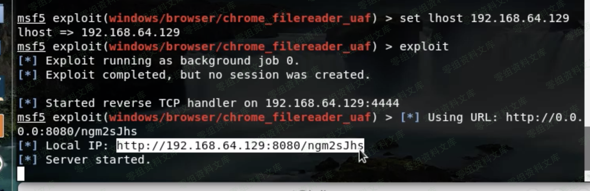

# （CVE-2019-5786）Chrome 远程代码执行漏洞

<!-- article-review:devices:begin -->
## 技术校订与证据边界（2026-10-02）

- 产品/组件：Chrome FileReader与Windows win32k链
- 本文讨论：CVE-2019-5786主；2019-0808沙箱逃逸链
- 版本、权限与配置前提：测试Win7 x86 Chrome72.0.3626.119；用户访问链接
- 资料类型：截图式浏览器利用演示；本次仅核对归档正文，未执行 PoC、未请求目标，未把原作者的“复现成功”继承为本库验证结果

### 逐项校订

- 影响版本写72.0.3626.121或更高，与旧版测试及修复意义反转
- 一图引用2020-6404资源，图片归属疑错配；多图片后残留路径片段，末尾仅image占位
- 缺MSF模块名/代码/来源，单5786与完整逃逸链不可混同
- 安全设备分类错误
- 已落实的文本修订：补齐文章标题。上列仍描述旧文问题时，以此落实项及下列限定为准；修订不代表运行验证

### 操作风险与恢复

- 本篇未提供足以确认无副作用的完整验证流程；应依正文所述配置、权限与交互前提评估，不能把通告或截图当成可直接运行的检测脚本

### 待核与来源

- 图片内容、模块和官方修复边界待核
- 引用图片未查看，截图内容及有效性待核验
- 文内原始链接和图片引用继续保留；未检查图片像素、未下载或执行外部附件。版本边界、修复/在野状态及厂商归属若缺一手依据，均不能视为本次已确认
- 下方保留原技术正文与载荷；其中历史时间表述和成功主张应按本节限定阅读
<!-- article-review:devices:end -->

（CVE-2019-5786）Chrome 远程代码执行漏洞
========================================

一、漏洞简介
------------

攻击者利用该漏洞配合一个win32k.sys的内核提权（CVE-2019-0808
）可以在win7上穿越Chrome沙箱

二、漏洞影响
------------

72.0.3626.121或更高版本

三、复现过程
------------

测试环境为：

    win7 x86
    谷歌浏览器版本为72.0.3626.119

Chrome远程代码执行漏洞/media/rId24.png)

这里看一下参数说明

Chrome远程代码执行漏洞/media/rId25.png)

设置lhost为我们的本机ip

Chrome远程代码执行漏洞/media/rId26.png)

执行exploit之后，会返回一个链接

Chrome远程代码执行漏洞/media/rId27.png)

只要被攻击者访问了这个链接，就会触发漏洞，返回session

image
