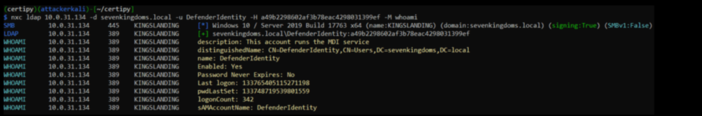

#  Microsoft Defender for Identity 漏洞可致未授权权限提升  

<!-- article-review:devices:begin -->
## 技术校订与证据边界（2026-10-02）

- 产品/组件：Microsoft Defender for Identity传感器
- 本文讨论：CVE-2025-26685；ADCS ESC8是环境配置链
- 版本、权限与配置前提：DNS注册、网络访问、触发DC事件；需可中继目标/ADCS配置才能升级
- 资料类型：MDI认证诱导链分析新闻；本次仅核对归档正文，未执行 PoC、未请求目标，未把原作者的“复现成功”继承为本库验证结果

### 逐项校订

- 捕获Net-NTLM响应不等于可事后离线中继哈希，应区分实时中继与离线破解
- 获取TGT通常需证书/密钥后续条件，不能捕获即得
- 迁移v3与传统传感器改WMI混叙，缺具体修复版本；只给二手链接无NetSPI/MSRC

### 操作风险与恢复

- 本篇未提供足以确认无副作用的完整验证流程；应依正文所述配置、权限与交互前提评估，不能把通告或截图当成可直接运行的检测脚本

### 待核与来源

- 官方传感器变更、gMSA仅降低破解不阻止中继及实际权限待核
- 引用图片未查看，截图内容及有效性待核验
- 文内原始链接和图片引用继续保留；未检查图片像素、未下载或执行外部附件。版本边界、修复/在野状态及厂商归属若缺一手依据，均不能视为本次已确认
- 下方保留原技术正文与载荷；其中历史时间表述和成功主张应按本节限定阅读
<!-- article-review:devices:end -->

邑安科技  邑安全   2025-06-16 08:34  
  
更多全球网络安全资讯尽在邑安全  
  
  
  
NetSPI 研究人员详细披露了 Microsoft Defender for Identity（MDI）中的欺骗漏洞（CVE-2025-26685）。该漏洞虽无法单独利用，但与其他漏洞结合时可能使攻击者无需认证即可在 Active Directory 环境中实现权限提升。  
  
漏洞原理分析  
  
该漏洞源于 MDI 传感器（用于监控横向移动路径）查询网络系统的方式。NetSPI 证实，具备网络访问权限的攻击者可伪装成目标系统，操纵 SAM-R 协议，诱使 MDI 向攻击者机器发起认证。  
  
研究指出："认证过程使用 SAM-R 协议，可将认证方式从 Kerberos 降级为 NTLM，导致域服务账户（DSA）的 Net-NTLM 哈希值被截获。"  
  
攻击链实现  
  
获取 Net-NTLM 哈希值后，攻击者可进行离线破解或用于 NTLM 中继攻击，从而请求 Kerberos 票据授予票据（TGT），甚至通过 ADCS（Active Directory 证书服务）配置错误获取证书。  
  
成功利用此漏洞需满足两个前提条件：  
- 攻击者系统必须通过手动或 Windows DHCP 集成方式在 DNS 中注册  
  
- 攻击者需通过向域控制器发起空会话连接来触发特定 Windows 事件 ID（Event ID）  
  
NetSPI 解释称："MDI 传感器将向攻击者系统进行认证，并通过查询本地管理员组成员来尝试映射本地管理路径（LMP）。"  
  
实际攻击演示  
  
实验室测试中，NetSPI 使用 Impacket、Certipy 和 NetExec 等工具，将 CVE-2025-26685 与 ESC8 等已知 ADCS 漏洞结合实现权限提升。攻击者通过中继捕获的哈希值，以 DSA 上下文请求证书，最终实现域级枚举或操控。  
  
微软修复建议  
  
微软建议从传统 MDI 传感器迁移至统一 XDR 传感器（v3.x），该版本完全规避了存在漏洞的 SAM-R 协议。报告指出："传统 MDI 传感器将不再使用 SAM-R 查询，改为采用强制 Kerberos 认证的 WMI 查询。"  
  
其他防御措施包括：  
  
将 DSA 配置为组托管服务账户（gMSA）以降低离线破解风险  
  
如非业务必需，可通过微软支持禁用 LMP 数据收集功能  
  
监控事件 ID 4624 及异常的 DSA 认证来源  
  
原文来自: securityonline.info  
  
原文链接:   
https://securityonline.info/microsoft-defender-for-identity-flaw-cve-2025-26685-allows-unauthenticated-privilege-escalation/  
  
欢迎收藏并分享朋友圈，让五邑人网络更安全  
  
  
  
欢迎扫描关注我们，及时了解最新安全动态、学习最潮流的安全姿势！  
  
推荐文章  
  
1  
  
[新永恒之蓝？微软SMBv3高危漏洞（CVE-2020-0796）分析复现](http://mp.weixin.qq.com/s?__biz=MzUyMzczNzUyNQ==&mid=2247488913&idx=1&sn=acbf595a4a80dcaba647c7a32fe5e06b&chksm=fa39554bcd4edc5dc90019f33746404ab7593dd9d90109b1076a4a73f2be0cb6fa90e8743b50&scene=21#wechat_redirect)  
  
  
2  
  
[重大漏洞预警：ubuntu最新版本存在本地提权漏洞（已有EXP）　](http://mp.weixin.qq.com/s?__biz=MzUyMzczNzUyNQ==&mid=2247483652&idx=1&sn=b2f2ec90db499e23cfa252e9ee743265&chksm=fa3941decd4ec8c83a268c3480c354a621d515262bcbb5f35e1a2dde8c828bdc7b9011cb5072&scene=21#wechat_redirect)  
  
  
  
  
  

---

> 来源：gelusus/wxvl（微信公众号漏洞文章自动归档，原文见文首链接）
