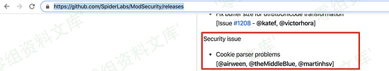
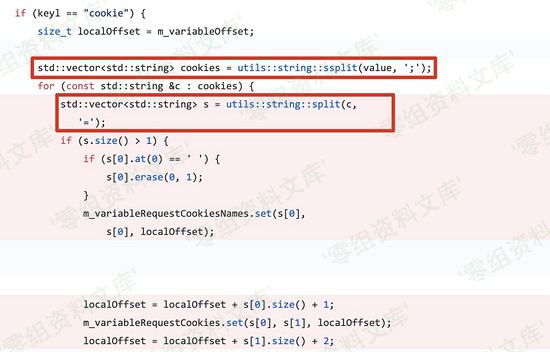
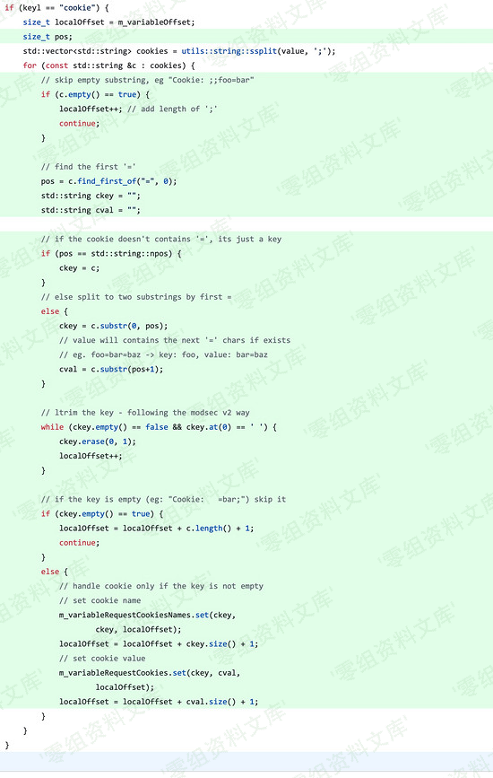
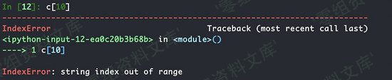
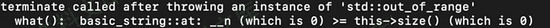

# （CVE-2019-19886）ModSecurity 拒绝服务漏洞

<!-- article-review:devices:begin -->
## 技术校订与证据边界（2026-10-02）

- 产品/组件：ModSecurity v3
- 本文讨论：CVE-2019-19886 Cookie处理DoS
- 版本、权限与配置前提：3.0–3.0.3，恶意Cookie经启用ModSecurity解析，反复触发可耗工作线程
- 资料类型：WAF补丁差异分析；本次仅核对归档正文，未执行 PoC、未请求目标，未把原作者的“复现成功”继承为本库验证结果

### 逐项校订

- 根因源代码/补丁及崩溃证据全在图片，正文数组越界仅类比应核精确机制
- 未明确安全发行版本，只有合并master提交；图片后多余路径
- 已落实的文本修订：补齐文章标题。上列仍描述旧文问题时，以此落实项及下列限定为准；修订不代表运行验证

### 操作风险与恢复

- 畸形输入可能使进程/内核崩溃、设备重启或服务不可用；本文崩溃线索不自动证明稳定代码执行，需隔离环境和可恢复配置

### 待核与来源

- 对应引擎/connector、崩溃影响和修复版本待核
- 引用图片未查看，截图内容及有效性待核验
- 文内原始链接和图片引用继续保留；未检查图片像素、未下载或执行外部附件。版本边界、修复/在野状态及厂商归属若缺一手依据，均不能视为本次已确认
- 下方保留原技术正文与载荷；其中历史时间表述和成功主张应按本节限定阅读
<!-- article-review:devices:end -->

（CVE-2019-19886）ModSecurity 拒绝服务漏洞
==========================================

一、漏洞简介
------------

2020年1月20日，Trustwave
SpiderLabs公开了其维护的开源WAF引擎ModSecurity的1个拒绝服务（DoS）漏洞，漏洞编号为：CVE-2019-19886。此漏洞影响ModSecurity的3.0到3.0.3版本。

二、漏洞影响
------------

ModSecurity 3.0到3.0.3版本

三、复现过程
------------

### 漏洞分析

通过Github项目的releases跟踪:
https://github.com/SpiderLabs/ModSecurity/releases

ModSecurity拒绝服务漏洞/media/rId25.png)

发现了airween的一个pr:
https://github.com/SpiderLabs/ModSecurity/pull/2201

被官方采纳并归并到了 `v3/master`

ModSecurity拒绝服务漏洞/media/rId26.png)

来看看他究竟修改了什么:
https://github.com/SpiderLabs/ModSecurity/pull/2201/commits/c7ad6c7613de3c1ac2ad1b4055f0ded22b522027

存在漏洞的代码如下：

ModSecurity拒绝服务漏洞/media/rId27.png)

可以看见这里将Cookie的值带入代码，先以 `;`
符号进行分割，进入for循环，再以 `=`
符号进行分割赋值，而后使用正常数组下标的表达方式进入功能中，那么问题出在了哪里？

我们再来看修复的代码：

ModSecurity拒绝服务漏洞/media/rId28.png)

简单阅读代码和注释就能了解到，它就是处理两种非正常的Cookie值:
`Cookie: ;;foo=bar` \\ `Cookie: =bar;`

换句话说就是ModSecurity原来在处理Cookie内容的时候过于信任用户的输入，这也是安全的一个大忌讳:
**一切用户的输入都是不可信的** ！

为什么会拒绝服务呢？可以理解为数组越界，类似:

ModSecurity拒绝服务漏洞/media/rId29.png)

### 漏洞复现

很明显，通过漏洞跟踪已经知道了漏洞攻击方式那就是构建恶意(畸形)的
`Cookie` 头

Curl命令测试: `curl -s -H 'Cookie: =test' 'http://test/'`

ModSecurity拒绝服务漏洞/media/rId31.png)

根据奇安信CERT的描述: `不断向服务器发送此类请求将使工作线程反复崩溃`
，那我们可以重复这个请求造成拒绝服务效果。

参考链接
--------

> https://gh0st.cn/archives/2020-01-24/1
