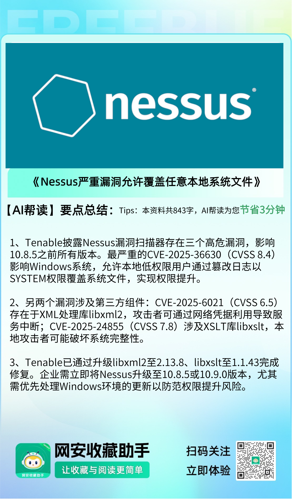

#  Nessus严重漏洞允许覆盖任意本地系统文件  

<!-- article-review:devices:begin -->
## 技术校订与证据边界（2026-10-02）

- 产品/组件：Nessus Windows与内置libxml2/libxslt
- 本文讨论：CVE-2025-36630主；6021/24855组件更新
- 版本、权限与配置前提：≤10.8.4，10.8.5/10.9.0修复；36630需本地低权，Windows
- 资料类型：Nessus三漏洞公告新闻；本次仅核对归档正文，未执行 PoC、未请求目标，未把原作者的“复现成功”继承为本库验证结果

### 逐项校订

- 概要代码块多次重复CVE与评分、空代码块，明显抓取损坏
- libxslt7.8分与文给AV:L/AC:H/PR:N/UI:N/S:C/C:N/I:H/A:H不应未经重算当同一向量
- 任意覆盖文件可致提权需执行链，不等于覆盖即获得SYSTEM会话
- 仅二手新闻链接，组件是否同平台影响需分开

### 操作风险与恢复

- 本篇未提供足以确认无副作用的完整验证流程；应依正文所述配置、权限与交互前提评估，不能把通告或截图当成可直接运行的检测脚本

### 待核与来源

- Tenable公告、CVSS向量和libxml2回移补丁证据待核
- 引用图片未查看，截图内容及有效性待核验
- 文内原始链接和图片引用继续保留；未检查图片像素、未下载或执行外部附件。版本边界、修复/在野状态及厂商归属若缺一手依据，均不能视为本次已确认
- 下方保留原技术正文与载荷；其中历史时间表述和成功主张应按本节限定阅读
<!-- article-review:devices:end -->

 FreeBuf   2025-07-02 11:03  
  
  
  
  
  
  
  
Tenable最新发布的安全公告披露了Nessus漏洞扫描器中存在的严重漏洞，攻击者可能通过权限提升攻击危害Windows系统。  
  
  
这些安全漏洞影响10.8.5之前的所有Nessus版本，包括一个关键的Windows特定漏洞(CVE-2025-36630)以及第三方组件libxml2和libxslt中的两个额外漏洞。  
  
  
**Part01**  
## 漏洞概要  

> 资料补充（非原文复原）：[Tenable TNS-2025-13](https://www.tenable.com/security/tns-2025-13) 列出本页所涉漏洞、组件更新和 Nessus 10.8.5/10.9.0 修复信息。归档的无内容围栏已清理，下列摘要原值保留。

  
```
1、CVE-2025-36630
```  
```
CVSSv3评分：8.4，影响Nessus 10.8.4及更早版本，允许提升至SYSTEM权限)
CVSSv3评分：8.4，
```  
```
2、CVE-2025-6021
```  
```
CVSSv3评分：6.5，影响Nessus 10.8.4及更早版本，Nessus底层XML处理功能使用的libxml2第三方组件漏洞
CVSSv3评分：6.5，
CVSSv3评分：6.5，

```  
```
3、CVE-2025-24855
3、CVE-2025-24855
CVE-2025-24855
```  
```
CVSSv3评分：7.8，影响Nessus 10.8.4及更早版本，Nessus XSLT转换操作使用的libxslt第三方组件漏洞  
CVSSv3评分：7.8，影响Nessus 10.8.4及更早版本，Nessus XSLT转换操作使用的libxslt第三方组件漏洞  
CVSSv3评分：7.8，影响Nessus 10.8.4及更早版本，Nessus XSLT转换操作使用的libxslt第三方组件漏洞  
CVSSv3评分：7.8，
CVSSv3评分：7.8，
CVSSv3评分：7.8，
Nessus 10.8.4及更早版本，Nessus XSLT转换操作使用的libxslt第三方组件漏洞  
  
  
```  
  
这些漏洞的CVSS评分介于6.5至8.4之间，对依赖Nessus进行安全评估的组织构成重大威胁。  
  
  
**Part02**  
### Windows权限提升漏洞  
  
  
最严重的漏洞编号为CVE-2025-36630，影响10.8.4 及之前版本的Windows系统Nessus安装。该高危漏洞使非管理员用户能够利用日志内容以SYSTEM权限覆盖任意本地系统文件，实质上允许权限提升攻击。该漏洞CVSSv3基础评分为8.4，属于高严重性级别，具有重大潜在影响。  
  
  
该漏洞的攻击向量被描述为需要本地访问且复杂度低(AV:L/AC:L/PR:L/UI:N/S:C/C:N/I:H/A:H)，表明攻击者需要低级别权限但无需用户交互即可利用该漏洞。影响范围标记为"已更改"，意味着该漏洞可能影响超出其原始安全上下文的资源。安全研究员Rishad Sheikh于2025年5月10日向Tenable报告了该关键漏洞。  
  
****  
**Part03**  
### 第三方组件更新  
  
  
除Windows特定漏洞外，Tenable还修复了为Nessus平台提供核心功能的底层第三方软件组件中的安全缺陷。该公司已将libxml2升级至2.13.8版本，libxslt升级至1.1.43版本，以修复已识别的漏洞CVE-2025-6021和CVE-2025-24855。  
  
  
CVE-2025-24855的基础评分为7.8，需要本地访问且攻击复杂度高，但无需用户权限(AV:L/AC:H/PR:N/UI:N/S:C/C:N/I:H/A:H)。  
  
  
CVE-2025-6021的CVSSv3基础评分为6.5，攻击向量需要网络访问和低权限凭据(AV:N/AC:L/PR:L/UI:N/S:U/C:N/I:N/A:H)。  
值得注意的是，针对CVE-2025-6021的修复已专门反向移植到Nessus 10.8.5中的libxml2 2.13.8版本实现中。  
  
  
**Part04**  
### 缓解措施  
  
  
运行受影响Nessus版本的组织应优先通过Tenable下载门户立即更新至10.8.5或10.9.0版本。漏洞披露时间线显示Tenable处理效率较高，在报告后18天内确认问题，并在初始披露约两个月后发布补丁。  
  
  
系统管理员应验证当前的Nessus安装情况，并在计划维护窗口期间实施安全更新。鉴于高严重性评级和权限提升的可能性，组织应将这些更新视为关键安全补丁，需要加速在所有基于Windows的Nessus安装中部署。  
  
  
**参考来源：**  
  
Nessus Windows Vulnerabilities Allow Overwrite of Arbitrary Local System Files  
  
https://cybersecuritynews.com/nessus-windows-vulnerabilities/  
  
  
###   
###   
###   
  
**推荐阅读**  
  
[](https://mp.weixin.qq.com/s?__biz=MjM5NjA0NjgyMA==&mid=2651324079&idx=1&sn=c11acae8f7897f7fa528977c559d8c05&scene=21#wechat_redirect)  
  
### 电台讨论  
  
****  
  
  
  
  
  
   
  


---

> 来源：gelusus/wxvl（微信公众号漏洞文章自动归档，原文见文首链接）
