#  CVE-2023-3009 TeamPass漏洞复现   

<!-- article-review:devices:begin -->
## 技术校订与证据边界（2026-10-02）

- 产品/组件：TeamPass密码管理器
- 本文讨论：CVE-2023-3009，具体类型/入口未文本说明
- 版本、权限与配置前提：&lt;3.0.9，测试3.0.8；权限与触发仅图片
- 资料类型：TeamPass搭建及截图式漏洞演示；本次仅核对归档正文，未执行 PoC、未请求目标，未把原作者的“复现成功”继承为本库验证结果

### 逐项校订

- 安装内容占主体，漏洞payload/入口/结果全缺文本，只称JS添加过滤
- shell用//作注释、unzipc/dcoker拼错，CentOS混入a2enmod，搭建不可直接照搬
- Docker未固定tag且端口80与已装SSL说明不完整
- 补丁JS过滤不自动证明服务端安全，需核实际XSS/输出场景；无CVE官方链接

### 操作风险与恢复

- 本篇未提供足以确认无副作用的完整验证流程；应依正文所述配置、权限与交互前提评估，不能把通告或截图当成可直接运行的检测脚本

### 待核与来源

- CVE类型、用户交互/权限、图片及补丁逻辑待核
- 引用图片未查看，截图内容及有效性待核验
- 文内原始链接和图片引用继续保留；未检查图片像素、未下载或执行外部附件。版本边界、修复/在野状态及厂商归属若缺一手依据，均不能视为本次已确认
- 下方保留原技术正文与载荷；其中历史时间表述和成功主张应按本节限定阅读
<!-- article-review:devices:end -->

Betta  火线Zone   2023-06-16 15:25  
  
  
  
  
  
  
**01**  
  
**简介**  
  
TeamPass 是一个密码管理器，专门用于通过在团队成员之间共享密码来以协作方式管理密码，提供大量功能，允许根据为每个用户定义的访问权限以有组织的方式管理的密码和相关数据， 是一个开源免费使用的产品，根据 OpenSource GNU GPL-3.0 分发。  
  
  
**02**  
  
**影响版本**  
  
**Teampass<3.0.9**  
  
  
**下载地址**  
  
https://github.com/nilsteampassnet/TeamPass/archive/refs/tags/3.0.8.zip  
  
  
**03**  
  
**安装**  
  
PHP版本要求>7.4  
  
http://teampass.xyz:8822/install/install.php  
  
  
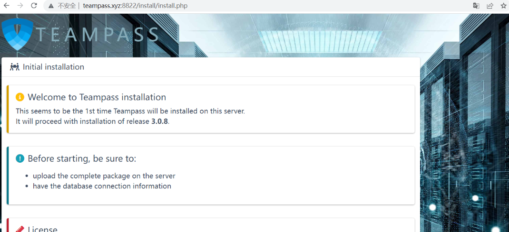  
  
  
下一步  
  
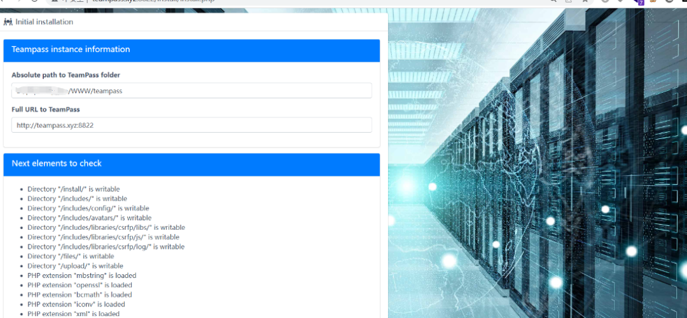  
  
  
安装环境需要linux,centos7换源，其实windows也可以安装  
```
mv /etc/yum.repos.d/CentOS-Base.repo /etc/yum.repos.d/CentOS-Base.repo.backup

wget -O /etc/yum.repos.d/CentOS-Base.repo http://mirrors.aliyun.com/repo/Centos-7.repo //下载新源

yum clean all //清除缓存

yum makecache //生成新缓存
```  
  
  
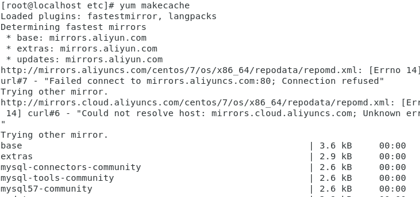  
  
```
yum install https://dl.fedoraproject.org/pub/epel/epel-release-latest-7.noarch.rpm
yum-config-manager --enable remi-php74
```  
  
  
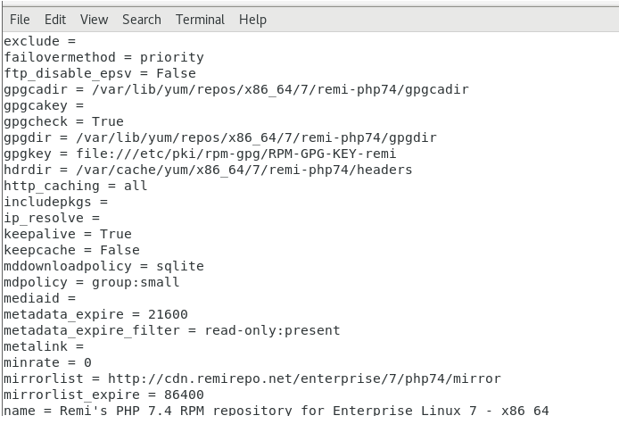  
  
```
yum install php php-cli php-fpm php-mysqlnd php-zip php-devel php-gd php-mcrypt php-mbstring php-curl php-xmlrpc php-xml
php -v
```  
  
  
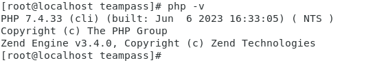  
  
  
安装phpmyadmin  
```
yum install phpmyadmin
```  
  
  
配置phpMyAdmin：  
```
vim /etc/httpd/conf.d/phpMyAdmin.conf
```  
  
  
将以下行添加到文件中：  
```
<Directory /usr/share/phpMyAdmin/>
   AddDefaultCharset UTF-8
</Directory>
```  
  
  
重启Apache：  
  
  
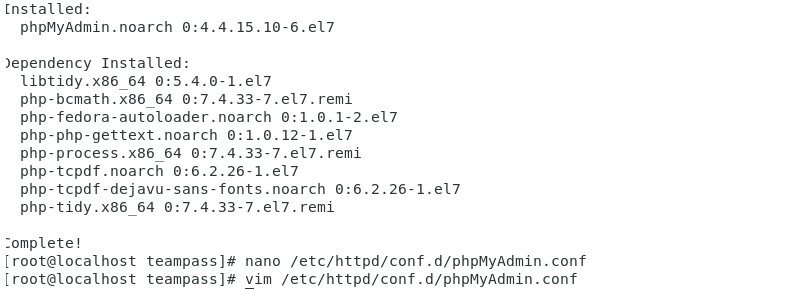  
  
```
systemctl restart httpd.service
```  
  
  
根据apache版本修改phpadmin配置  
```
vim /etc/httpd/conf.d/phpMyAdmin.conf
```  
  
  
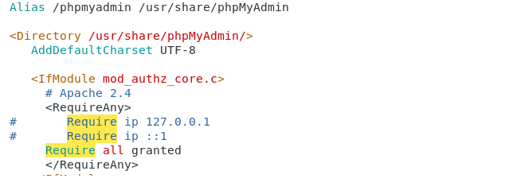  
  
  
centos7开放防火墙80端口  
```
firewall-cmd --zone=public --add-port=80/tcp --permanent
firewall-cmd --reload
```  
  
  
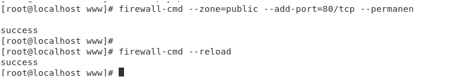  
```
update user set authentication_string=password('1qaz@WSX') where user='root';
```  
  
  
安装ssl证书  
```
mkdir -p /etc/ssl/localcerts
openssl req -new -x509 -days 365 -nodes -out /etc/ssl/localcerts/apache.pem -keyout /etc/ssl/localcerts/apache.key
chmod 600 /etc/ssl/localcerts/apache*
sudo ln -s /etc/httpd/conf.modules.d/10-a2enmod.conf /etc/httpd/conf.modules.d/00-base.conf
a2enmod ssl
```  
  
  
环境问题，这里装证书是最麻烦的，ssl协议能走没问题。这里其实有相对来说更简单的安装方法。  
  
  
**04**  
  
**结合Docker**  
```
docker pull teampass/teampass   //拉取镜像
wget https://github.com/nilsteampassnet/TeamPass/archive/refs/tags/3.0.8.zip   //下载项目
unzipc TeamPass-3.0.8       //解压
mv TeamPass-3.0.8 teampass  //改名
docker run -p 80:80 teampass/teampass
```  
  
  
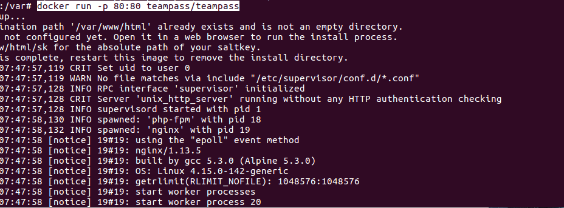  
```
dcoker ps   //查看docker容器id
docker cp ./teampass/ a4fb5937eaa8:/var/www/html/    //将文件复制到docker镜像中
```  
  
  
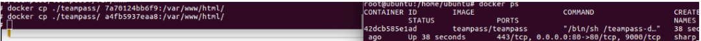  
  
  
以此方法安装也可以，该环境中时已经安装好了ssl证书的  
  
  
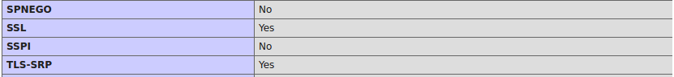  
  
  
准备工作做好之后就可以正常走安装流程了。  
  
  
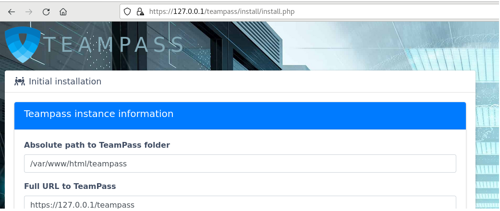  
  
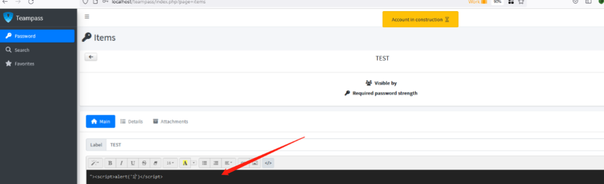  
  
  
效果  
  
  
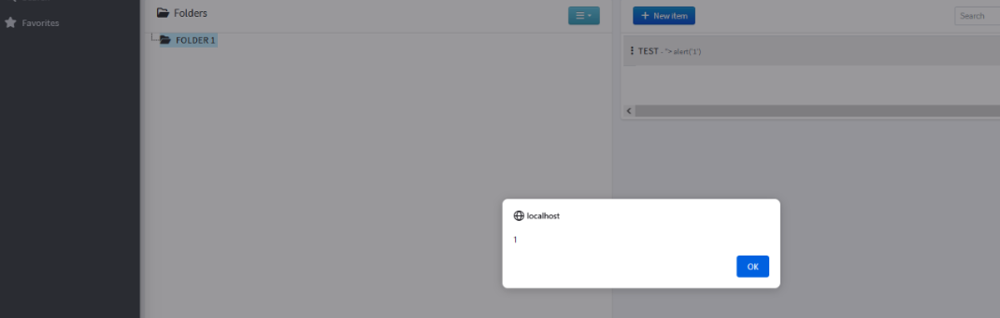  
  
  
目前在版本3.0.9中已修复  
```
https://github.com/nilsteampassnet/teampass/commit/6ba8cf1f4b89d62a08d122d533ccf4cb4e26a4ee?diff=unified
```  
  
  
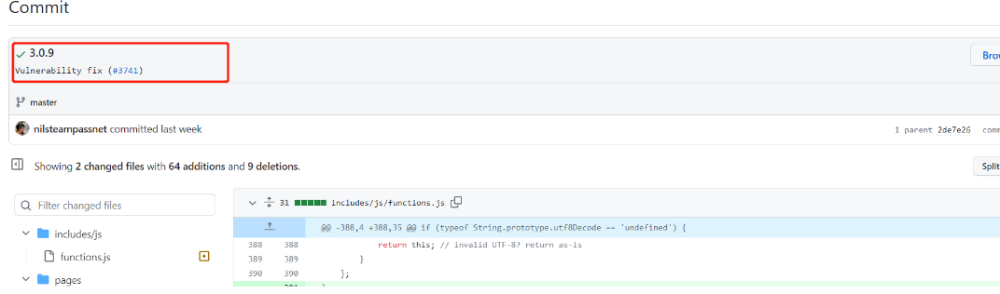  
  
  
可以看到在js中添加了过滤  
  
  
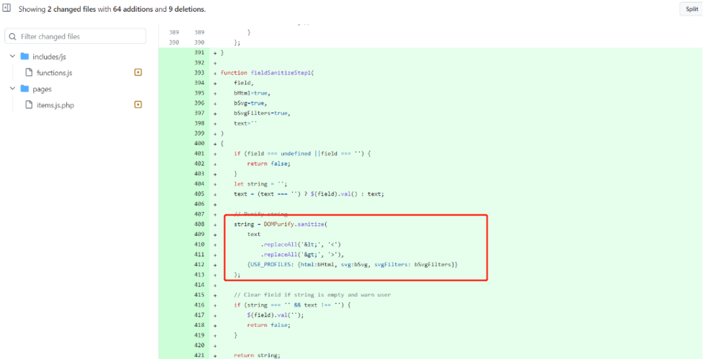  
  
  
在releases中无最新版本的源文件。  
  
  
  
往期推荐  
  
[](http://mp.weixin.qq.com/s?__biz=MzI2NDQ5NTQzOQ==&mid=2247498389&idx=1&sn=e78e640981a447988ec70fe02c787373&chksm=eaa972b5dddefba3fb56a33502dda53959a04f14885365ad52166956c891c0bed19b169984b5&scene=21#wechat_redirect)  
  
[](http://mp.weixin.qq.com/s?__biz=MzI2NDQ5NTQzOQ==&mid=2247498370&idx=1&sn=b2cb2572d95b688098c4d2e307d8f4db&chksm=eaa972a2dddefbb4f2f2ef53bde19c23b4ba492f8983fec95cebf4d00331179120eaa019ece9&scene=21#wechat_redirect)  
  
[](http://mp.weixin.qq.com/s?__biz=MzI2NDQ5NTQzOQ==&mid=2247498370&idx=2&sn=f17c2c5c79ba506b9729ba8053df956b&chksm=eaa972a2dddefbb4d581a8a5dfbc8b261f33935238ff1e812383cb8fd3564c69e6c1b35c11cb&scene=21#wechat_redirect)  
  
  
  
火线Zone是火线安全平台运营的安全社区，拥有超过20,000名可信白帽安全专家，内容涵盖渗透测试、红蓝对抗、漏洞分析、代码审计、漏洞复现等热门主题，旨在研究讨论实战攻防技术，助力社区安全专家技术成长，2年内已贡献1300+原创攻防内容，提交了100,000+原创安全漏洞。  
  
欢迎具备分享和探索精神的你加入火线Zone社区，一起分享技术干货，共建一个有技术氛围的优质安全社区！  
  
  
  
  


---

> 来源：gelusus/wxvl（微信公众号漏洞文章自动归档，原文见文首链接）
