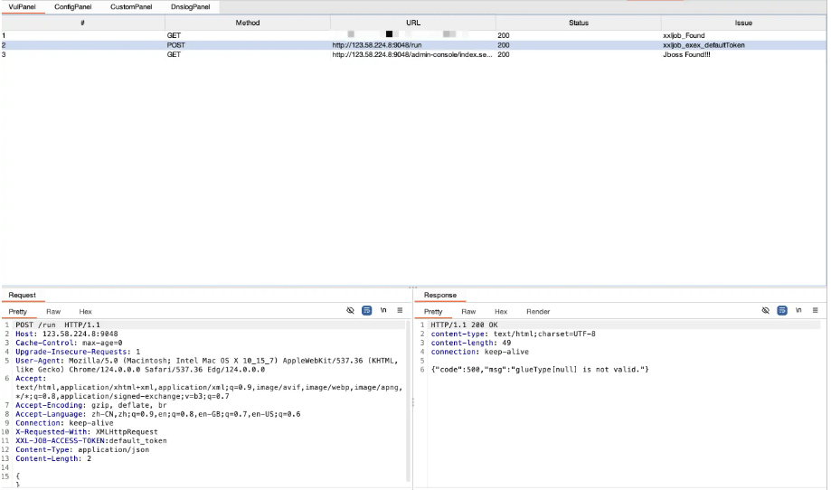
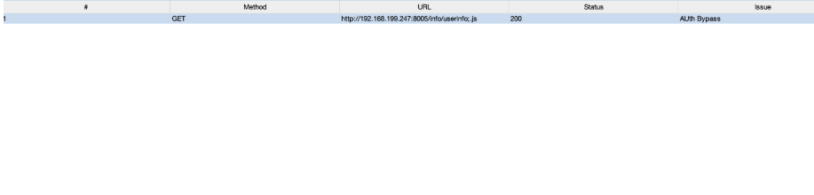
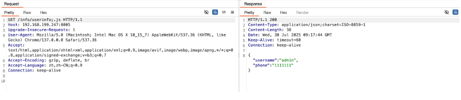
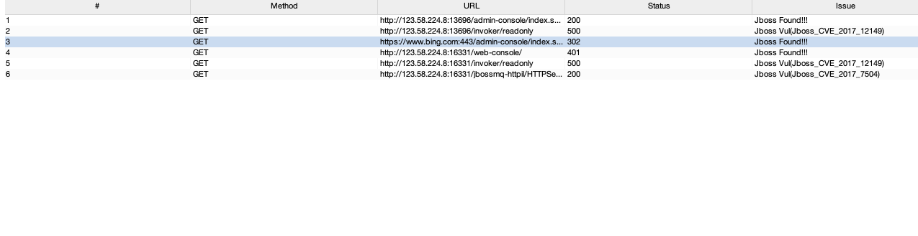
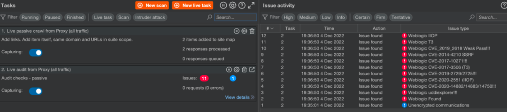

#  TsojanScan-Plus：基于原 Burp 漏洞插件重磅二开，新增多漏洞扫描与权限绕过检测  

<!-- article-review:devices:begin -->
## 技术校订与证据边界（2026-10-02）

- 产品/组件：TsojanScan-Plus Burp扩展，非被披露漏洞产品
- 本文讨论：无单一漏洞实体；多扫描模块介绍
- 版本、权限与配置前提：Burp Pro2024+声称，JAR需公众号获取，未给仓库链接/固定构建
- 资料类型：扫描插件推广/使用说明；本次仅核对归档正文，未执行 PoC、未请求目标，未把原作者的“复现成功”继承为本库验证结果

### 逐项校订

- 全部靶场验证/避免误报漏报无数据支持
- 前称主动扫描/DNSlog，尾称不发真实请求与全部仅理论判断，范围自相矛盾
- 下载仓库未给，源码/来源/构建校验缺失，大量付费资源推广

### 操作风险与恢复

- 回连样例可能向外部地址发送网络请求或建立会话；应使用自己的隔离回连服务，DNS/LDAP 到达只能证明相应交互，不能单独证明 RCE

### 待核与来源

- 实际仓库、版本、模块行为与验证记录未核，未下载运行
- 引用图片未查看，截图内容及有效性待核验
- 文内原始链接和图片引用继续保留；未检查图片像素、未下载或执行外部附件。版本边界、修复/在野状态及厂商归属若缺一手依据，均不能视为本次已确认
- 下方保留原技术正文与载荷；其中历史时间表述和成功主张应按本节限定阅读
<!-- article-review:devices:end -->

7uup
                    7uup  渗透安全HackTwo   2026-01-15 16:01  
  
0x01 工具介绍  
  
  
针对原版 TsojanScan 插件功能边界的拓展需求，**TsojanScan-Plus**  
 完成重磅二次开发，基于经典 BurpSuite 漏洞探测插件核心架构深度优化升级。在保留原版少发包、高精度探测的优势基础上，新增 Jboss 扫描、鉴权绕过检测、SOAP 接口探测等实用功能，还陆续集成 OSS/Minio 对象存储检测、XXL-Job 漏洞扫描等模块，所有新增能力均经 Vulfocus 在线靶场实测验证，让这款集成化 Burp 漏洞插件的探测场景更全面，适配更多渗透测试实战需求。  
  
注意：  
现在只对常读和星标的公众号才展示大图推送，建议大家把  
**渗透安全HackTwo**  
"**设为****星标⭐️**  
"  
**否****则可能就看不到了啦！**  
  
**下载地址在末尾 #渗透安全HackTwo**  
  
0x02   
功能简介  
  
  
✨ 主要特性  
  
基于原版深度二开，保留核心优势  
  
延续原版 TsojanScan少发包、高精度的探测原则，不增加多余请求量，同时兼容 Burp Suite Pro 2024 + 新版本，修复原版已知兼容性问题，保证插件运行稳定性。  
  
新增多类高危漏洞专项扫描  
  
拓展漏洞检测覆盖范围，新增Jboss 漏洞扫描、XXL-Job 漏洞探测，同时集成OSS/Minio 对象存储检测（listObject），适配云原生、任务调度平台等主流渗透场景。  
  
  
  
新增权限绕过与接口探测能力  
  
加入Bypass_Auth_Check 鉴权绕过检测模块，精准识别未授权访问风险；新增 SOAP 协议及各类 Services Api 探测，覆盖更多协议与接口类型的漏洞检测。  
  
  
  
  
  
实测验证，功能实用性拉满  
  
所有二开新增功能均经过Vulfocus 在线靶场实测验证，POC 检测精准度高，避免误报 / 漏报，可直接投入渗透测试实战使用。  
  
  
  
轻量扩容，持续迭代更新  
  
二开过程保持插件轻量性，不占用过多 Burp 资源，后续持续迭代升级（如 v0.0.2/0.0.3 版本陆续新增 OSS、XXL-Job 检测），不断补充实战化检测能力。  
  
兼容原版全量功能，一站式探测  
  
完整保留原版 Fastjson、Nacos、SQL 注入、Log4j2、ThinkPHP 等全量漏洞探测模块，兼顾主动 / 被动双扫描模式，支持自定义黑名单、DNSlog 多平台配置，实现一站式漏洞探测。  
  
0x03更新说明  
```
修复已知bug
```  
  
  
0x04 使用介绍  
  
📦  
使用指南  
  
下载 TsojanScan-Plus 编译好的 JAR 包（项目仓库可获取）；  
  
打开 Burp Suite，进入Extensions > Installed > Add；  
  
选择Java作为插件类型，点击Select file加载下载的 JAR 包，点击Next完成安装；  
  
  
###   
  
  
**0x05 内部VIP星球介绍-V1.4（福利）**  
  
        如果你想学习更多**渗透测试技术/应急溯源/免杀工具/挖洞SRC赚取漏洞赏金/红队打点等**  
欢迎加入我们**内部星球**  
可获得内部工具字典和享受内部资源和  
内部交流群，  
**每天更新1day/0day漏洞刷分上分****(2026POC更新至5024+)**  
**，**  
包含全网一些**付费扫描****工具及内部原创的Burpsuite自动化漏****洞探测插件/漏扫工具等，AI代审工具，最新挖洞技巧等**  
。shadon/Zoomeye/Quake/  
Fofa高级会员，CTFShow等各种账号会员共享。详情点击下方链接了解，觉得价格高的师傅后台回复"   
**星球**  
 "有优惠券名额有限先到先得  
**❗️**  
啥都有  
**❗️**  
全网资源  
最新  
最丰富  
**❗️****（🤙截止目前已有2400+多位师傅选择加入❗️早加入早享受）**  
  
****  
最新漏洞情报分享：  
https://t.zsxq.com/d8wtW  
  
****  
  
**👉****点击了解加入-->>内部VIP知识星球福利介绍V1.4版本-1day/0day漏洞库及内部资源更新**  
  
****  
  
  
结尾  
  
# 免责声明  
  
  
# 获取方法  
  
  
**公众号回复20260116获取下载**  
  
# 最后必看-免责声明  
  
  
      
文章中的案例或工具仅面向合法授权的企业安全建设行为，如您需要测试内容的可用性，请自行搭建靶机环境，勿用于非法行为。如  
用于其他用途，由使用者承担全部法律及连带责任，与作者和本公众号无关。  
本项目所有收录的poc均为漏洞的理论判断，不存在漏洞利用过程，不会对目标发起真实攻击和漏洞利用。文中所涉及的技术、思路和工具仅供以安全为目的的学习交流使用。  
如您在使用本工具或阅读文章的过程中存在任何非法行为，您需自行承担相应后果，我们将不承担任何法律及连带责任。本工具或文章或来源于网络，若有侵权请联系作者删除，请在24小时内删除，请勿用于商业行为，自行查验是否具有后门，切勿相信软件内的广告！  
  
  
  
# 往期推荐  
  
  
**1.内部VIP知识星球福利介绍V1.4（AI自动化工具）**  
  
**2.CS4.8-CobaltStrike4.8汉化+插件版**  
  
**3.全新升级BurpSuite2025.12专业(稳定版)**  
  
**4. 最新xray1.9.11高级版下载Windows/Linux**  
  
**5. 最新HCL AppScan Standard**  
  
  
渗透安全HackTwo  
  
微信号：关注公众号获取  
  
后台回复星球加入：  
知识星球  
  
扫码关注 了解更多  
  
  
  
  
  
上一篇文章：  
[Nacos配置文件攻防思路总结|揭秘Nacos被低估的攻击面](https://mp.weixin.qq.com/s?__biz=Mzg3ODE2MjkxMQ==&mid=2247492839&idx=1&sn=b6f091114fbd8e8922153a996c8f4f1c&scene=21#wechat_redirect)  
  
  


---

> 来源：gelusus/wxvl（微信公众号漏洞文章自动归档，原文见文首链接）
