#  WAF绕过-漏洞利用篇-sql注入+文件上传-过狗  

<!-- article-review:devices:begin -->
## 技术校订与证据边界（2026-10-02）

- 产品/组件：安全狗Apache版4.0及Pikachu靶场，其他WAF为背景
- 本文讨论：SQL/上传解析差异与配置绕过，无CVE
- 版本、权限与配置前提：特定规则配置/后端解析语义，部分方法明确4.0无效
- 资料类型：WAF绕过实验教程及营销；本次仅核对归档正文，未执行 PoC、未请求目标，未把原作者的“复现成功”继承为本库验证结果

### 逐项校订

- 重要payload、配置和结果仅截图，无完整请求/规则版本
- and替like不是通用等价替换；重复参数取最后与注释解析取决后端，不能概括所有WAF
- 安全狗默认只检URL不检POST缺版本/配置证据；垃圾数据溢出未区分长度上限与内存漏洞
- 35.2%/39.4%调查比例无日期/样本，机器语言误称机器学习；大量零成本插件广告

### 操作风险与恢复

- 文中写入/上传步骤会创建或覆盖目标文件；须先核对服务账户写权限、保存路径和脚本解析条件，验证后按原路径核查残留

### 待核与来源

- 截图、准确规则配置、具体成功范围与统计来源待核
- 引用图片未查看，截图内容及有效性待核验
- 文内原始链接和图片引用继续保留；未检查图片像素、未下载或执行外部附件。版本边界、修复/在野状态及厂商归属若缺一手依据，均不能视为本次已确认
- 下方保留原技术正文与载荷；其中历史时间表述和成功主张应按本节限定阅读
<!-- article-review:devices:end -->

原创 兰陵猪猪哼  小黑子安全   2025-07-22 04:13  
  
WAF绕过主要集中在信息收集，漏洞发现，漏洞利用，权限控制四个阶段。  
  
1、什么是WAF？  
  
Web Application Firewall（web应用防火墙），一种公认的说法是“web应用防火墙通过执行一系列针对HTTP/HTTPS的安全策略来专门为web应用提供保护的一款产品。  
  
基本可以分为以下4种：  
  
软件型WAF  
  
以软件的形式安装在服务器上面，可以接触到服务器上的文件，因此就可以检测服务器上是否有webshell，是否有文件被创建等。  
  
硬件型WAF  
  
以硬件形式部署在链路中，支持多种部署方式。当串联到链路上时可以拦截恶意流量，在旁路监听模式时只记录攻击但是不进行拦截。  
  
云WAF  
  
一般以反向代理的形式工作，通过配置后，使对网站的请求数据优先经过WAF主机，在WAF主机对数据进行过滤后再传给服务器。  
  
网站内置的WAF  
  
就是来自网站内部的过滤，直接出现在网站代码中，比如说对输入的参数强制类转换啊，对输入的参数进行敏感词检测啊什么的。  
  
2、如何判断WAF？  
  
Wafw00f识别工具：  
https://github.com/EnableSecurity/wafw00f  
  
看图识别：  
https://mp.weixin.qq.com/s/3uUZKryCufQ_HcuMc8ZgQQ  
  
其他项目脚本平台。  
  
3  
、目前有哪些常见WAF产品？  
  
参考：https://blog.csdn.net/w2sft/article/details/104533082/  
  
①硬件型  
  
硬件型WAF以一个独立的硬件设备的形态存在，支持以多种方式（如透明桥接模式、旁路模式、反向代理等）部署到网络中为后端的Web应用提供安全防护，是最为传统的WAF型态，在受访企业中部署占比为35.2%。相对于软件产品类的WAF，这类产品的优点是性能好、功能全面、支持多种模式部署等，但它的价格通常比较贵。国内的绿盟、安恒、启明星辰等老牌厂商旗下的WAF都属于此类。  
  
②软件型  
  
这种类型的WAF采用纯软件的方式实现，特点是安装简单，容易使用，成本低。但它的缺点也是显而易见的，除了性能受到限制外，还可能会存在兼容性、安全等问题。这类WAF的代表有ModSecurity、Naxsi、ShareWAF、安全狗等。  
  
③云WAF  
  
随着云计算技术的快速发展，使得基于云的WAF实现成为可能，在本次调查中占比甚至超过了传统的硬件WAF跃升为第一位，达到39.4%。阿里云、腾讯云、深信服云WAF、Imperva WAF是这类WAF的典型代表。  
  
常规  
WAF  
检测技术：  
  
1.  
正则匹配——容易被绕过（使用加密，编码，分段等）  
  
2.  
机器语言  
  
3.  
行为分析  
  
安全狗绕过  
-  
sql  
注入  
&  
文件上传  
  
sql  
注入安全狗绕过：  
  
1.  
关键字替换  
/  
关键字重复  
  
测试注入点，发现被拦截  
  
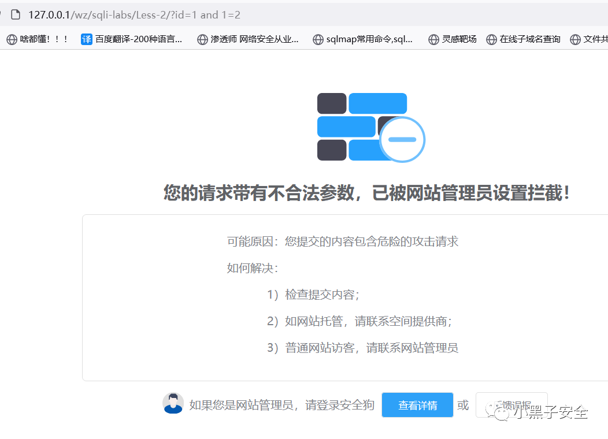  
  
将  
and  
参数更改为  
like  
，成功绕过  
  
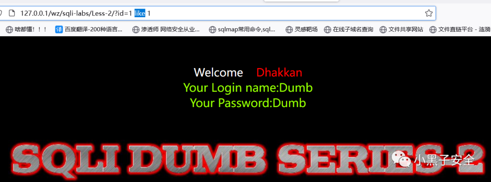  
  
还可以双写关键字绕过  
  
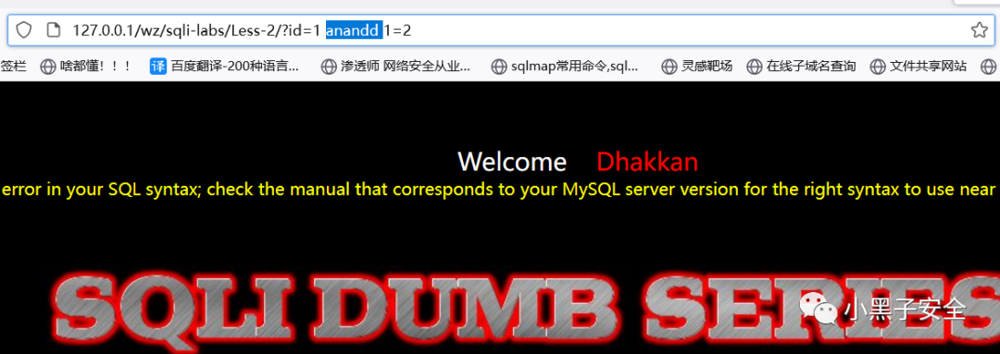  
  
2.  
更换提交方式绕过  
  
如：安全狗只默认开启检测  
url  
，不会检测  
post  
  
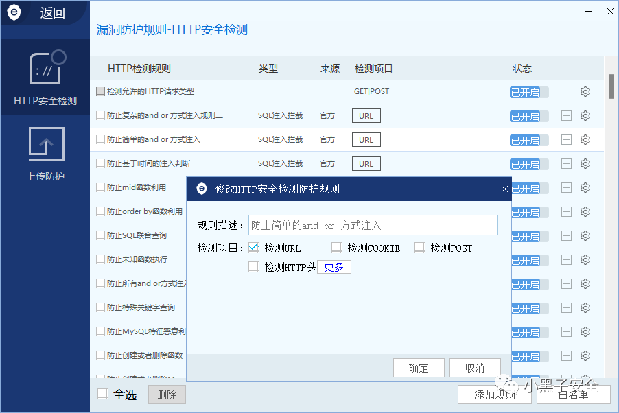  
  
开始绕过  
  
burp  
抓包——发送给  
Repeater  
——右键选择  
Change request method  
  
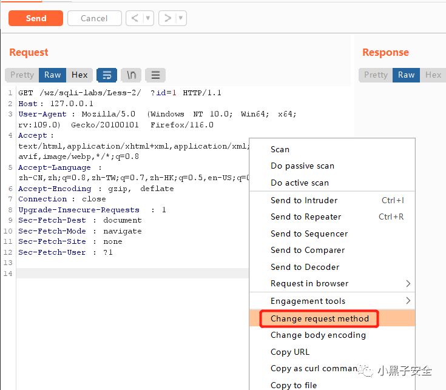  
  
更改为  
post  
请求，开始注入测试  
  
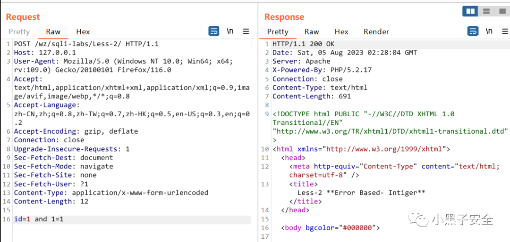  
  
更改正文编码绕过  
  
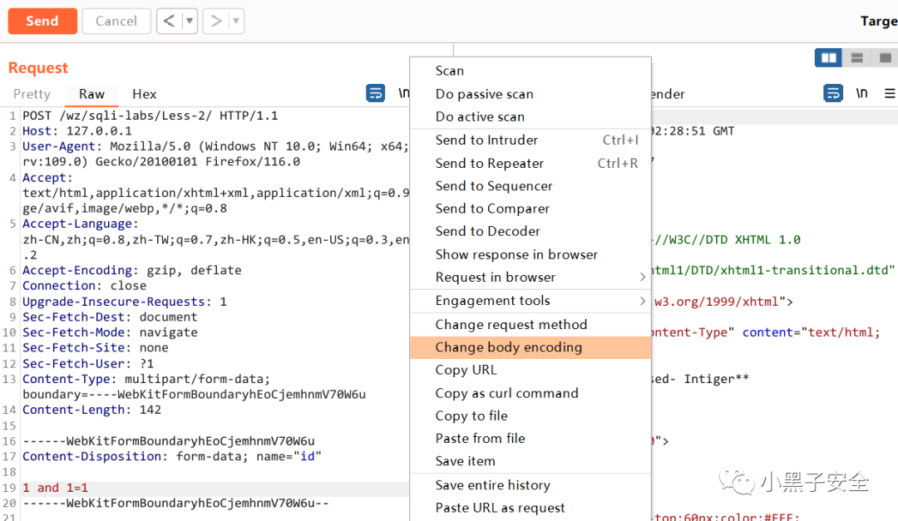  
  
3.  
HPP参数污染——使用网站安全狗  
(  
apache  
)4.0  
版本无法绕过  
  
此方法利用的是中间件特性  
  
特性图：  
  
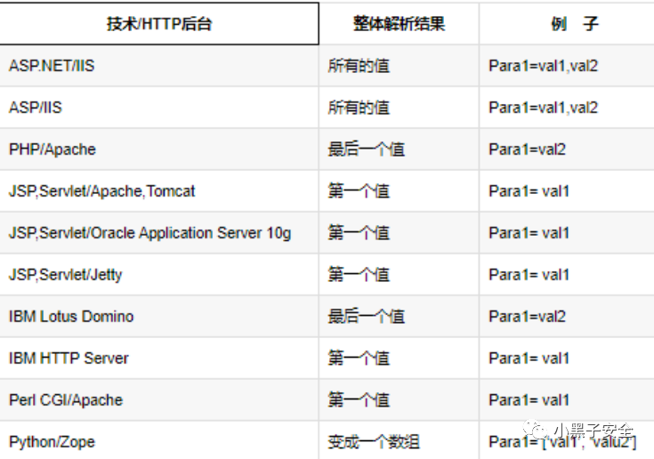  
  
写一串输出用户传递参数的代码  
  
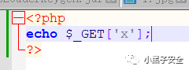  
  
访问，并且传递参数  
  
传递一个参数：  
  
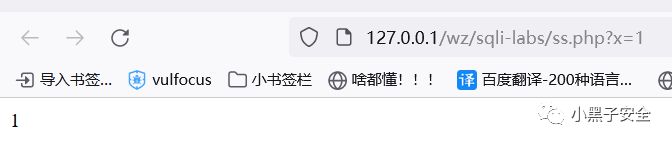  
  
传递两个参数时，只会输出最后一个参数值：  
  
  
  
利用这个特性就可以配合注释符  
(/**/)  
绕过安全狗：  
  
使用注释符包裹因为中间件特性要执行的注入语句，安全狗检测到注释符就不会注释符内的内容，从而绕过安全狗。  
  
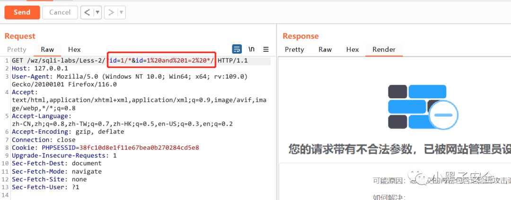  
  
文件上传安全狗绕过：  
  
pikachu  
靶场文件上传第一关本来上传  
jpg  
图片抓包修改后缀为  
php  
即可通关，但是布置了安全狗之后无法通关。  
  
被安全狗拿捏了（  
=_=  
）  
  
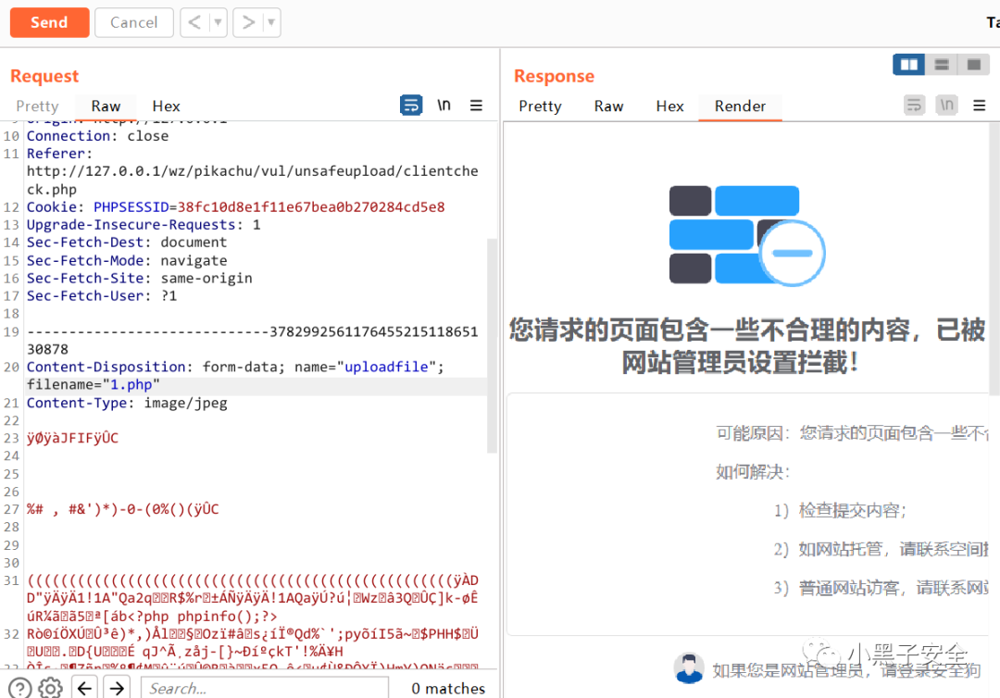  
  
1.  
去掉符号绕过  
  
去掉“  
1.  
php  
”的双引号变为  
 1.php  
  
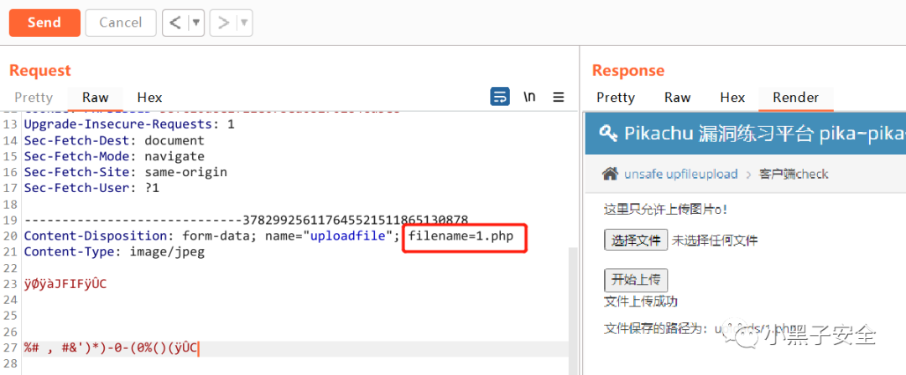  
  
2.  
两个  
=  
或者多个  
=  
绕过——使用网站安全狗  
(  
apache  
)4.0  
版本无法绕过  
  
使用两个  
=  
或者多个  
=  
绕过  
  
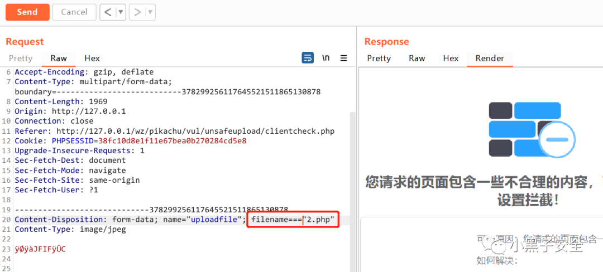  
  
3.  
后缀换行绕过——使用网站安全狗  
(  
apache  
)4.0  
版本无法绕过  
  
对上传文件的后缀名进行换行  
  
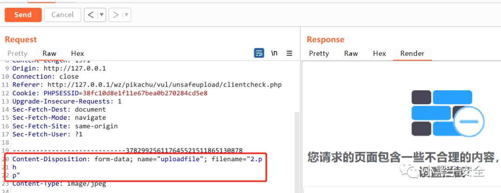  
  
4.  
垃圾数据绕过——使用网站安全狗  
(  
apache  
)4.0  
版本无法绕过  
  
在  
;  
filename="3.php"  
后面  
(  
或者前面的其他参数后面  
)  
写上很多垃圾数据，让安全狗在匹配时数据溢出，这样就无法检测到上传文件处。  
  
格式：垃圾数据  
;  
filename="3.php"  
  
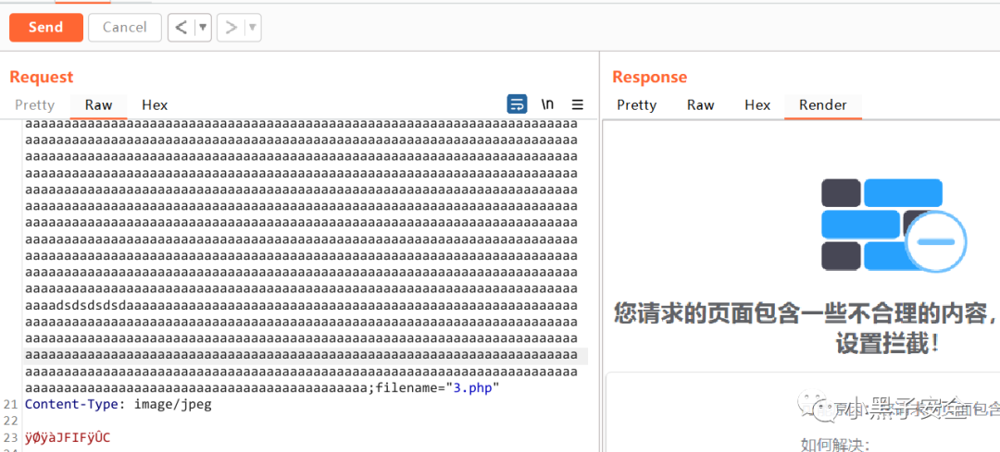  
  
5.  
参数模拟绕过  
  
将文件名修改为数据包里面的参数，让安全狗误判。  
  
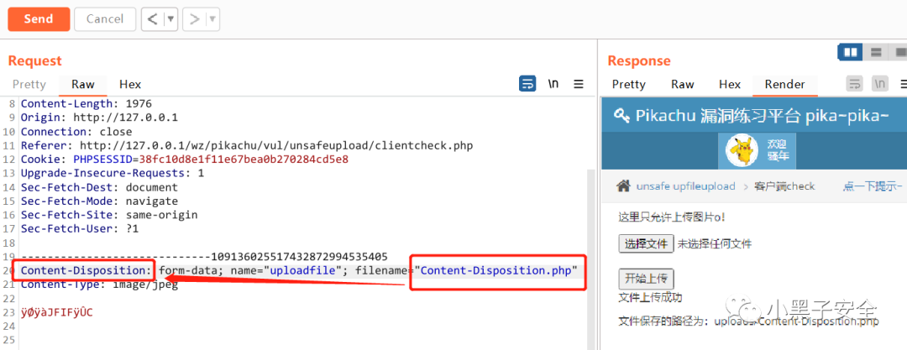  
  
网站目录也产生了上传的文件  
  
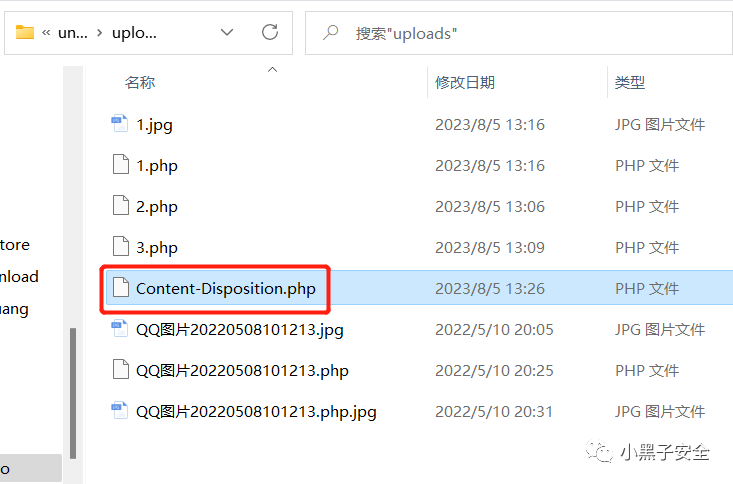  
  
推荐一下作者最新研发的yakit被动漏洞检测插件，可挖掘企业src漏洞。  
  
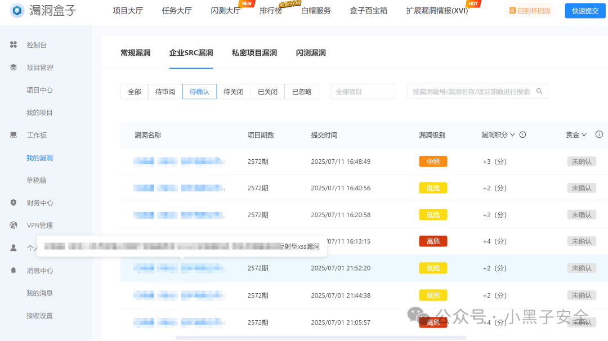  
  
以上漏洞都是不需要任何技巧的，作者只是开启插件在目标网站用鼠标“点点点点”就挖掘出这么多漏洞，完全  
  
“零基础”“  
  
零成本”挖洞  
  
目前一共开发了四个插件：  
  
被动  
sql  
注入检测  
  
被动  
xss  
扫描优化版  
  
被动目录扫描好人版  
  
被动  
ssrf  
及  
log4j  
检测  
  
插件使用效果：[记一次企业src漏洞挖掘连爆七个漏洞！](https://mp.weixin.qq.com/s?__biz=Mzg5NDg4MzYzNQ==&mid=2247486552&idx=1&sn=41c4e4a40fd104f53e22f5a7143c88ad&scene=21#wechat_redirect)  
  
  
插件使用教程：  
[新一代SQL注入检测技术，小白也能轻松挖到漏洞！](https://mp.weixin.qq.com/s?__biz=Mzg5NDg4MzYzNQ==&mid=2247486516&idx=1&sn=8ce41df1c1c32eddb5762dc6c362a85b&poc_token=HEcld2ij2mPrmNUdYokG5LVG3B9lMQFCmGocR1XA&scene=21#wechat_redirect)  
  
  
知识星球——小黑子安全圈  
[  
精华版  
]  
    
开业大吉！  
  
每一个插件都是非常实用的，有没有用作者也已经通过  
  
企业  
src   
漏洞的挖掘来证明了，并且只需要开启插件  
  
点击鼠标就可以全自动挖掘漏洞。  
  
需要获取插件的小伙伴可以扫描下方二维码加入我的知识星球，星球  
 99  
元  
/  
年  
  
，前  
50  
个加入的  
 77  
元  
/  
年。  
  
加入知识星球的同学会提供  
  
yakit  
  
安装  
  
和  
  
插件  
  
使用教程。  
  
  
  
本星球只提供精华内容，没有烂大街的东西。会持续更新  
yakit  
插件和各种漏洞漏洞探针和利用工具，哪怕你是什么都不懂的小白用了插件点点鼠标就能挖到漏洞。  
  
注！！！红包返现！！！拉新活动！！！  
  
拉新人加入星球待满三天也会返  
20  
红包  
(  
微信直接转  
)  
。插件会一直优化和上新，欢迎大家加入星球。  
  
  
  
  

---

> 来源：gelusus/wxvl（微信公众号漏洞文章自动归档，原文见文首链接）
