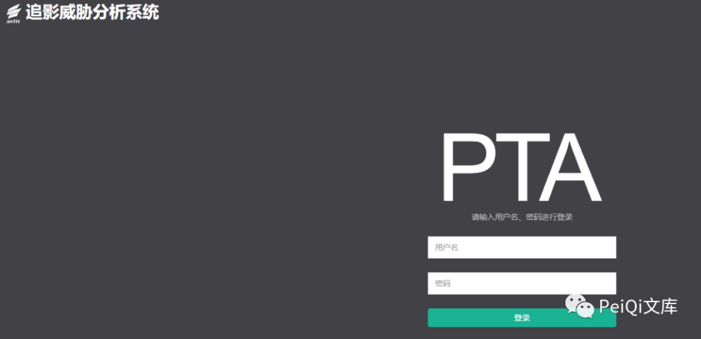
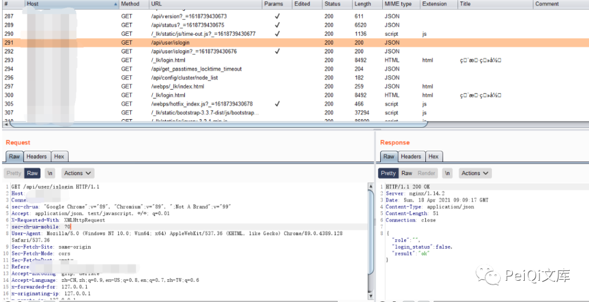
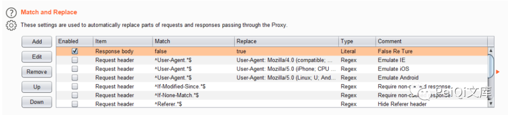
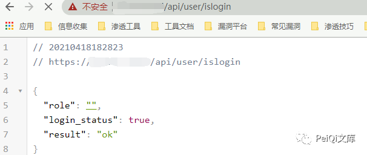
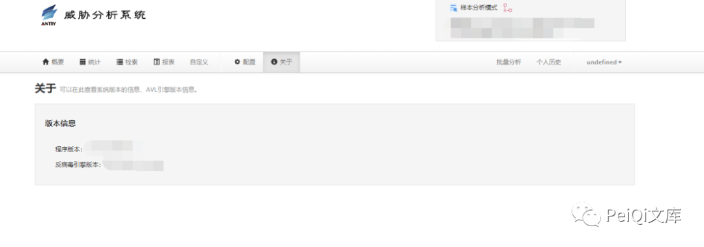

# X 天 高级可持续威胁安全检测系统 越权访问漏洞

<!-- article-review:devices:begin -->
## 技术校订与证据边界（2026-10-02）

- 产品/组件：安天高级持续威胁检测系统，标题部分隐名
- 本文讨论：api/user/islogin前端信任login_status
- 版本、权限与配置前提：客户端修改响应，版本未知
- 资料类型：响应篡改登录界面绕过；本次仅核对归档正文，未执行 PoC、未请求目标，未把原作者的“复现成功”继承为本库验证结果

### 逐项校订

- 改false为true只能证明前端显示绕过，必须展示未授权后端敏感数据/操作才能证明真正越权
- 关键响应/后台结果仅截图，角色字段仍为空需解释
- 无版本/补丁及具体产品型号

### 操作风险与恢复

- 本篇未提供足以确认无副作用的完整验证流程；应依正文所述配置、权限与交互前提评估，不能把通告或截图当成可直接运行的检测脚本

### 待核与来源

- 未经修改的后端API响应/权限对照与型号版本待核
- 引用图片未查看，截图内容及有效性待核验
- 文内原始链接和图片引用继续保留；未检查图片像素、未下载或执行外部附件。版本边界、修复/在野状态及厂商归属若缺一手依据，均不能视为本次已确认
- 下方保留原技术正文与载荷；其中历史时间表述和成功主张应按本节限定阅读
<!-- article-review:devices:end -->


<meta name="referrer" content="no-referrer"/>

> 本文由 [简悦 SimpRead](http://ksria.com/simpread/) 转码， 原文地址 [mp.weixin.qq.com](https://mp.weixin.qq.com/s/Bmn4w_OGMnC4PFKJX85p8A)


**一****：漏洞描述🐑**

**X 天 高级可持续威胁安全检测系统 存在越权访问漏洞，攻击者可以通过工具修改特定的返回包导致越权后台查看敏感信息**

**二:  漏洞影响🐇**

**X 天 高级可持续威胁安全检测系统**

**三:  漏洞复现🐋**

**登录页面如下**



**其中抓包过程中发现请求的一个身份验证 Url**  



```
{"role": "", "login_status": false, "result": "ok"}
```

**其中 **login_status 为 false**, 将参数使用 Burp 替换响应包为 **true****



**请求 **/api/user/islogin** 时成功越过身份验证**



**再次访问首页验证越权漏洞**



 ****四:  关于文库🦉****

****（文库暂时关闭一段时间，敏感问题解决后再次开放~）****

**在线文库：**

**http://wiki.peiqi.tech**

**Github：**

**https://github.com/PeiQi0/PeiQi-WIKI-POC**

最后
--

> 下面就是文库的公众号啦，更新的文章都会在第一时间推送在交流群和公众号
> 
> 想要加入交流群的师傅公众号点击交流群加我拉你啦~
> 
> 别忘了 Github 下载完给个小星星⭐

公众号

**同时知识星球也开放运营啦，希望师傅们支持支持啦🐟**

**知识星球里会持续发布一些漏洞公开信息和技术文章~**


**由于传播、利用此文所提供的信息而造成的任何直接或者间接的后果及损失，均由使用者本人负责，文章作者不为此承担任何责任。**

**PeiQi 文库 拥有对此文章的修改和解释权如欲转载或传播此文章，必须保证此文章的完整性，包括版权声明等全部内容。未经作者允许，不得任意修改或者增减此文章内容，不得以任何方式将其用于商业目的。**

---

> 来源：MrWQ/vulnerability-paper（https://github.com/MrWQ/vulnerability-paper）
