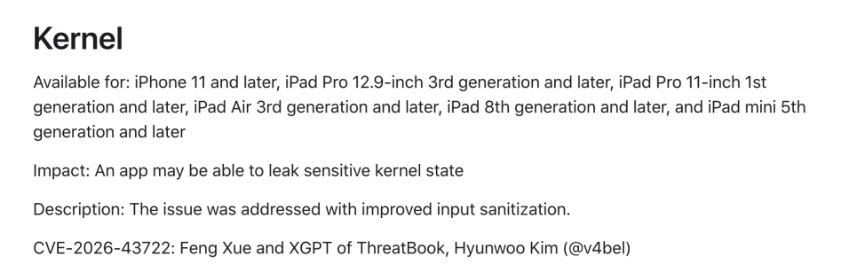

#  微步 XGPT 发现 Apple 内核漏洞并获致谢  

<!-- article-review:devices:begin -->
## 技术校订与证据边界（2026-10-02）

- 产品/组件：Apple XNU Kernel，微步XGPT为发现工具
- 本文讨论：CVE-2026-43722堆越界读及后续写入链声称
- 版本、权限与配置前提：本地非特权，iOS/iPadOS/macOS26.5.2声称修复
- 资料类型：研究发现简讯；本次仅核对归档正文，未执行 PoC、未请求目标，未把原作者的“复现成功”继承为本库验证结果

### 逐项校订

- 误归微步安全设备，实际Apple内核
- 读取到系统共享页写入/root需额外机制，文章只给概述不应当完整证明
- 单Apple链接是否覆盖三个OS修复范围需核

### 操作风险与恢复

- 文中写入/上传步骤会创建或覆盖目标文件；须先核对服务账户写权限、保存路径和脚本解析条件，验证后按原路径核查残留

### 待核与来源

- Apple官方描述/机型构建、CVE映射及提权链待核
- 引用图片未查看，截图内容及有效性待核验
- 文内原始链接和图片引用继续保留；未检查图片像素、未下载或执行外部附件。版本边界、修复/在野状态及厂商归属若缺一手依据，均不能视为本次已确认
- 下方保留原技术正文与载荷；其中历史时间表述和成功主张应按本节限定阅读
<!-- article-review:devices:end -->

微步情报局
                    微步情报局  微步在线研究响应中心   2026-06-30 07:23  
  
漏洞概况  
  
  
今天Apple官方发布   
Apple iOS、iPadOS、macOS  
 26.5.2版，修复了WebKit、Kernel 等组件的多个漏洞。  
其中CVE-2026-43722由微步XGPT发现并报送Apple官方。  
  
  
  
该漏洞由于  
XNU Kernel 未验证 page_starts_offset 和 page_extras_offset，攻击者可利用此漏洞触发内核堆越界读，进而通过重定向链写入系统级共享区域页面。精心构造的攻击可能可以实现从非特权用户到 root 的本地权限提升。  
修复方案  
  
### 官方修复方案  
  
Apple 建议所有用户尽快通过设置 > 通用 > 软件更新进行升级。官方修复通告地址：：  
  
https://support.apple.com/en-us/127594  
  
微步产品支撑  
  
  
微步漏洞情报于  
2026-06-29  
收录该漏洞。  
  
微步下一代威胁情报平台NGTIP及X情报社区已于漏洞收录时向漏洞订阅用户推送该漏洞情报，并将持续推送后续更新；对于已经录入资产的用户，支持实时自动化排查受影响资产。  
  
  

---

> 来源：gelusus/wxvl（微信公众号漏洞文章自动归档，原文见文首链接）
