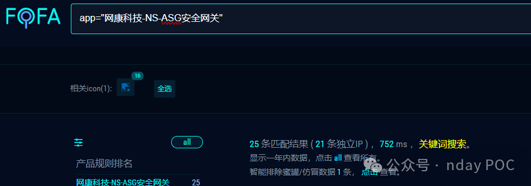
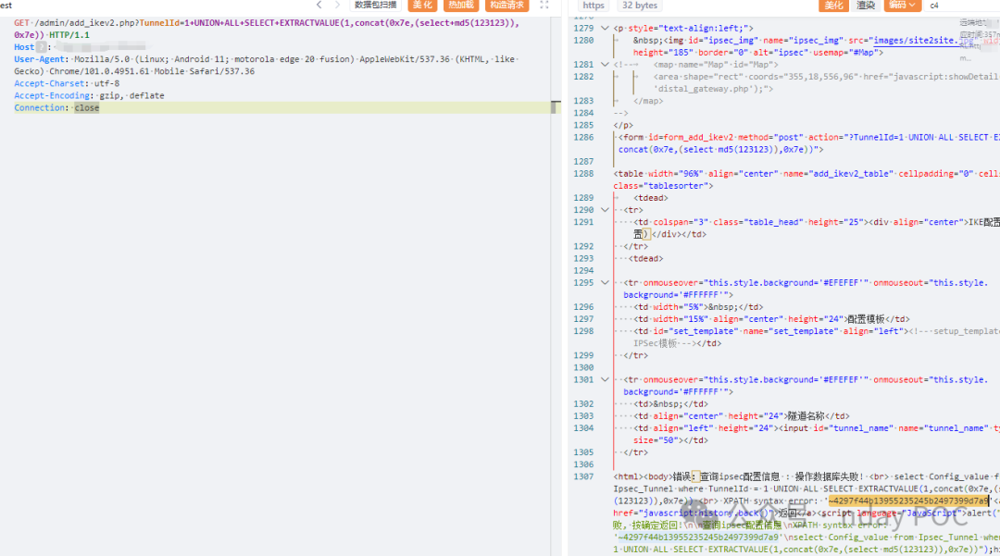
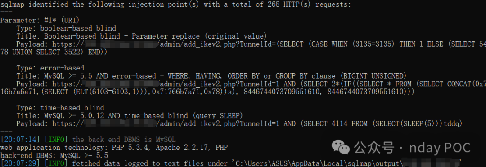
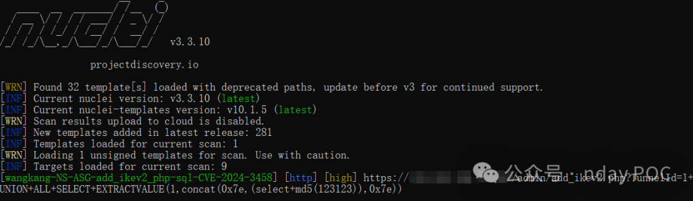
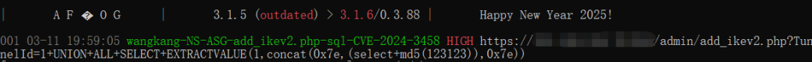
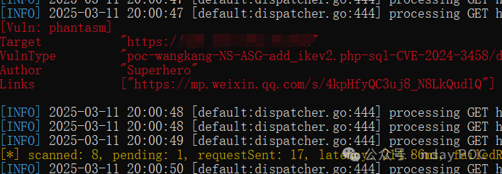
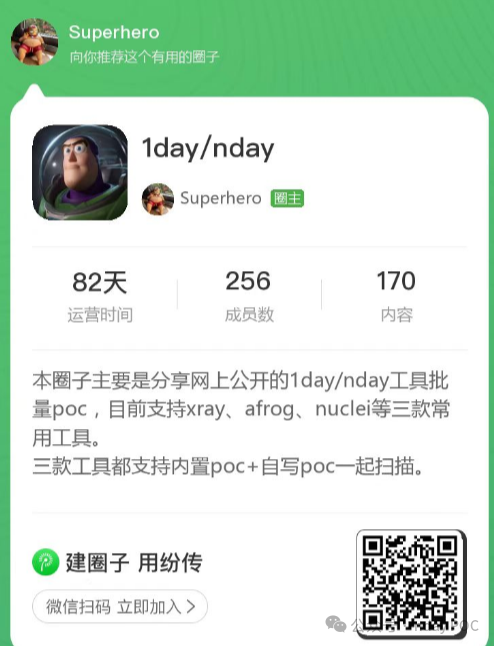

#  网康科技 NS-ASG 应用安全网关 add_ikev2.php SQL注入漏洞(CVE-2024-3458)   

<!-- article-review:devices:begin -->
## 技术校订与证据边界（2026-10-02）

- 产品/组件：网康NS-ASG add_ikev2.php
- 本文讨论：CVE-2024-3458
- 版本、权限与配置前提：声称未认证，具体版本/参数仅图或缺失
- 资料类型：SQL注入截图与工具推广；本次仅核对归档正文，未执行 PoC、未请求目标，未把原作者的“复现成功”继承为本库验证结果

### 逐项校订

- 实际请求和注入参数全在截图，工具模板不随文提供
- 高权限写命令仅潜在影响，未给数据库权限/落地链
- 修复只有厂商首页无版本，放在index.php目录混淆不同入口

### 操作风险与恢复

- 本篇未提供足以确认无副作用的完整验证流程；应依正文所述配置、权限与交互前提评估，不能把通告或截图当成可直接运行的检测脚本

### 待核与来源

- CVE鉴权/受影响构建、截图及修复待核
- 引用图片未查看，截图内容及有效性待核验
- 文内原始链接和图片引用继续保留；未检查图片像素、未下载或执行外部附件。版本边界、修复/在野状态及厂商归属若缺一手依据，均不能视为本次已确认
- 下方保留原技术正文与载荷；其中历史时间表述和成功主张应按本节限定阅读
<!-- article-review:devices:end -->

Superhero  Nday Poc   2025-03-11 20:09  
  
  
  
  
  
  
  
内容仅用于学习交流自查使用，由于传播、利用本公众号所提供的  
POC  
信息及  
POC对应脚本  
而造成的任何直接或者间接的后果及损失，均由使用者本人负责，公众号nday poc及作者不为此承担任何责任，一旦造成后果请自行承担！如文章有侵权烦请及时告知，我们会立即删除文章并致歉。谢谢！  
  
  
**00******  
  
**产品简介**  
  
  
网康科技的NS-ASG应用安全网关是一款软硬件一体化的产品，集成了SSL和IPSec，旨在保障业务访问的安全性，适配所有移动终端，提供多种链路均衡和选择技术，支持多种认证方式灵活组合，以及内置短信认证、LDAP令牌、USB KEY等多达13种认证方式。  
**01******  
  
**漏洞概述**  
  
  
网康科技 NS-ASG 应用安全网关 add_ikev2.php接口处存在SQL注入漏洞，未经身份验证的恶意攻击者利用 SQL 注入漏洞获取数据库中的信息（例如管理员后台密码、站点用户个人信息）之外，攻击者甚至可以在高权限下向服务器写入命令，进一步获取服务器系统权限。  
**02******  
  
**搜索引擎**  
  
  
FOFA:  
```
app="网康科技-NS-ASG安全网关"
```  
  
  
  
  
**03******  
  
**漏洞复现**  
  
查询MD5值  
  
  
  
sqlmap验证  
  
  
  
  
**04**  
  
**自查工具**  
  
  
nuclei  
  
  
  
afrog  
  
  
  
xray  
  
  
  
  
**05******  
  
**修复建议**  
  
  
1、关闭互联网暴露面或接口设置访问权限  
  
2、  
目前官方已发布漏洞修复版本，建议用户升级到安全版本：  
  
https://www.netentsec.com/  
  
  
**06******  
  
**内部圈子介绍**  
  
  
1、本圈子主要是分享网上公布的1day/nday POC详情及对应检测脚本，目前POC脚本均支持xray、afrog、nuclei等三款常用工具。  
  
2、三款工具都支持内置poc+自写poc目录一起扫描。  
  
3、保持每周更新7-10个左右POC。  
  
4、所发布的POC脚本均已测试完毕，直接拿来即用。  
  
  
  
  
  


---

> 来源：gelusus/wxvl（微信公众号漏洞文章自动归档，原文见文首链接）
