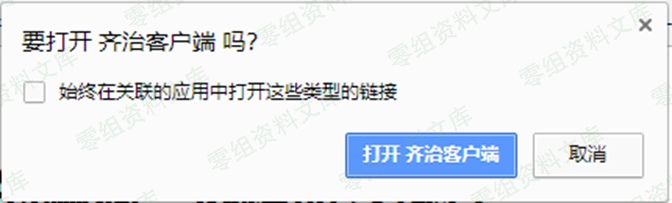
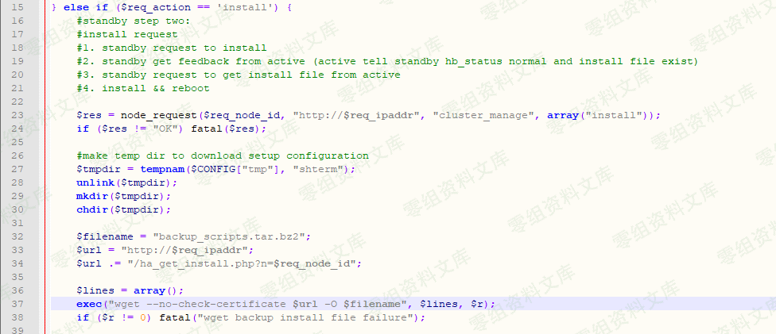
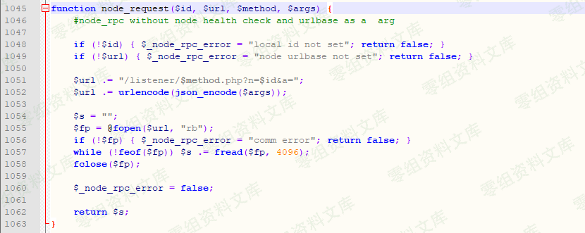
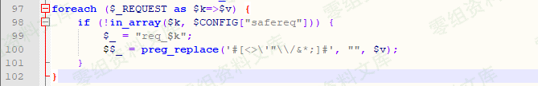
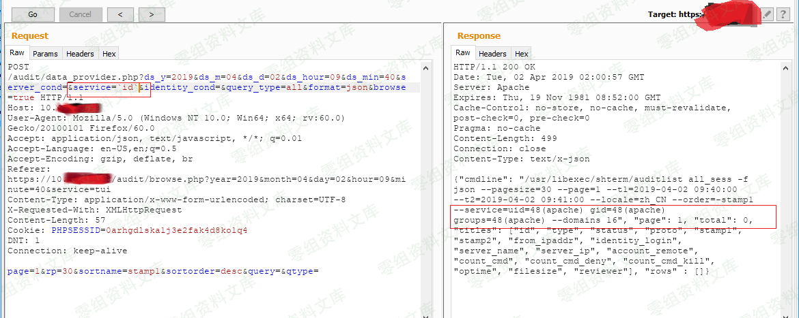
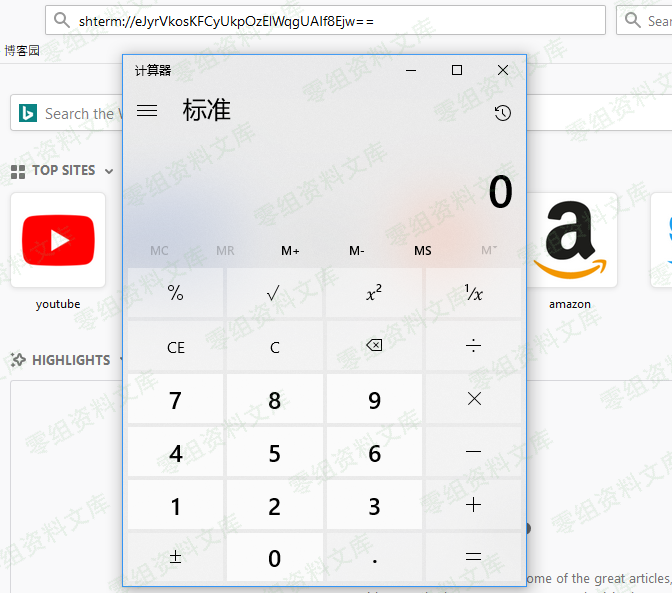

# （CNVD-2019-09593）齐治堡垒机 ShtermClient-2.1.1 命令执行漏洞

<!-- article-review:devices:begin -->
## 技术校订与证据边界（2026-10-02）

- 产品/组件：齐治ShtermClient2.1.1客户端
- 本文讨论：CNVD-2019-09593 shterm自定义协议任意app启动
- 版本、权限与配置前提：已安装受影响客户端、用户打开shterm链接/浏览器确认
- 资料类型：客户端URL协议命令执行分析；本次仅核对归档正文，未执行 PoC、未请求目标，未把原作者的“复现成功”继承为本库验证结果

### 逐项校订

- 简介/影响章节空，只有测试2.1.1无修复范围
- 多图引用20835和17294另漏洞资源，归属疑误；路径残余文本
- 客户端执行不能表述成堡垒机服务端RCE；编码与LoadShell参数细节多为图
- 已落实的文本修订：补齐文章标题。上列仍描述旧文问题时，以此落实项及下列限定为准；修订不代表运行验证

### 操作风险与恢复

- 本篇未提供足以确认无副作用的完整验证流程；应依正文所述配置、权限与交互前提评估，不能把通告或截图当成可直接运行的检测脚本

### 待核与来源

- CNVD范围、浏览器提示前提、资源图与修复待核
- 引用图片未查看，截图内容及有效性待核验
- 文内原始链接和图片引用继续保留；未检查图片像素、未下载或执行外部附件。版本边界、修复/在野状态及厂商归属若缺一手依据，均不能视为本次已确认
- 下方保留原技术正文与载荷；其中历史时间表述和成功主张应按本节限定阅读
<!-- article-review:devices:end -->

（CNVD-2019-09593）齐治堡垒机 ShtermClient-2.1.1 命令执行漏洞
=============================================================

一、漏洞简介
------------

二、漏洞影响
------------

三、复现过程
------------

### 漏洞分析

首先，在安装齐治运维堡垒机客户端软件ShtermClient后，会在计算机上注册一个伪协议"shterm"。堡垒机正是通过该协议，调用本地程序打开了连接到堡垒机的通道。如下图是chrome浏览器打开链接时的提示。

齐治堡垒机ShtermClient-2.1.1命令执行漏洞/media/rId25.png)

我们可以在注册表中找到它，Command子项指明了如何处理shterm协议的URI。

齐治堡垒机ShtermClient-2.1.1命令执行漏洞/media/rId26.png)

通过对该过程的抓包分析，发现将"app":"mstsc"改为"app":"calc"，生成的shterm
URI即可打开本地的计算器。一度认为命令只能注入app参数，后来使用Procmon.exe监控LoadShell.exe的执行，发现会在%tmp%目录下生成一些日志文件，通过分析日志文件以及多次测试，得到了最终可行的利用方案。

齐治堡垒机ShtermClient-2.1.1命令执行漏洞/media/rId27.png)

Client/inflate.php源代码，可见服务端仅是将提交的数据，先进行压缩，在进行base64编码后即输出。

齐治堡垒机ShtermClient-2.1.1命令执行漏洞/media/rId28.png)

### 漏洞复现

首先在靶机上安装ShtermClient-2.1.1。

然后，在kali上搭建PHP环境，以便生成shterm URI，见下图。

齐治堡垒机ShtermClient-2.1.1命令执行漏洞/media/rId30.png)

如果你使用了存在漏洞的shtermclient，在浏览器中打开以下链接，将会在本机打开计算器calc.exe。

    shterm://eJyrVkosKFCyUkpOzElWqgUAIf8Ejw==

齐治堡垒机ShtermClient-2.1.1命令执行漏洞/media/rId31.png)

参考链接
--------

> https://www.cnblogs.com/StudyCat/p/11201725.html
