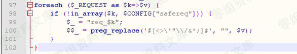
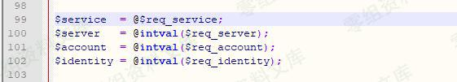
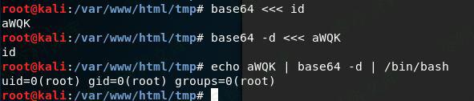
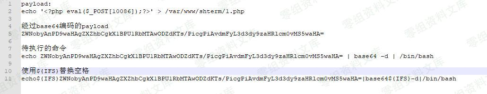

# （CNVD-2019-17294）齐治堡垒机 后台命令执行漏洞

<!-- article-review:devices:begin -->
## 技术校订与证据边界（2026-10-02）

- 产品/组件：齐治堡垒机
- 本文讨论：CNVD-2019-17294 audit/data_provider.php service
- 版本、权限与配置前提：后台认证权限，危险字符过滤需IFS规避；版本未知
- 资料类型：后台命令注入截图分析；本次仅核对归档正文，未执行 PoC、未请求目标，未把原作者的“复现成功”继承为本库验证结果

### 逐项校订

- 简介/影响空，源码/最终请求全图，文本不足重建过滤逻辑
- 多个路径残留，身份角色和修复版本缺失
- 已落实的文本修订：补齐文章标题。上列仍描述旧文问题时，以此落实项及下列限定为准；修订不代表运行验证

### 操作风险与恢复

- 本篇未提供足以确认无副作用的完整验证流程；应依正文所述配置、权限与交互前提评估，不能把通告或截图当成可直接运行的检测脚本

### 待核与来源

- 真实过滤列表、授权角色、版本与图证待核
- 引用图片未查看，截图内容及有效性待核验
- 文内原始链接和图片引用继续保留；未检查图片像素、未下载或执行外部附件。版本边界、修复/在野状态及厂商归属若缺一手依据，均不能视为本次已确认
- 下方保留原技术正文与载荷；其中历史时间表述和成功主张应按本节限定阅读
<!-- article-review:devices:end -->

（CNVD-2019-17294）齐治堡垒机 后台命令执行漏洞
==============================================

一、漏洞简介
------------

二、漏洞影响
------------

三、复现过程
------------

### 漏洞分析

首先，定位到/audit/data\_provider.php，直接查找\$\_GET\['service'\]或者\$\_REQUEST\['service'\]都找不到。原来在文件开头包含的common.php中，已有全局配置。

代码如下，不但给变量加了个前缀"req\_"，还过滤掉了一些危险字符。

齐治堡垒机后台命令执行漏洞/media/rId25.jpg)

然后，搜索"
\$req\_service"定位到data\_provider.php文件的第99行。可见，将\$GET\['service'\]赋值到\$service变量中。

齐治堡垒机后台命令执行漏洞/media/rId26.jpg)

然后，跟进\$service来到data\_provider.php文件的第124行。可见，通过字符串拼接，将\$\_GET\['service'\]带入到\$cmd变量中。

齐治堡垒机后台命令执行漏洞/media/rId27.jpg)

然后，跟进\$cmd来到data\_provider.php文件的第133行。可见，\$cmd被带入exec函数中执行。至此，造成远程命令执行漏洞。

齐治堡垒机后台命令执行漏洞/media/rId28.jpg)

漏洞复现
--------

如下图，通过在传递参数"service=`id`"，成功执行命令，并回显命令执行结果。

齐治堡垒机后台命令执行漏洞/media/rId30.png)

通过反单引号执行命令，写入PHP一句话代码到服务器。

原理如下图所示，这样就可以绕过过滤执行任意命令。实际上，还需要用\${IFS}替换掉空格才行。

齐治堡垒机后台命令执行漏洞/media/rId31.jpg)

所以，最终方案如下。

齐治堡垒机后台命令执行漏洞/media/rId32.jpg)

参考链接
--------

> https://www.cnblogs.com/StudyCat/p/11197986.html
